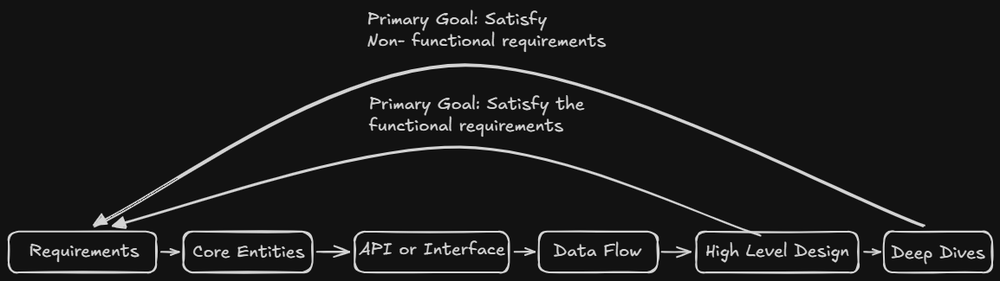

# Delevery Framework
- worst thing in interview is fail to give a working system
- this is time management
- here you just need to focus on the right things 


## Requirements: (~ 5 Minutes)
### 1. Functional requirements:
- core features pof system
- first thing to discuss with interviewr
- create a prioritized list of core features
- top 3
- keep targeted
- main objective of interview is to meet these requirements


- should be 
 1. Users should be ....

**e.g. For Twitter**
1. Users should be able to post tweets
2. Users should be able to follow other users
3. Users should be able to see tweets from users they follow

**e.g. cache**
1. Clients should be able to insert items
2. Clients should be able to set expirations
3. Clients should be able to read items

### 2. Non-Functional Requirements:
- statements about system qualities that are important for users
- if possible quantify like DAU 100M, low latency for search <500ms

checklist of things to consider for NFR:
**1. CAP Theorem:** consistency vs availability
**2. Environment Constraint:** like memory, mobile device etc
**3. Scalability:** does this system have unique scaling requirements? bursty traffic at specfic time, events like holidays, campaign, also consider read vs write ratio here, read vs writes scale
**4. Latency:** how quickly does system need to respond?
**5. Durability:** how important is data loss? financial system vs social media
**6. Security:** how much secure? data protection, access control, compliance
**7. Fault Tolerance:** how well system need to handle failures? redundency, failover, and recovery msm
**8. Compliance:** legal or regulatory requirements? data protection laws

- should be 
 1. The System should be able to ....

**e.g. Twitter**
1. The system should be highly available, availability > consistency
2. The system should be able to scale to support 100M+ DAU (Daily Active Users)
3. The system should be low latency, rendering feeds in under 200ms

### 3. Capacity Estimation:
- back-of-the-envelop is often unnecessary
- perform calculation only if they will directly influence your design
- in most scenarios, we deal with large distribution system and its reasonable to assume as much.
- explain the interviewer that you would like to skip on estimations upfront and that you will do math while designing when and if necessary.

## Core Entities (~ 2 Minutes):
- list the core entities of your system - small list
- these are core entities that your api will exchange and that your system will persist in data model
- you'll discover new entities and relationships that you didn't anticipate
- e.g. Twitter
 1. User
 2. tweet
 3. Follow

ask yourself?
1. Who are the actors in the system? Are they overlapping?
2. What are the nouns or resources necessary to satisfy the functional requirements?

## API or System Interface (~ 5 Minutes):
- contract between `users` and `system`
- here need to make a `quick decision`
**Q. What API protocol should you use?**
1. REST (Representational State Transfer): most of times default
2. GraphQL: allows client to specify wxactly what data they want to receive (over or under fetching), choose this when you have diverse clients with different data needs.
3. RPC (Remote Procedure Call): Action Oriented protocol, faster than REST for service-to-service cms, use for internal apis when performance is critical

> For real time features, also need `websockets` or `Server-Sent Events` but design your core api first.

e.g. Twitter
with REST and design our endpoints using our core entities as resources.

```python
POST /v1/tweets
body: {
    "text": str
}

GET v1/tweets/{tweet_id} -> Tweet

POST /v1/follows
body:{
    "folowee_id": str
}

GET /v1/feed -> Tweet[]
```

> current user is derived from auth token present in header not from request body or path parameters
Always authenticate requests and derive the current user from the auth token, not from user input.

## Data Flow (~ 5 Minutes):
- for data processing systems, its helpful to describe high level sequence of actions or processes that the system performs on the inputs to produce the desired outputs.
- if no long sequence of action, skip this.
- usually a simple data flow list

e.g. web crawler
1. Fetch seed URLs
2. Parse HTML
3. Extract URLs
4. Store data
5. Repeat

## High Level Design (~ 15 minutes):
- now you can start to design high level architecture
- consists of 
   - drawing boxes and arrows to represent different components of your system and how they interact.
- Components are basic building blocks like servers, databases, caches, etc.

- STAY FOCUSED
- Focus on a relatively simple design that meets the core functional requirements, and then layer on complexity to satisfy the non-functional requirements in your deep dives section.

- as you are drawing, you should be talking through your thought process with your interviewer.
- be explicit about how data flows through the system and what state(in dbs, chaches, messages queues) changes with each request, starting from API requests and ending with response.

- When your request reaches your database or persistence layer, it's a great time to start documenting the relevant columns/fields for each entity
-  You can do this directly next to your database visually. This helps keep it close to the relevant components and makes it easy to evolve as you iterate on your design
- here dont worry about types

- Don't waste your time documenting every column/field in your schema. 
- For example, your interviewer knows that a User table has a name, email, and password hash so you don't need to write these down. Instead, focus on the columns/fields that are particularly relevant to your design.

### Deep Dives (~ 10 minutes)
- after high level design, harden your design
- ensure it meets all of your non-functional requirements
- addressing edge cases
- identifying and addressing issues and bottlenecks
- improving the design based on probes from your interviewer
- The degree to which you're proactive in leading deep dives is a function of your seniority. 
- More junior candidates can expect the interviewer to jump in here and point out places where the design could be improved. 
- More senior candidates should be able to identify these places themselves and lead the discussion.
- Make sure you give your interviewer room to ask questions and probe your design. 
- Chances are they have specific signals they want to get from you and you're going to miss it if you're too busy talking.