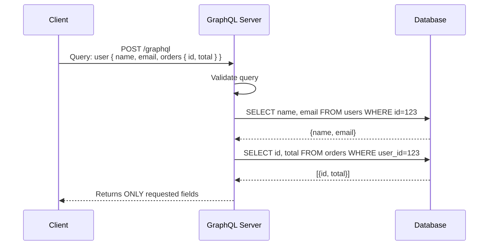
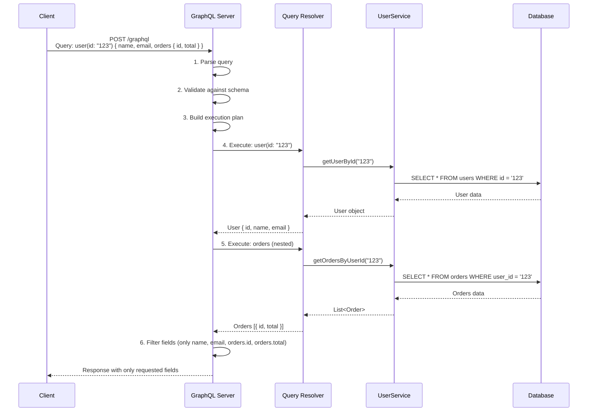
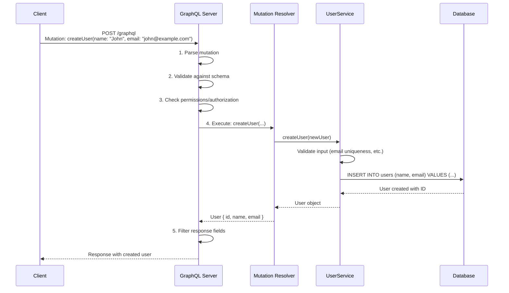
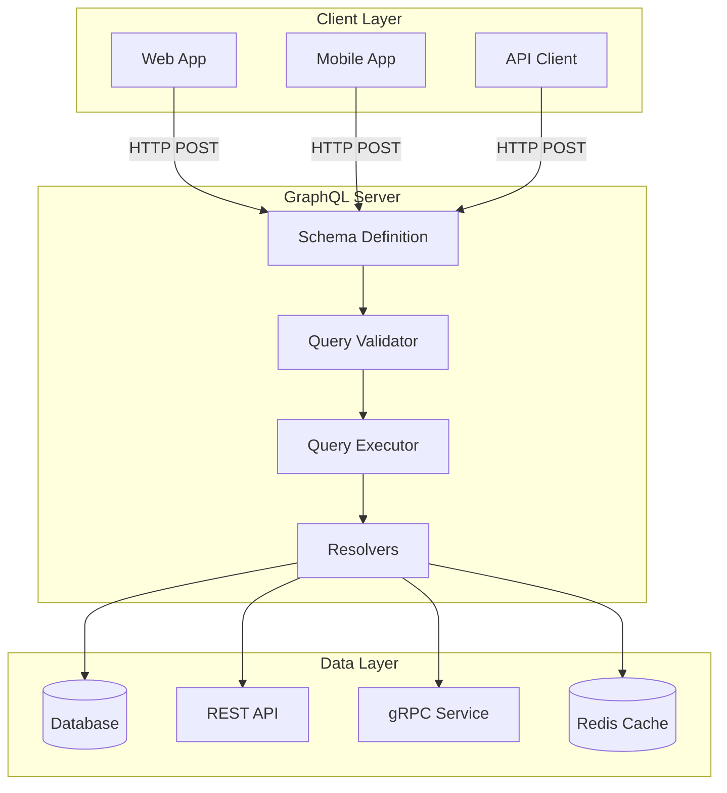
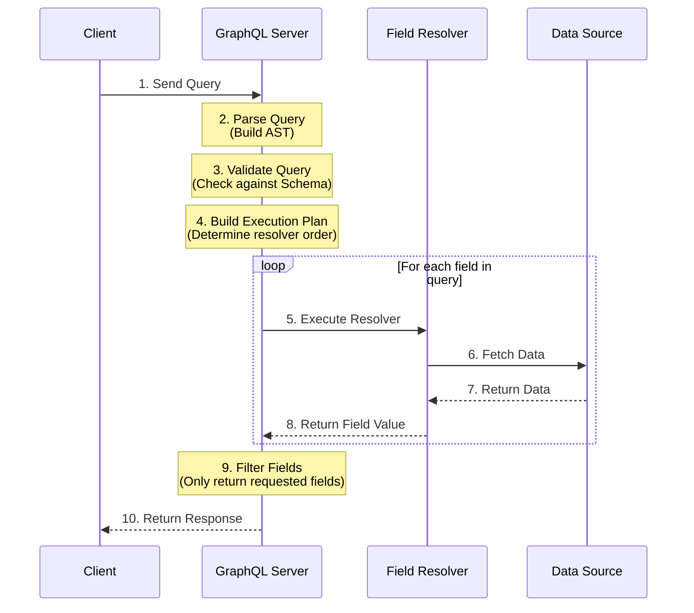
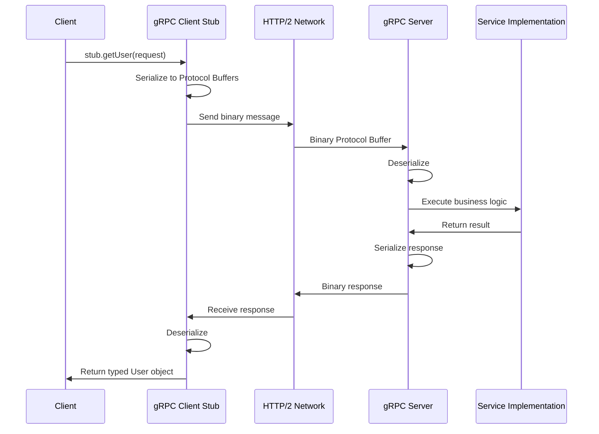
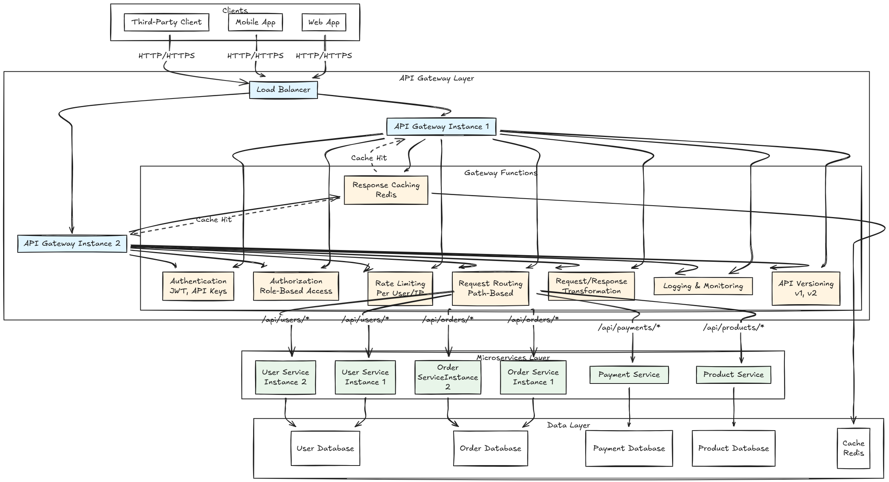
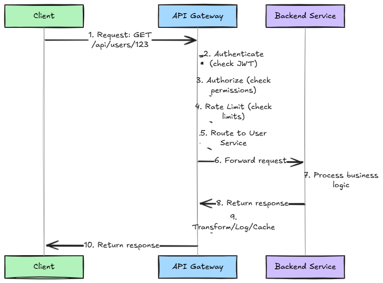

# API Design

A comprehensive guide to designing APIs, understanding different API styles (REST, GraphQL, gRPC), and implementing API Gateway patterns.

---

## Table of Contents

1. [What is an API?](#what-is-an-api)
2. [REST API](#rest-api)
3. [GraphQL](#graphql)
4. [gRPC](#grpc)
5. [REST vs GraphQL vs gRPC](#rest-vs-graphql-vs-grpc)
6. [API Gateway](#api-gateway)
7. [API Versioning](#api-versioning)
8. [API Best Practices](#api-best-practices)
9. [Real-World Examples](#real-world-examples)
10. [Interview Tips](#interview-tips)

---

# What is an API?

An **API (Application Programming Interface)** is a set of rules and protocols that allows different software applications to communicate with each other.

**Simple definition:** A contract that defines how applications can request and exchange data.

## API Communication Flow

```
┌─────────────────────────────────────────────────────────────────────────────┐
│                        API COMMUNICATION FLOW                               │
└─────────────────────────────────────────────────────────────────────────────┘

    Client Application                    Server Application
    (Frontend, Mobile,                    (Backend Service)
     Another Service)
         │                                       │
         │  1. HTTP Request                      │
         │     GET /api/users/123                │
         │     Headers: Authorization: Bearer... │
         │──────────────────────────────────────>│
         │                                       │
         │                                       │ 2. Process Request
         │                                       │    • Validate auth
         │                                       │    • Query database
         │                                       │    • Apply business logic
         │                                       │
         │  3. HTTP Response                     │
         │     Status: 200 OK                    │
         │     Body: {"id": 123, "name": "..."}  │
         │<──────────────────────────────────────│
         │                                       │
         │  4. Client processes response         │
         │                                       │
```

## Why APIs Matter

```
┌─────────────────────────────────────────────────────────────────────────────┐
│                         WHY APIS ARE IMPORTANT                              │
└─────────────────────────────────────────────────────────────────────────────┘

┌─────────────────────────────────────────────────────────────────────────────┐
│                                                                             │
│   1. DECOUPLING                                                             │
│      • Frontend and backend can be developed independently                  │
│      • Mobile app and web app share same backend                            │
│      • Services can be built by different teams                             │
│                                                                             │
│   2. REUSABILITY                                                            │
│      • One API can serve multiple clients (web, mobile, third-party)        │
│      • Don't duplicate business logic                                       │
│                                                                             │
│   3. SCALABILITY                                                            │
│      • Scale frontend and backend independently                             │
│      • Cache API responses                                                  │
│      • Load balance API servers                                             │
│                                                                             │
│   4. TECHNOLOGY INDEPENDENCE                                                │
│      • Frontend: React (JavaScript)                                         │
│      • Backend: Java, Python, Go (any language)                             │
│      • As long as they speak HTTP/JSON                                      │
│                                                                             │
│   5. STANDARDIZATION                                                        │
│      • Common patterns (REST, GraphQL)                                      │
│      • Easy for developers to understand                                    │
│      • Tooling support (Postman, Swagger)                                   │
│                                                                             │
└─────────────────────────────────────────────────────────────────────────────┘
```

---

# REST API

## What is REST?

**REST (Representational State Transfer)** is an architectural style for designing web APIs. REST APIs use standard HTTP methods to perform operations on resources.

**Simple definition:** An API that uses HTTP methods (GET, POST, PUT, DELETE) to interact with resources identified by URLs.

Think of REST like a library system - you have books (resources) at specific locations (URLs), and you use standard actions (HTTP methods) to interact with them.

## How does REST work?

REST follows these key principles:

1. **Resource-Based**: Everything is a resource (users, orders, products) identified by URLs
   - Example: `/api/users/123` represents user with ID 123

2. **HTTP Methods**: Use standard HTTP methods to interact with resources
   - GET - Retrieve a resource
   - POST - Create a new resource
   - PUT - Update entire resource
   - PATCH - Partial update
   - DELETE - Remove a resource

3. **Stateless**: Each request contains all information needed. Server doesn't store client state between requests.

4. **Uniform Interface**: Consistent URL structure, standard HTTP status codes, standard response formats (JSON)

5. **Cacheable**: Responses can be cached using HTTP cache headers
6. **Layered System**: Can have load balancers, proxies, gateways - client doesn't know about intermediate layers

## REST API Design Best Practices

1. **Use Nouns, Not Verbs**: `GET /api/users` not `GET /api/getUsers`
2. **Use Plural Nouns**: `GET /api/users` not `GET /api/user`
3. **Hierarchical Structure**: `GET /api/users/123/orders` for relationships
4. **Query Parameters**: Use for filtering, sorting, pagination - `GET /api/users?page=1&limit=10`
5. **Proper Status Codes**: Use 201 for created, 404 for not found, etc.
6. **Version Your APIs**: `/api/v1/users` vs `/api/v2/users`
7. **Consistent Response Format**: Use same structure for all responses
8. **Implement Pagination**: Don't return all records at once
9. **Use HTTPS**: Always in production
10. **Document Your API**: Use OpenAPI/Swagger

### Resource Naming

**Good Examples:**
- `GET /api/users` - Get all users
- `GET /api/users/123` - Get user with ID 123
- `POST /api/users` - Create new user
- `PUT /api/users/123` - Update entire user
- `PATCH /api/users/123` - Partial update
- `DELETE /api/users/123` - Delete user
- `GET /api/users/123/orders` - Get orders for user 123

**Bad Examples:**
- ❌ `GET /api/getUser/123` - Don't use verbs in URLs
- ❌ `POST /api/user/123/delete` - Use DELETE method instead
- ❌ `GET /api/user_123` - Use `/users/123` format

**Rules:**
- Use nouns, not verbs
- Use plural nouns for collections (`/users`, not `/user`)
- Use hierarchical structure for relationships
- Keep URLs simple and intuitive

### HTTP Methods

- **GET**: Retrieve resource(s). Safe and idempotent. No request body.
- **POST**: Create new resource. Not idempotent. Request body contains data.
- **PUT**: Update entire resource (replace). Idempotent. Request body contains full resource.
- **PATCH**: Partial update. Idempotent (depends on implementation). Request body contains only changed fields.
- **DELETE**: Remove resource. Idempotent. No request body.

### HTTP Status Codes

**Success (2xx):**
- `200 OK` - Request successful
- `201 Created` - Resource created successfully
- `204 No Content` - Success, no response body

**Client Errors (4xx):**
- `400 Bad Request` - Invalid request
- `401 Unauthorized` - Authentication required
- `403 Forbidden` - Not authorized
- `404 Not Found` - Resource doesn't exist
- `409 Conflict` - Resource conflict (e.g., duplicate email)

**Server Errors (5xx):**
- `500 Internal Server Error` - Unexpected server error
- `502 Bad Gateway` - Upstream server error
- `503 Service Unavailable` - Service temporarily unavailable

### REST API Example

**Get User:**
```
GET /api/users/123
Headers: Authorization: Bearer token...

Response: 200 OK
{
  "id": 123,
  "name": "John Doe",
  "email": "john@example.com"
}
```

**Create User:**
```
POST /api/users
Body: {
  "name": "Jane Smith",
  "email": "jane@example.com"
}

Response: 201 Created
{
  "id": 124,
  "name": "Jane Smith",
  "email": "jane@example.com"
}
```

## What are the benefits of using REST?

1. **Simple and Standard**: Uses standard HTTP methods that everyone understands
2. **Stateless**: Each request is independent, making it easier to scale
3. **Cacheable**: HTTP caching works out of the box
4. **Language Agnostic**: Works with any programming language
5. **Tooling Support**: Great tooling (Postman, Swagger, etc.)
6. **Browser Friendly**: Works directly from browsers

## What are the disadvantages of REST?

1. **Over-fetching**: You might get more data than you need
2. **Under-fetching**: You might need multiple requests to get all data
3. **No Standard Schema**: No built-in way to define API structure
4. **Versioning**: Need to handle API versioning manually

## When to use REST?

**Use REST when:**
- Building public APIs
- Simple CRUD operations
- Need HTTP caching
- Browser clients
- Team familiar with REST

**Don't use REST when:**
- Need to minimize data transfer (mobile apps)
- Complex nested queries
- Need real-time subscriptions
- Want to avoid over-fetching

---

# GraphQL

## What is GraphQL?

**GraphQL** is a query language and runtime for APIs that allows clients to request exactly the data they need.

**Simple definition:** An API where clients specify what fields they want, and the server returns only those fields.

Think of GraphQL like ordering at a restaurant - you tell the waiter exactly what you want (specific fields), and they bring you only that, not the entire menu.

## Why do we need GraphQL?

GraphQL solves three main problems with REST APIs:

1. **Over-fetching**: REST APIs often return more data than you need
   - Example: You only need user name and email, but REST returns name, email, phone, address, birthDate, etc.

2. **Under-fetching**: REST APIs might not return enough data, requiring multiple requests
   - Example: To get user info and their orders, you need 2 requests: GET /users/123 and GET /users/123/orders

3. **Rapid Iteration**: Frontend and backend teams can work independently
   - Frontend can request new fields without backend changes (if fields exist in schema)

## How does GraphQL work?

Here's the basic flow:

1. **Client sends a query** specifying exactly what fields it needs
2. **GraphQL server validates** the query against the schema
3. **Server executes resolvers** to fetch data from database/APIs
4. **Server filters and returns** only the requested fields

```mermaid
graph TB
    Client[Client Application]
    GraphQL[GraphQL Server]
    DB[(Database)]
    API[REST API]
    
    Client -->|Query: user { name, email }| GraphQL
    GraphQL -->|Validate Schema| GraphQL
    GraphQL -->|Execute Resolvers| DB
    GraphQL -->|Execute Resolvers| API
    DB -->|Data| GraphQL
    API -->|Data| GraphQL
    GraphQL -->|Filter & Return| Client
```

### Key Components

- **Schema**: Defines what data is available (types, fields, operations)
- **Query**: Read operation - client requests specific fields
- **Mutation**: Write operation - client modifies data
- **Subscription**: Real-time operation - client receives updates
- **Resolver**: Function that fetches data for each field

## GraphQL vs REST: Key Difference

**REST Problem:**
- Client needs: User name, email, and order IDs
- REST requires 2 requests:
  1. `GET /api/users/123` → Returns ALL user fields (name, email, phone, address, etc.) - **Over-fetching**
  2. `GET /api/users/123/orders` → Returns ALL order fields - **Over-fetching**
- Result: Transferred ~5KB, but only needed ~200 bytes (96% waste)

**GraphQL Solution:**
- Single request: `POST /graphql`
```graphql
query {
  user(id: "123") {
    name
    email
    orders {
      id
      total
    }
  }
}
```
- Response: Only requested fields
- Result: Transferred ~200 bytes, exactly what was needed (0% waste)



## GraphQL Core Concepts

### 1. Schema

The schema defines what data is available. It's like a contract between client and server.

**Schema Example:**
```graphql
type User {
  id: ID!              # ! means required
  name: String!
  email: String!
  age: Int             # Optional (no !)
  orders: [Order!]!    # Array of Order objects
}

type Query {
  user(id: ID!): User
  users(limit: Int): [User!]!
}

type Mutation {
  createUser(name: String!, email: String!): User!
}
```

**Type System:**
- **Scalar Types**: String, Int, Float, Boolean, ID (built-in)
- **Object Types**: User, Order (custom types you define)
- **List Types**: [String] (array)
- **Non-Null**: String! (required), String (optional)
- **Enum**: OrderStatus { PENDING, SHIPPED }


### 2. Queries (Read Operations)

Queries fetch data. They never modify data.

**Simple Query:**
```graphql
query {
  user(id: "123") {
    name
    email
  }
}
```

**Nested Query (Get related data):**
```graphql
query {
  user(id: "123") {
    name
    email
    orders {
      id
      total
    }
  }
}
```

**Query with Variables:**
```graphql
query GetUser($userId: ID!) {
  user(id: $userId) {
    name
    email
  }
}
# Variables: { "userId": "123" }
```

### How Resolvers Work

Resolvers are functions that fetch data for each field in a GraphQL query. They:
- Receive the parent object and field arguments
- Fetch data from database, API, or other source
- Return the field value
- Can be nested (resolver for `User.orders` receives the `User` object as parent)

### Query Execution Flow



### 3. Mutations (Write Operations)

Mutations modify data (create, update, delete).

**Create:**
```graphql
mutation {
  createUser(name: "John", email: "john@example.com") {
    id
    name
    email
  }
}
```

**Update:**
```graphql
mutation {
  updateUser(id: "123", name: "John Smith") {
    id
    name
  }
}
```

**Delete:**
```graphql
mutation {
  deleteUser(id: "123") {
    id
  }
}
```


### Mutation Execution Flow



### 4. Subscriptions (Real-time Updates)

Subscriptions allow clients to receive **real-time updates** when data changes on the server. They use WebSockets for persistent connections.

#### Subscription Example

```graphql
# Subscribe to order status changes
subscription {
  orderStatusChanged(orderId: "456") {
    id
    status
    updatedAt
    estimatedDelivery
  }
}

# Client receives updates automatically:
# Update 1:
{
  "data": {
    "orderStatusChanged": {
      "id": "456",
      "status": "PROCESSING",
      "updatedAt": "2024-01-15T10:00:00Z",
      "estimatedDelivery": "2024-01-20"
    }
  }
}

# Update 2 (when status changes):
{
  "data": {
    "orderStatusChanged": {
      "id": "456",
      "status": "SHIPPED",
      "updatedAt": "2024-01-16T14:30:00Z",
      "estimatedDelivery": "2024-01-20"
    }
  }
}
```

#### Subscription with Filters

```graphql
# Subscribe to all orders for a user
subscription {
  userOrders(userId: "123") {
    id
    status
    total
    updatedAt
  }
}

# Subscribe to new users
subscription {
  userCreated {
    id
    name
    email
    createdAt
  }
}
```

### How Subscriptions Work

Subscriptions use **WebSockets** under the hood to maintain a persistent connection. The resolver returns a reactive stream (Publisher) that emits events when data changes. The GraphQL server handles the WebSocket connection and streams updates to the client.

### GraphQL Architecture: How It All Works Together



### GraphQL Request/Response Cycle



### How Resolvers Work

Resolvers are functions that fetch data for each field. When you query `user { name, orders }`, the resolver for `user` fetches the user, then the resolver for `orders` fetches the orders. The server filters and returns only the requested fields.

### 4. Subscriptions (Real-time Updates)

Subscriptions allow clients to receive real-time updates when data changes.

**Example:**
```graphql
subscription {
  orderStatusChanged(orderId: "456") {
    id
    status
    updatedAt
  }
}
```

Client automatically receives updates when order status changes (uses WebSockets under the hood).

## What are the benefits of using GraphQL?

1. **No Over-fetching**: Get exactly the data you need, nothing more
2. **No Under-fetching**: Get related data in one request (user + orders in one query)
3. **Single Endpoint**: One endpoint (`/graphql`) for all operations
4. **Strongly Typed**: Schema defines exact structure, prevents errors
5. **Introspection**: Can query the schema itself to discover available fields
6. **Versioning**: Add new fields without breaking existing clients

## What are the disadvantages of GraphQL?

1. **Complexity**: Steeper learning curve than REST
2. **Caching**: Harder to cache (single endpoint, complex queries)
3. **Over-engineering**: Overkill for simple APIs
4. **N+1 Problem**: Can cause multiple database queries if not optimized
5. **File Uploads**: Not built-in, need workarounds
6. **Rate Limiting**: Harder to implement (complex queries vary in cost)

## When to use GraphQL?

**Use GraphQL when:**
- Multiple clients need different data shapes (web app needs more fields, mobile needs fewer)
- Mobile apps need to minimize data transfer
- Complex nested data relationships
- Need real-time subscriptions
- Want to avoid API versioning

**Don't use GraphQL when:**
- Simple CRUD operations
- Need simple HTTP caching
- Team unfamiliar with GraphQL
- Simple data requirements
- High performance is critical (REST can be faster for simple cases)

---

# gRPC

## What is gRPC?

**gRPC (gRPC Remote Procedure Calls)** is a high-performance RPC framework developed by Google that uses HTTP/2 and Protocol Buffers.

**Simple definition:** A way to call functions on remote servers as if they were local, with high performance and type safety.

Think of gRPC like calling a function in your code, but that function runs on a different server. You write the function call normally, and gRPC handles all the network communication behind the scenes.

## Why do we need gRPC?

gRPC is designed for:
1. **Performance**: Binary protocol (Protocol Buffers) is 3-10x faster than JSON
2. **Type Safety**: Strongly typed contracts via .proto files (compile-time checks)
3. **Streaming**: Built-in support for streaming requests/responses
4. **Language Agnostic**: Works across multiple programming languages (Java, Python, Go, etc.)
5. **HTTP/2**: Leverages HTTP/2 features (multiplexing, header compression)

## How does gRPC work?

Here's the step-by-step flow:

1. **Define .proto file** - Define your service and message types
2. **Generate code** - Use protoc compiler to generate client/server code
3. **Client calls method** - Call remote method like a local function: `stub.getUser(request)`
4. **Serialize** - gRPC serializes request to Protocol Buffers (binary format)
5. **Send over HTTP/2** - Binary message sent over HTTP/2
6. **Server processes** - Server deserializes, executes business logic, serializes response
7. **Client receives** - Client deserializes response and gets typed result



## gRPC vs REST: Key Differences

**REST:**
- Protocol: HTTP/1.1
- Format: JSON (text, human-readable)
- Performance: Good
- Streaming: No (request-response only)
- Type Safety: No (runtime checks)
- Browser Support: Excellent
- Use Case: Public APIs, Web apps

**gRPC:**
- Protocol: HTTP/2
- Format: Protocol Buffers (binary)
- Performance: Excellent (3-10x faster)
- Streaming: Yes (4 types)
- Type Safety: Yes (compile-time)
- Browser Support: Limited (need gRPC-Web)
- Use Case: Microservices, Internal APIs

## Protocol Buffers (Protobuf)

Protocol Buffers is Google's binary serialization format. It's the foundation of gRPC.

### Why Protocol Buffers?

1. **Size Efficiency**: Binary format is 3-10x smaller than JSON
   - Field numbers instead of field names
   - No whitespace, quotes, or colons
   - Example: JSON ~150 bytes → Protobuf ~60 bytes (60% smaller)

2. **Speed**: Faster serialization/deserialization than JSON
   - No parsing overhead
   - Optimized binary encoding

3. **Type Safety**: Strongly typed schema with compile-time validation

4. **Schema Evolution**: Add new fields without breaking old clients

### Protocol Buffer Example

```protobuf
// user.proto
syntax = "proto3";

service UserService {
  rpc GetUser(GetUserRequest) returns (User);
  rpc ListUsers(ListUsersRequest) returns (stream User);
}

message GetUserRequest {
  string user_id = 1;  // Field number
}

message User {
  string id = 1;
  string name = 2;
  string email = 3;
  int32 age = 4;
}
```

## gRPC Streaming Types

gRPC supports four types of RPC methods:

### 1. Unary RPC
One request, one response (like REST).
```protobuf
rpc GetUser(GetUserRequest) returns (User);
```

### 2. Server Streaming
One request, stream of responses.
```protobuf
rpc ListUsers(ListUsersRequest) returns (stream User);
```
**Use Case:** Server sends multiple items over time (real-time updates, large datasets)

### 3. Client Streaming
Stream of requests, one response.
```protobuf
rpc CreateUsers(stream CreateUserRequest) returns (CreateUsersResponse);
```
**Use Case:** Client sends multiple items, server processes and returns summary (batch upload)

### 4. Bidirectional Streaming
Stream of requests, stream of responses.
```protobuf
rpc ChatWithUsers(stream ChatMessage) returns (stream ChatMessage);
```
**Use Case:** Real-time chat, gaming, collaborative editing

## gRPC Implementation Overview

### Development Workflow

1. **Define .proto file** - Define service and message types
2. **Generate code** - Use protoc compiler to generate client/server stubs
3. **Implement server** - Extend generated base class and implement RPC methods
4. **Create client** - Use generated stub to call remote methods
5. **Deploy** - Run server and connect clients

### Key Implementation Points

- **Server**: Extends generated `*ServiceImplBase` class, implements RPC methods
- **Client**: Uses generated stub (blocking or async) to make calls
- **Streaming**: Use `StreamObserver` for streaming RPCs
- **Error Handling**: Use gRPC status codes and error details
- **Code Generation**: Automatic from .proto files using protoc compiler

## What are the benefits of using gRPC?

1. **Performance**: 3-10x faster than REST
   - Binary Protocol Buffers (smaller payloads)
   - HTTP/2 multiplexing (multiple requests on one connection)
   - No JSON parsing overhead

2. **Type Safety**: Strongly typed contracts via .proto files
   - Compile-time validation
   - Auto-generated client/server code
   - Prevents runtime errors

3. **Streaming Support**: Built-in support for streaming
   - Four streaming types (unary, server, client, bidirectional)
   - Perfect for real-time communication, chat, gaming

4. **Language Agnostic**: Write .proto once, use in any language
   - Consistent API across services
   - Easy microservices integration

5. **Schema Evolution**: Add new fields without breaking clients
   - Backward and forward compatible

## What are the disadvantages of gRPC?

1. **Browser Support**: Limited native browser support (need gRPC-Web proxy)
2. **Debugging Difficulty**: Binary format is not human-readable, harder to inspect
3. **Learning Curve**: Need to learn Protocol Buffers and .proto syntax
4. **Less Flexibility**: Strict schema required, schema changes need code generation
5. **Tooling**: Less mature tooling than REST (fewer debugging tools)
6. **Caching**: HTTP caching doesn't work well with binary format

## When to use gRPC?

**Use gRPC when:**
- Microservices communication (service-to-service)
- High performance requirements (low latency, high throughput)
- Need streaming (real-time data, chat, gaming)
- Strong typing important (contract-first development)
- Internal APIs only (not public-facing)
- Services in different languages (polyglot architecture)

**Don't use gRPC when:**
- Public APIs (browser clients)
- Simple CRUD operations
- Team unfamiliar with Protocol Buffers
- Need maximum flexibility (rapid schema changes)
- Simple HTTP caching is important

**Real-World Examples:**
- ✅ Google Cloud APIs, Kubernetes, Netflix, Uber (microservices)
- ❌ GitHub API, Twitter API (public REST APIs)

---

# REST vs GraphQL vs gRPC

## Quick Comparison

| Aspect | REST | GraphQL | gRPC |
|--------|------|---------|------|
| **Data Format** | JSON (text) | JSON (text) | Binary (Protobuf) |
| **Performance** | Good | Good | Excellent (3-10x faster) |
| **Over-fetching** | Yes (common) | No | No |
| **Under-fetching** | Yes (multiple requests) | No | No |
| **Caching** | Excellent (HTTP caching) | Limited | Limited |
| **Learning Curve** | Easy | Medium | Hard |
| **Browser Support** | Excellent | Good | Limited |
| **Streaming** | No | Yes (Subscriptions) | Yes (4 types) |
| **Type Safety** | No | Schema-based | Strong (compile-time) |
| **Use Case** | Public APIs, Web apps | Mobile apps, Complex queries | Microservices, Internal |

## When to Use What?

**Use REST when:**
- Building public APIs
- Simple CRUD operations
- Need HTTP caching
- Browser clients
- Team familiar with REST

**Use GraphQL when:**
- Mobile apps (minimize data transfer)
- Complex nested queries
- Multiple clients with different needs
- Need real-time subscriptions
- Want to avoid over-fetching

**Use gRPC when:**
- Microservices (service-to-service)
- High performance requirements
- Need streaming
- Internal APIs only
- Strong typing important

---

# API Gateway

## What is an API Gateway?

An **API Gateway** is a service that acts as an intermediary between clients and backend microservices. 
It accepts API requests, routes them to the appropriate services, and handles common tasks like authentication, rate limiting, and request transformation.

**Simple definition:** A single entry point that sits in front of your microservices and handles all the common infrastructure concerns, so your services can focus on business logic.

Think of it like a receptionist in a building - instead of clients going directly to each department, they go through the receptionist who routes them to the right place and handles common tasks like security checks.

## Why do we need an API Gateway?

### The Problem Without API Gateway

In a microservices architecture, you have multiple services (User Service, Order Service, Payment Service, etc.). Without a gateway, each service needs to implement:

- Authentication and authorization
- Rate limiting
- Logging and monitoring
- Request validation
- Error handling
- Protocol translation

**Problems this creates:**

1. **Code Duplication**: Every service has the same authentication code, rate limiting code, etc.
2. **Inconsistent Implementation**: Service A might use JWT, Service B uses API keys - different security approaches
3. **Hard to Maintain**: If you need to change rate limiting rules, you have to update all services
4. **Client Complexity**: Clients need to know all service endpoints and handle different protocols
5. **Security Issues**: Multiple attack surfaces, inconsistent security policies

### The Solution: API Gateway

Instead of each service handling these concerns, the API Gateway handles them centrally:

```
    Client
      │
      ▼
    ┌─────────────────────┐
    │   API Gateway         │  ← Handles: Auth, Rate Limit, Routing, etc.
    └──────────┬────────────┘
               │
      ┌────────┼────────┬────────┐
      │        │        │        │
      ▼        ▼        ▼        ▼
   User    Order   Payment  Product
  Service Service Service  Service
  (Only Business Logic)
```

**Benefits:**

- **Centralized Management**: Update authentication rules in one place, not in every service
- **Consistent Security**: All services use the same security policies
- **Simpler Services**: Services focus only on business logic
- **Better Client Experience**: Clients interact with one endpoint, not multiple services
- **Easier Monitoring**: All requests go through one point, making it easier to track

## How does an API Gateway work?

Here's the step-by-step flow when a client makes a request:

1. **Client sends request** to the API Gateway (e.g., `GET /api/users/123`)

2. **Authentication**: Gateway checks if the request has a valid token (JWT, API key, etc.)

3. **Authorization**: Gateway verifies if the user has permission to access this resource

4. **Rate Limiting**: Gateway checks if the client has exceeded their request limit

5. **Request Routing**: Gateway looks at the URL path and routes to the correct service
   - `/api/users/*` → User Service
   - `/api/orders/*` → Order Service

6. **Request Transformation**: Gateway may transform the request format if needed (e.g., REST to gRPC)

7. **Forward to Service**: Gateway forwards the request to the appropriate microservice

8. **Response Handling**: When the service responds, the gateway:
   - Transforms the response if needed
   - Caches it (if cacheable)
   - Logs the request/response
   - Returns it to the client

### API Gateway Architecture Diagram



### Request Flow Example



**Key Features Shown:**

1. **High Availability**: Multiple API Gateway instances behind a load balancer
2. **Gateway Functions**: All cross-cutting concerns handled in one place
3. **Service Routing**: Path-based routing to different microservices
4. **Load Balancing**: Multiple instances of services for scalability
5. **Caching**: Response caching to reduce backend load
6. **Request Flow**: Complete sequence from client to database and back

## What are the responsibilities of an API Gateway?

An API Gateway typically handles these tasks:

1. **Request Routing**: Routes requests to the correct microservice based on URL path
   - Example: `/api/users/*` goes to User Service, `/api/orders/*` goes to Order Service

2. **Authentication & Authorization**: Validates tokens and checks user permissions
   - Validates JWT tokens, API keys, OAuth tokens
   - Checks if user has permission to access the resource

3. **Rate Limiting**: Prevents abuse by limiting requests per user/IP
   - Example: Max 100 requests per minute per user

4. **Request/Response Transformation**: Converts between different formats
   - Example: Client sends REST request, gateway converts to gRPC for backend service

5. **Load Balancing**: Distributes requests across multiple instances of a service

6. **Caching**: Stores responses to reduce load on backend services

7. **Logging & Monitoring**: Tracks all requests for analytics and debugging

8. **Error Handling**: Standardizes error responses and implements circuit breakers

9. **API Versioning**: Routes different API versions to different service versions
   - Example: `/api/v1/users` vs `/api/v2/users`

10. **Security**: Handles CORS, IP whitelisting, DDoS protection

## Common API Gateway Patterns

### 1. Request Routing

The gateway routes requests to different services based on the URL path.

**Example:**
- Client requests: `GET /api/users/123`
- Gateway sees `/api/users/*` and routes to User Service
- Client requests: `GET /api/orders/456`
- Gateway sees `/api/orders/*` and routes to Order Service

### 2. Request Aggregation

The gateway can call multiple services and combine their responses into one.

**Example:** Client wants a user dashboard
- Gateway calls User Service (get user info)
- Gateway calls Order Service (get user orders)
- Gateway calls Payment Service (get payment history)
- Gateway combines all responses and returns to client

This reduces the number of round trips the client needs to make.

### 3. Protocol Translation

The gateway can translate between different protocols.

**Example:**
- Client sends REST request (HTTP/JSON)
- Backend service uses gRPC (binary protocol)
- Gateway translates REST → gRPC when forwarding
- Gateway translates gRPC → REST when responding

This allows clients to use REST while services use gRPC internally.

## What are the benefits of using an API Gateway?

1. **Abstraction**: Clients don't need to know about individual services. They interact with one gateway endpoint, and the gateway handles routing to the right service.

2. **Security**: All security concerns (authentication, authorization, rate limiting) are handled in one place. This makes it easier to enforce consistent security policies and reduces the attack surface.

3. **Performance**: The gateway can cache responses, reducing load on backend services. It can also aggregate requests, reducing the number of round trips clients need to make.

4. **Developer Experience**: Developers working on services can focus on business logic instead of infrastructure concerns like authentication and rate limiting.

5. **Consumer Experience**: Clients get a unified API interface, making it easier to discover and use APIs. They don't need to understand the internal service architecture.

6. **Monitoring**: All requests go through one point, making it easier to track usage, identify issues, and collect metrics.

7. **Versioning**: The gateway can handle multiple API versions simultaneously, routing `/api/v1/*` to one version and `/api/v2/*` to another.

## What are the disadvantages of using an API Gateway?

1. **Single Point of Failure**: If the gateway goes down, all services become inaccessible. This is why gateways need to be highly available (multiple instances, load balanced).

2. **Bottleneck**: All traffic goes through the gateway, which can become a bottleneck if not scaled properly.

3. **Additional Latency**: The gateway adds one extra hop in the request path, which adds a small amount of latency (usually negligible).

4. **Complexity**: It's another component to manage, deploy, and monitor. This adds operational overhead.

5. **Cost**: You need additional infrastructure to run the gateway (servers, load balancers, etc.).

## When to use an API Gateway?

**Use an API Gateway when:**

- You have multiple microservices (3+ services)
- You need centralized authentication and rate limiting
- You have multiple client types (web app, mobile app, third-party integrations)
- You want to hide your internal service architecture from clients
- You need API versioning support
- You want consistent security policies across all services

**Don't use an API Gateway when:**

- You have a single service or monolith
- Your application is simple and doesn't need these features
- Direct service access is acceptable
- You want to minimize latency (though the latency added is usually very small)
- The operational overhead isn't worth it for your use case

## Popular API Gateway Solutions

- **Kong**: Open-source, self-hosted, very popular
- **AWS API Gateway**: Managed service, good if you're on AWS
- **Azure API Management**: Managed service for Azure
- **Nginx**: Can be used as a simple API gateway, high performance
- **Traefik**: Good for Kubernetes environments
- **Ambassador**: Kubernetes-native API gateway

---

# API Versioning

API versioning is the practice of managing changes to your API while maintaining backward compatibility.

## Why Version APIs?

```
┌─────────────────────────────────────────────────────────────────────────────┐
│                    WHY VERSION APIS?                                        │
└─────────────────────────────────────────────────────────────────────────────┘

Problem: Breaking Changes
──────────────────────────

Version 1: GET /api/users/123
Response: {
  "id": 123,
  "name": "John",
  "email": "john@example.com"
}

You want to change:
• Remove "email" field
• Add "firstName" and "lastName" instead of "name"
• Change response structure

If you change directly:
❌ All existing clients break!
❌ Mobile apps crash
❌ Third-party integrations fail

Solution: Versioning
─────────────────────

Version 1: GET /api/v1/users/123  (keep old format)
Version 2: GET /api/v2/users/123  (new format)

Both work simultaneously!
```

## Versioning Strategies

### 1. URL Path Versioning

```
┌─────────────────────────────────────────────────────────────────────────────┐
│                    URL PATH VERSIONING                                      │
└─────────────────────────────────────────────────────────────────────────────┘

/api/v1/users/123
/api/v2/users/123

Pros:
• Clear and explicit
• Easy to route
• Cache-friendly

Cons:
• URL pollution
• Breaks REST resource concept
```

### 2. Query Parameter Versioning

```
┌─────────────────────────────────────────────────────────────────────────────┐
│                    QUERY PARAMETER VERSIONING                               │
└─────────────────────────────────────────────────────────────────────────────┘

/api/users/123?version=1
/api/users/123?api-version=2

Pros:
• Clean URLs
• Optional (default to latest)

Cons:
• Less visible
• Harder to cache
```

### 3. Header Versioning

```
┌─────────────────────────────────────────────────────────────────────────────┐
│                    HEADER VERSIONING                                        │
└─────────────────────────────────────────────────────────────────────────────┘

GET /api/users/123
Headers:
  Accept: application/vnd.api+json;version=1
  API-Version: 2

Pros:
• Clean URLs
• RESTful

Cons:
• Less discoverable
• Requires header knowledge
```

### 4. Content Negotiation

```
┌─────────────────────────────────────────────────────────────────────────────┐
│                    CONTENT NEGOTIATION VERSIONING                           │
└─────────────────────────────────────────────────────────────────────────────┘

GET /api/users/123
Headers:
  Accept: application/vnd.myapi.v1+json
  Accept: application/vnd.myapi.v2+json

Pros:
• RESTful
• Flexible

Cons:
• Complex
• Less common
```

## Versioning Best Practices

```
┌─────────────────────────────────────────────────────────────────────────────┐
│                    VERSIONING BEST PRACTICES                                 │
└─────────────────────────────────────────────────────────────────────────────┘

1. Use URL Path Versioning (Most Common)
   ✅ /api/v1/users
   ✅ /api/v2/users

2. Always Version from v1
   ✅ Start with /api/v1/
   ❌ Don't start with /api/v0/

3. Support Multiple Versions
   • Keep old versions running
   • Deprecate gradually
   • Give clients time to migrate

4. Document Breaking Changes
   • Clear changelog
   • Migration guide
   • Deprecation timeline

5. Use Semantic Versioning Concepts
   • v1.0 → v1.1 (backward compatible)
   • v1.x → v2.0 (breaking changes)

6. Set Deprecation Timeline
   • Announce 6 months before
   • Support for 1 year
   • Then remove
```

---

# API Best Practices

## Security

```
┌─────────────────────────────────────────────────────────────────────────────┐
│                    API SECURITY BEST PRACTICES                              │
└─────────────────────────────────────────────────────────────────────────────┘

1. Use HTTPS
   ✅ Always use HTTPS in production
   ❌ Never use HTTP for sensitive data

2. Authentication
   ✅ Use JWT tokens or OAuth 2.0
   ✅ Store tokens securely
   ❌ Don't put tokens in URLs

3. Authorization
   ✅ Implement role-based access control
   ✅ Check permissions on every request
   ❌ Don't trust client-side checks

4. Input Validation
   ✅ Validate all inputs
   ✅ Sanitize user data
   ❌ Don't trust client input

5. Rate Limiting
   ✅ Implement rate limiting
   ✅ Prevent abuse
   ❌ Don't allow unlimited requests

6. CORS
   ✅ Configure CORS properly
   ✅ Whitelist allowed origins
   ❌ Don't use wildcard (*) in production
```

## Performance

```
┌─────────────────────────────────────────────────────────────────────────────┐
│                    API PERFORMANCE BEST PRACTICES                           │
└─────────────────────────────────────────────────────────────────────────────┘

1. Pagination
   ✅ Always paginate large lists
   ✅ Use cursor-based pagination for large datasets
   ❌ Don't return all records

2. Caching
   ✅ Cache GET requests
   ✅ Use appropriate cache headers
   ❌ Don't cache sensitive data

3. Compression
   ✅ Enable Gzip/Brotli compression
   ✅ Reduce payload size
   ❌ Don't compress already compressed data

4. Database Optimization
   ✅ Use indexes
   ✅ Optimize queries
   ❌ Don't do N+1 queries

5. Response Size
   ✅ Return only needed fields
   ✅ Use field selection (GraphQL)
   ❌ Don't over-fetch data
```

## Documentation

```
┌─────────────────────────────────────────────────────────────────────────────┐
│                    API DOCUMENTATION BEST PRACTICES                         │
└─────────────────────────────────────────────────────────────────────────────┘

1. Use OpenAPI/Swagger
   ✅ Generate documentation from code
   ✅ Keep docs in sync with code
   ❌ Don't maintain docs separately

2. Include Examples
   ✅ Request examples
   ✅ Response examples
   ✅ Error examples

3. Document All Endpoints
   ✅ Every endpoint documented
   ✅ Parameters explained
   ✅ Response formats defined

4. Version Documentation
   ✅ Document each version
   ✅ Show differences between versions
   ❌ Don't mix versions in docs
```

---

# Real-World Examples

## REST API: GitHub API

```
┌─────────────────────────────────────────────────────────────────────────────┐
│                    GITHUB REST API EXAMPLE                                  │
└─────────────────────────────────────────────────────────────────────────────┘

GET /users/octocat
───────────────────

Response:
{
  "login": "octocat",
  "id": 1,
  "avatar_url": "https://github.com/images/error/octocat_happy.gif",
  "url": "https://api.github.com/users/octocat",
  "type": "User",
  "site_admin": false
}

GET /users/octocat/repos
─────────────────────────

Response:
[
  {
    "id": 1296269,
    "name": "Hello-World",
    "full_name": "octocat/Hello-World"
  }
]

Features:
• RESTful design
• Pagination
• Rate limiting
• Versioning (v3, v4)
• Comprehensive documentation
```

## GraphQL API: GitHub GraphQL API

```
┌─────────────────────────────────────────────────────────────────────────────┐
│                    GITHUB GRAPHQL API EXAMPLE                                │
└─────────────────────────────────────────────────────────────────────────────┘

Query:
{
  user(login: "octocat") {
    name
    email
    repositories(first: 5) {
      nodes {
        name
        description
      }
    }
  }
}

Response:
{
  "data": {
    "user": {
      "name": "The Octocat",
      "email": "octocat@github.com",
      "repositories": {
        "nodes": [
          {
            "name": "Hello-World",
            "description": "My first repository"
          }
        ]
      }
    }
  }
}

Benefits:
• Get exactly what you need
• Single request for nested data
• Strongly typed schema
```

## gRPC: Google Cloud APIs

```
┌─────────────────────────────────────────────────────────────────────────────┐
│                    GOOGLE CLOUD gRPC EXAMPLE                                 │
└─────────────────────────────────────────────────────────────────────────────┘

Many Google Cloud services use gRPC:
• Cloud Spanner (database)
• Cloud Pub/Sub (messaging)
• Cloud Speech-to-Text
• Cloud Vision API

Benefits:
• High performance
• Streaming support
• Type safety
• Language agnostic
```

---

# Interview Tips

## Common Questions

**Q: What is REST and what are its principles?**
A: REST is an architectural style for APIs. Key principles: resource-based URLs, HTTP methods (GET, POST, PUT, DELETE), stateless, uniform interface, cacheable, layered system.

**Q: REST vs GraphQL - when to use each?**
A: Use REST for public APIs, simple CRUD, when you need HTTP caching. Use GraphQL for mobile apps, complex nested queries, when you want to avoid over-fetching, and when multiple clients need different data shapes.

**Q: What is gRPC and when is it used?**
A: gRPC is a high-performance RPC framework using Protocol Buffers and HTTP/2. Use it for microservices communication, when you need high performance, streaming, or strong typing. Not ideal for browser clients.

**Q: What is an API Gateway and why use it?**
A: API Gateway is a single entry point that handles routing, authentication, rate limiting, and other cross-cutting concerns. Benefits: centralized concerns, service decoupling, consistent interface, easier versioning.

**Q: How do you version APIs?**
A: Most common approach is URL path versioning (/api/v1/users). Alternatives: query parameters, headers, content negotiation. Best practice: always version from v1, support multiple versions, provide deprecation timeline.

**Q: What are REST API best practices?**
A: Use nouns in URLs, proper HTTP methods, correct status codes, pagination, caching, HTTPS, input validation, rate limiting, comprehensive documentation.

**Q: How do you handle API authentication?**
A: Common methods: JWT tokens (stateless), OAuth 2.0 (third-party), API keys (simple services). Store tokens securely, never in URLs, validate on every request.

**Q: What is the N+1 problem in GraphQL?**
A: When a GraphQL query causes multiple database queries. Solution: use DataLoader to batch requests, or optimize resolver functions to fetch related data efficiently.

## Key Points to Remember

- **REST** = Resource-based, HTTP methods, stateless, cacheable
- **GraphQL** = Query language, get exactly what you need, single endpoint
- **gRPC** = High performance, binary, streaming, microservices
- **API Gateway** = Single entry point, handles cross-cutting concerns
- **Versioning** = URL path most common (/api/v1/)
- **Security** = HTTPS, authentication, authorization, rate limiting
- **Performance** = Pagination, caching, compression, optimization
- **Documentation** = OpenAPI/Swagger, examples, keep in sync

---

## Related Topics

- [Architecture Patterns](../system-design/Architecture-Patterns.md) - Microservices architecture
- [Web Servers & App Servers](../system-design/WebServers-AppServers.md) - Where APIs run
- [Real-Time Communication](../system-design/RealTime-Communication.md) - WebSockets, SSE for real-time APIs
- [Load Balancing](../system-design/LoadBalancing.md) - Distribute API traffic

