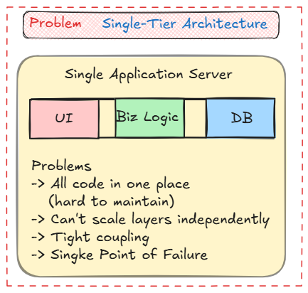
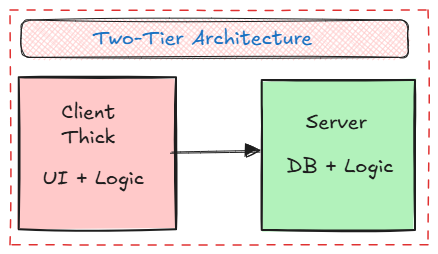
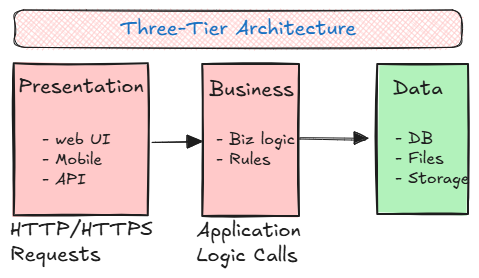
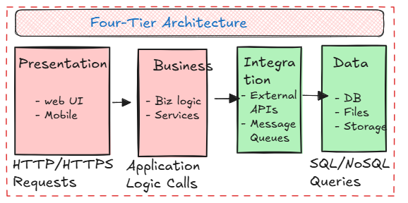
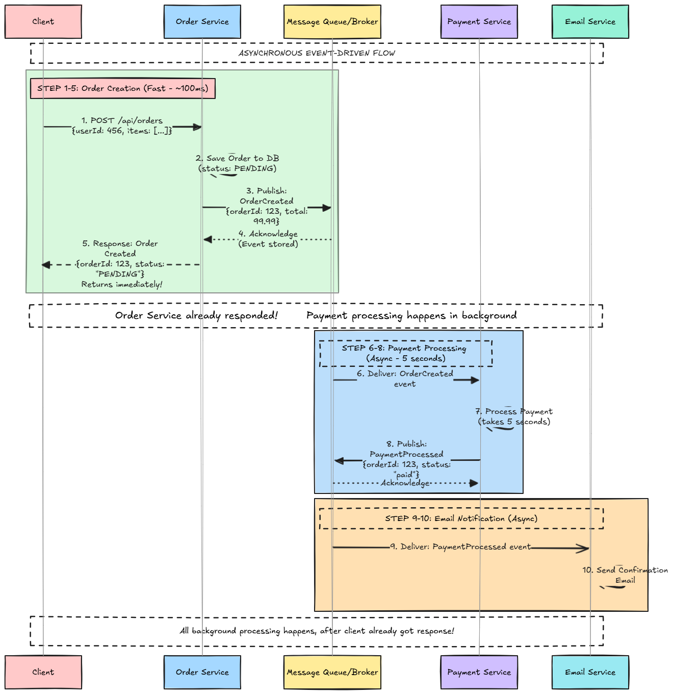

# Architecture Patterns

A comprehensive guide to understanding different software architecture patterns, from traditional N-tier architectures to modern microservices and enterprise integration patterns.

---

## Table of Contents

1. [N-tier Architecture](#n-tier-architecture)
2. [Monoliths](#monoliths)
3. [Microservices](#microservices)
4. [Monolith vs Microservices](#monolith-vs-microservices)
5. [Migration Strategies](#migration-strategies)
6. [Enterprise Service Bus (ESB)](#enterprise-service-bus-esb)
7. [Real-World Examples](#real-world-examples)
8. [Interview Tips](#interview-tips)

---

# N-tier Architecture

N-tier architecture (also called multi-tier architecture) is a client-server architecture pattern where the application is divided into **logical layers**, each running on separate physical machines or processes.

**Simple definition:** Split your application into layers (Presentation, Business Logic, Data) that can be deployed and scaled independently.

## Why N-tier Architecture?



## Common N-tier Patterns

### 2-tier Architecture (Client-Server)



```
    • Client: UI + some business logic
    • Server: Database + business logic
    • Example: Desktop apps with database backend
```

### 3-tier Architecture (Most Common)


```
    Benefits:
    • Separation of concerns
    • Independent scaling
    • Technology flexibility (different tech per tier)
    • Better security (database not directly exposed)
```

### 4-tier Architecture


```
    Integration Tier handles:
    • External service calls
    • Message queue integration
    • API gateways
    • Service orchestration
```

## N-tier Architecture Components

### Presentation Tier (Client Tier)

```
┌─────────────────────────────────────────────────────────────────────────────┐
│                        PRESENTATION TIER                                   │
└─────────────────────────────────────────────────────────────────────────────┘

Responsibilities:
• User interface rendering
• User input validation (client-side)
• Display data to users
• Handle user interactions

Technologies:
• Web: React, Angular, Vue.js
• Mobile: React Native, Flutter, Native apps
• Desktop: Electron, JavaFX, WPF

Characteristics:
• Stateless (preferred) or stateful
• Communicates with Business Tier via HTTP/HTTPS
• No direct database access
• Can be deployed on CDN (for web)
```

### Business Tier (Application Tier / Logic Tier)

```
┌─────────────────────────────────────────────────────────────────────────────┐
│                         BUSINESS TIER                                      │
└─────────────────────────────────────────────────────────────────────────────┘

Responsibilities:
• Business logic execution
• Data validation (server-side)
• Transaction management
• Security enforcement
• Workflow orchestration

Technologies:
• Java: Spring Boot, Java EE
• Python: Django, Flask, FastAPI
• Node.js: Express, NestJS
• .NET: ASP.NET Core

Characteristics:
• Stateless (scalable)
• Contains core business rules
• Validates all inputs
• Coordinates with Data Tier
• Can be horizontally scaled
```

### Data Tier (Database Tier)

```
┌─────────────────────────────────────────────────────────────────────────────┐
│                          DATA TIER                                         │
└─────────────────────────────────────────────────────────────────────────────┘

Responsibilities:
• Data persistence
• Data retrieval
• Data integrity
• Transaction management
• Backup and recovery

Technologies:
• SQL: PostgreSQL, MySQL, SQL Server
• NoSQL: MongoDB, Cassandra, DynamoDB
• Caching: Redis, Memcached
• File Storage: S3, Azure Blob

Characteristics:
• ACID properties (for SQL)
• Replication for availability
• Sharding for scale
• Backup strategies
• Access controlled
```

## N-tier Architecture Flow

```
┌─────────────────────────────────────────────────────────────────────────────┐
│                    REQUEST FLOW IN 3-TIER ARCHITECTURE                     │
└─────────────────────────────────────────────────────────────────────────────┘

    User Action: "View Order Details"
    
    Step 1: Presentation Tier
    ──────────────────────────
    Browser/App
        │
        │ HTTP GET /api/orders/123
        ▼
    Presentation Tier (API Gateway/Web Server)
        • Receives request
        • Validates authentication
        • Routes to Business Tier
    
    Step 2: Business Tier
    ─────────────────────
        │
        │ Internal API call
        ▼
    Business Tier (Application Server)
        • Validates business rules
        • Checks permissions
        • Prepares query
        • Calls Data Tier
    
    Step 3: Data Tier
    ──────────────────
        │
        │ SQL Query
        ▼
    Data Tier (Database)
        • Executes query
        • Returns data
    
    Step 4: Response (Reverse Path)
    ────────────────────────────────
    Data Tier → Business Tier → Presentation Tier → User
    
    Total Latency: ~50-200ms (depending on complexity)
```

## Advantages of N-tier Architecture

| Advantage | Description |
|-----------|-------------|
| **Separation of Concerns** | Each tier has a single responsibility |
| **Independent Scaling** | Scale each tier based on load (e.g., more app servers, fewer DB servers) |
| **Technology Flexibility** | Use different technologies per tier (React frontend, Java backend, PostgreSQL DB) |
| **Security** | Database not directly exposed to clients |
| **Maintainability** | Changes in one tier don't affect others |
| **Team Organization** | Different teams can work on different tiers |
| **Reusability** | Business logic can be reused by multiple presentation layers |

## Disadvantages of N-tier Architecture

| Disadvantage | Description |
|--------------|-------------|
| **Network Latency** | Multiple hops between tiers add latency |
| **Complexity** | More moving parts to manage |
| **Deployment** | Need to deploy and coordinate multiple tiers |
| **Testing** | Integration testing across tiers is complex |
| **Cost** | More infrastructure (servers, networking) |

## When to Use N-tier Architecture

**Use N-tier when:**
- Application has clear separation of concerns
- Different tiers have different scaling needs
- Multiple client types (web, mobile, desktop)
- Need to use different technologies per tier
- Security is important (database isolation)

**Don't use N-tier when:**
- Simple application (overkill)
- All tiers must scale together
- Tight coupling between layers
- Very low latency requirements (fewer hops = better)

---

# Monoliths

A **monolithic architecture** is a single, unified application where all components are tightly coupled and deployed together as one unit.

**Simple definition:** Everything (UI, business logic, database access) in one codebase, deployed as one application.

## Monolithic Architecture Structure

```
┌─────────────────────────────────────────────────────────────────────────────┐
│                        MONOLITHIC ARCHITECTURE                              │
└─────────────────────────────────────────────────────────────────────────────┘

    ┌──────────────────────────────────────────────────────────────┐
    │                    MONOLITHIC APPLICATION                    │
    │                                                              │
    │  ┌──────────────┐  ┌──────────────┐  ┌──────────────┐        │
    │  │   User       │  │   Order      │  │   Payment    │        │
    │  │   Module     │  │   Module     │  │   Module     │        │
    │  └──────────────┘  └──────────────┘  └──────────────┘        │
    │                                                              │
    │  ┌──────────────┐  ┌──────────────┐  ┌──────────────┐        │
    │  │   Product    │  │   Inventory  │  │   Shipping   │        │
    │  │   Module     │  │   Module     │  │   Module     │        │
    │  └──────────────┘  └──────────────┘  └──────────────┘        │
    │                                                              │
    │  All modules share:                                          │
    │  • Same codebase                                             │
    │  • Same database                                             │
    │  • Same deployment                                           │
    │  • Same runtime                                              │
    └──────────────────────────────────────────────────────────────┘
                              │
                              ▼
                    ┌─────────────────┐
                    │   Database      │
                    └─────────────────┘

    Deployment:
    • Single JAR/WAR file (Java)
    • Single executable (Go)
    • Single process (Node.js)
    • All-or-nothing deployment
```

## Types of Monoliths

### 1. Simple Monolith

```
┌─────────────────────────────────────────────────────────────────────────────┐
│                          SIMPLE MONOLITH                                    │
└─────────────────────────────────────────────────────────────────────────────┘

    ┌──────────────────────────────────────┐
    │      Single Application              │
    │                                      │
    │  • All code in one place             │
    │  • No clear module boundaries        │
    │  • Tightly coupled                   │
    │  • Quick to build initially          │
    │  • Hard to maintain later            │
    └──────────────────────────────────────┘

    Example: Small startup MVP
```

### 2. Modular Monolith

```
┌─────────────────────────────────────────────────────────────────────────────┐
│                         MODULAR MONOLITH                                    │
└─────────────────────────────────────────────────────────────────────────────┘

    ┌──────────────────────────────────────┐
    │      Monolithic Application          │
    │                                      │
    │  ┌──────────┐  ┌──────────┐          │
    │  │ Module A │  │ Module B │          │
    │  │ (Users)  │  │ (Orders) │          │
    │  └──────────┘  └──────────┘          │
    │                                      │
    │  • Clear module boundaries           │
    │  • Loose coupling between modules    │
    │  • Still deployed as one unit        │
    │  • Easier to extract later           │
    └──────────────────────────────────────┘

    Example: Well-structured enterprise app
    Benefit: Easier migration to microservices later
```

## Advantages of Monoliths

| Advantage | Description |
|-----------|-------------|
| **Simple Development** | One codebase, easy to understand |
| **Easy Testing** | All code in one place, straightforward testing |
| **Simple Deployment** | Deploy one artifact |
| **Performance** | No network calls between modules (in-process) |
| **ACID Transactions** | Easy to maintain consistency across modules |
| **Debugging** | Single process, easier to debug |
| **Low Latency** | No network hops between services |

## Disadvantages of Monoliths

| Disadvantage | Description |
|--------------|-------------|
| **Scaling** | Must scale entire application (can't scale parts) |
| **Technology Lock-in** | One technology stack for everything |
| **Deployment Risk** | Small change requires full redeployment |
| **Team Coordination** | Multiple teams work on same codebase (merge conflicts) |
| **Fault Isolation** | One bug can bring down entire application |
| **Long Startup Time** | Large application takes time to start |
| **Memory Usage** | All modules loaded in memory even if unused |

## When to Use Monoliths

**Use Monoliths when:**
- Small team (1-5 developers)
- Simple application
- Early stage startup (MVP)
- Tight coupling is acceptable
- Need strong consistency
- Low traffic expected
- Team is co-located

**Don't use Monoliths when:**
- Large team (10+ developers)
- Different scaling needs per feature
- Need different technologies
- High availability requirements
- Multiple teams working independently

---

# Microservices

**Microservices architecture** is an approach where an application is built as a collection of small, independent services that communicate over well-defined APIs.

**Simple definition:** Break your application into small, independent services, each handling one business capability.

## Microservices Architecture Structure

```
┌─────────────────────────────────────────────────────────────────────────────┐
│                        MICROSERVICES ARCHITECTURE                           │
└─────────────────────────────────────────────────────────────────────────────┘

    ┌──────────────┐    ┌──────────────┐    ┌──────────────┐
    │   User       │    │   Order      │    │   Payment    │
    │   Service    │    │   Service    │    │   Service    │
    │              │    │              │    │              │
    │  • Own DB    │    │  • Own DB    │    │  • Own DB    │
    │  • Own Code  │    │  • Own Code  │    │  • Own Code  │
    │  • Own Deploy│    │  • Own Deploy│    │  • Own Deploy│
    └──────┬───────┘    └──────┬───────┘    └──────┬───────┘
           │                   │                   │
           └───────────────────┼───────────────────┘
                               │
                    ┌──────────┴──────────┐
                    │   API Gateway      │
                    │   / Load Balancer  │
                    └────────────────────┘

    Each Service:
    • Independent deployment
    • Own database (database per service)
    • Own technology stack (can use different languages)
    • Own team ownership
    • Communicates via APIs (REST, gRPC, Message Queue)
```

## Microservices Characteristics

```
┌─────────────────────────────────────────────────────────────────────────────┐
│                    MICROSERVICES CHARACTERISTICS                            │
└─────────────────────────────────────────────────────────────────────────────┘

┌─────────────────────────────────────────────────────────────────────────────┐
│                                                                             │
│   1. INDEPENDENT DEPLOYMENT                                                 │
│      • Deploy User Service without affecting Order Service                  │
│      • Each service has its own CI/CD pipeline                              │
│      • Can deploy multiple times per day                                    │
│                                                                             │
│   2. TECHNOLOGY DIVERSITY                                                   │
│      • User Service: Java/Spring Boot                                       │
│      • Order Service: Node.js/Express                                       │
│      • Analytics Service: Python/FastAPI                                    │
│      • Use best tool for each job                                           │
│                                                                             │
│   3. DATABASE PER SERVICE                                                   │
│      • User Service → PostgreSQL                                            │
│      • Order Service → MongoDB                                              │
│      • Analytics Service → ClickHouse                                       │
│      • No shared database (avoids coupling)                                 │
│                                                                             │
│   4. SMALL, FOCUSED SERVICES                                                │
│      • Each service does ONE thing well                                     │
│      • User Service: User management only                                   │
│      • Order Service: Order processing only                                 │
│      • Follows Single Responsibility Principle                              │
│                                                                             │
│   5. DECENTRALIZED GOVERNANCE                                               │
│      • Each team owns their service                                         │
│      • Teams can make independent decisions                                 │
│      • No central architecture team needed                                  │
│                                                                             │
│   6. FAULT ISOLATION                                                        │
│      • If Payment Service crashes, Order Service still works                │
│      • Can implement circuit breakers                                       │
│      • Better resilience                                                    │
│                                                                             │
└─────────────────────────────────────────────────────────────────────────────┘
```

## Microservices Communication Patterns

### 1. Synchronous Communication (Request-Response)

```
┌─────────────────────────────────────────────────────────────────────────────┐
│                    SYNCHRONOUS COMMUNICATION                                │
└─────────────────────────────────────────────────────────────────────────────┘

    Client              API Gateway          Order Service      Payment Service
      │                      │                    │                    │
      │ 1. Create Order      │                    │                    │
      │─────────────────────>│                    │                    │
      │                      │ 2. POST /orders    │                    │
      │                      │───────────────────>│                    │
      │                      │                    │ 3. Charge Card     │
      │                      │                    │───────────────────>│
      │                      │                    │<────────────────── │
      │                      │                    │ 4. Payment OK      │
      │                      │<────────────────── │                    |
      │                      │ 5. Order Created   │                    │
      | <──────────────────  │                    │                    |  
      │ 6. Response          │                    │                    │

    Protocols: REST, gRPC, GraphQL
    Pros: Simple, easy to understand
    Cons: Tight coupling, cascading failures
```

### 2. Asynchronous Communication (Event-Driven)

In asynchronous communication, services communicate through events via a message broker. The key difference is that **the sender doesn't wait for the receiver to process the message** - it publishes the event and continues immediately.

#### How Asynchronous Communication Works


**Key Points from the Diagram:**
- **Steps 1-5** happen quickly (~100ms) - Order Service returns immediately
- **Steps 6-10** happen asynchronously in the background (5+ seconds)
- Client doesn't wait for payment processing
- All events flow through Message Queue/Broker
- Services are decoupled - don't know about each other

#### What "Return Immediately" Means

**Synchronous (Blocking):**
```
Order Service → Payment Service
     │              │
     │  Wait...     │  Processing (5 seconds)
     │  Wait...     │  ...
     │  Wait...     │  ...
     │<─────────────│  Done!
     │              │
Response after 5 seconds
```

**Asynchronous (Non-Blocking):**
```
Order Service → Message Queue → Payment Service
     │               │                │
     │  Publish      │                │
     │  Event        │                │
     │──────────────>│                │
     │               │                │
     │<───────────── │  Acknowledge   │
     │               │                │
Response after 50ms  (just publishing to queue)
     │               │                │
     │               │                │  Processing (5 seconds)
     │               │                │  (happens in background)
```

**Key Insight:** The Order Service doesn't wait for Payment Service to finish. It:
1. Publishes the event to the message queue
2. Gets acknowledgment from the queue (fast, ~50ms)
3. Returns response to client immediately
4. Payment processing happens **asynchronously in the background**

#### Detailed Flow Explanation

```
┌─────────────────────────────────────────────────────────────────────────────┐
│                    STEP-BY-STEP ASYNCHRONOUS FLOW                           │
└─────────────────────────────────────────────────────────────────────────────┘

STEP 1: Client Request
──────────────────────
Client sends: POST /api/orders
Body: {userId: 456, items: [...], total: 99.99}

STEP 2: Order Service Processing
──────────────────────────────────
Order Service:
  • Validates request
  • Creates order record in database
  • Order status = "PENDING"
  • Generates OrderCreated event

STEP 3: Publish Event (Non-Blocking)
──────────────────────────────────────
Order Service → Message Queue:
  Publish: OrderCreated {
    orderId: 123,
    userId: 456,
    total: 99.99,
    timestamp: "2024-01-20T10:30:00Z"
  }

Message Queue:
  • Stores event
  • Acknowledges receipt
  • Returns immediately to Order Service

Time taken: ~50ms (just publishing to queue)

STEP 4: Order Service Returns
───────────────────────────────
Order Service → Client:
  Response: {
    orderId: 123,
    status: "PENDING",
    message: "Order created, payment processing..."
  }

Total time: ~100ms (vs 5+ seconds in synchronous)

STEP 5: Background Processing (Async)
─────────────────────────────────────
Message Queue → Payment Service:
  Delivers: OrderCreated event

Payment Service:
  • Receives event
  • Processes payment (takes 5 seconds)
  • Updates order status
  • Publishes PaymentProcessed event

STEP 6: Other Services React (Async)
─────────────────────────────────────
Message Queue → Email Service:
  Delivers: PaymentProcessed event

Email Service:
  • Sends confirmation email
  • Updates user notifications

All happens asynchronously, Order Service already responded!
```

#### Why "Return Immediately" Matters

```
┌─────────────────────────────────────────────────────────────────────────────┐
│                    BENEFITS OF IMMEDIATE RETURN                             │
└─────────────────────────────────────────────────────────────────────────────┘

1. BETTER USER EXPERIENCE
   ───────────────────────
   Synchronous: User waits 5+ seconds for response
   Asynchronous: User gets response in ~100ms
   
   User sees: "Order created! Payment processing..."
   (Payment happens in background)

2. HIGHER THROUGHPUT
   ──────────────────
   Synchronous: Can handle 1 request per 5 seconds = 0.2 req/sec
   Asynchronous: Can handle 1 request per 0.1 seconds = 10 req/sec
   
   Order Service can process 50x more requests!

3. RESILIENCE
   ───────────
   If Payment Service is down:
   
   Synchronous: Order Service fails, user gets error
   Asynchronous: Order Service succeeds, event queued
                 Payment processes when service recovers

4. SCALABILITY
   ────────────
   • Order Service handles requests quickly
   • Payment Service processes at its own pace
   • Can scale services independently
   • No bottlenecks
```

#### Event-Driven Communication Principles

```
┌─────────────────────────────────────────────────────────────────────────────┐
│                    EVENT-DRIVEN PRINCIPLES                                  │
└─────────────────────────────────────────────────────────────────────────────┘

┌─────────────────────────────────────────────────────────────────────────────┐
│                                                                             │
│   1. FIRE-AND-FORGET                                                        │
│      • Publisher sends event and forgets about it                           │
│      • Doesn't wait for processing                                          │
│      • Doesn't know who will consume                                        │
│                                                                             │
│   2. DECOUPLING                                                             │
│      • Services don't know about each other                                 │
│      • Communicate only through events                                      │
│      • Can add/remove consumers without changing publisher                  │
│                                                                             │
│   3. EVENTUAL CONSISTENCY                                                   │
│      • Order status: "PENDING" initially                                    │
│      • Payment processes in background                                      │
│      • Status updates to "PAID" later                                       │
│      • Client can poll or use WebSocket for updates                         │
│                                                                             │
│   4. MESSAGE QUEUE AS BUFFER                                                │
│      • Events stored in queue                                               │
│      • Survive service failures                                             │
│      • Processed when consumer available                                    │
│      • Guaranteed delivery                                                  │
│                                                                             │
│   5. PARALLEL PROCESSING                                                    │
│      • Multiple services can process same event                             │
│      • Payment Service processes payment                                    │
│      • Email Service sends notification                                     │
│      • Analytics Service records event                                      │
│      • All happen in parallel                                               │
│                                                                             │
└─────────────────────────────────────────────────────────────────────────────┘
```

#### Synchronous vs Asynchronous Comparison

```
┌─────────────────────────────────────────────────────────────────────────────┐
│                    SYNCHRONOUS vs ASYNCHRONOUS                              │
└─────────────────────────────────────────────────────────────────────────────┘

┌─────────────────────────────────────────────────────────────────────────────┐
│                                                                             │
│   Aspect          │  Synchronous          │  Asynchronous                   │
│   ────────────────┼───────────────────────┼─────────────────────────────────│
│                   |                       |                                 │
│   Response Time   │  Slow (waits for      │  Fast (returns immediately)     │
│                   │   all processing)     │                                 │
│                                                                             │
│   Throughput      │  Low (blocked)        │  High (non-blocking)            │
│                                                                             │
│   Coupling        │  Tight (knows about   │  Loose (only knows queue)       │
│                   │   other services)     │                                 │
│                                                                             │
│   Failure         │  Cascading (one       │  Isolated (queue buffers)       │
│   Handling        │   failure affects all)│                                 │
│                                                                             │
│   Scalability     │  Limited (must scale  │  Independent (scale each)       │
│                   │   together)           │                                 │
│                                                                             │
│   Consistency     │  Immediate (strong)   │  Eventual (weak)                │
│                                                                             │
│   Complexity      │  Simple               │  More complex                   │
│                                                                             │
└─────────────────────────────────────────────────────────────────────────────┘
```

#### Real-World Example: E-Commerce Order

```
┌─────────────────────────────────────────────────────────────────────────────┐
│                    E-COMMERCE ORDER - ASYNCHRONOUS FLOW                     │
└─────────────────────────────────────────────────────────────────────────────┘

User clicks "Place Order"
    │
    ▼
Order Service (100ms):
  • Creates order (status: PENDING)
  • Publishes OrderCreated event
  • Returns: "Order #123 created! Processing payment..."
    │
    ▼
User sees confirmation immediately ✅
    │
    ▼
Background (async, happens later):
    │
    ├─▶ Payment Service processes payment (5 seconds)
    │   Publishes PaymentProcessed event
    │
    ├─▶ Inventory Service reserves items (2 seconds)
    │   Publishes InventoryReserved event
    │
    ├─▶ Email Service sends confirmation (1 second)
    │
    └─▶ Analytics Service records order (500ms)

All happen in parallel, user already got response!
```

**Protocols:** Message Queues (RabbitMQ, Kafka), Publisher/Subscriber
**Pros:** Loose coupling, better scalability, resilience, higher throughput
**Cons:** Eventual consistency, complexity, need to handle async errors

## Advantages of Microservices

| Advantage | Description |
|-----------|-------------|
| **Independent Scaling** | Scale high-traffic services independently |
| **Technology Diversity** | Use best technology for each service |
| **Fault Isolation** | One service failure doesn't bring down entire system |
| **Team Autonomy** | Teams can work independently |
| **Faster Deployment** | Deploy individual services frequently |
| **Easier Understanding** | Smaller codebase per service |
| **Better Resource Utilization** | Allocate resources per service needs |

## Disadvantages of Microservices

| Disadvantage | Description |
|--------------|-------------|
| **Complexity** | More services = more to manage |
| **Network Latency** | Inter-service calls add latency |
| **Distributed Transactions** | Hard to maintain ACID across services |
| **Data Consistency** | Eventual consistency challenges |
| **Testing Complexity** | Need to test service interactions |
| **Operational Overhead** | More deployments, monitoring, logging |
| **Debugging Difficulty** | Trace requests across multiple services |

## When to Use Microservices

**Use Microservices when:**
- Large team (10+ developers)
- Different scaling needs per feature
- Need technology diversity
- Services have clear boundaries
- High availability requirements
- Rapid feature development needed
- Team autonomy is important

**Don't use Microservices when:**
- Small team (1-5 developers)
- Simple application
- Tight coupling between features
- Need strong consistency
- Limited operational expertise
- Early stage startup

---

# Monolith vs Microservices

```
┌─────────────────────────────────────────────────────────────────────────────┐
│                    MONOLITH vs MICROSERVICES                                │
└─────────────────────────────────────────────────────────────────────────────┘

┌─────────────────────────────────────────────────────────────────────────────┐
│                                                                             │
│   Aspect              │  Monolith          │  Microservices                 │
│   ────────────────────┼────────────────────┼─────────────────────────────── │
│                       |                    |                                │
│   Complexity          │  Low               │  High                          │
│   Deployment          │  Simple (one unit) │  Complex (many services)       │
│   Scaling             │  Scale all         │  Scale independently           │
│   Technology          │  Single stack      │  Multiple stacks               │
│   Team Size           │  Small teams       │  Large teams                   │
│   Development Speed   │  Fast initially    │  Fast after setup              │
│   Testing             │  Simple            │  Complex (integration)         │
│   Debugging           │  Easy              │  Hard (distributed tracing)    │
│   Performance         │  Better (no hops)  │  Network latency               │
│   Consistency         │  Strong (ACID)     │  Eventual (BASE)               │
│   Fault Isolation     │  Poor              │  Good                          │
│   Cost                │  Lower             │  Higher (more infrastructure)  │
│                                                                             │
└─────────────────────────────────────────────────────────────────────────────┘
```
```
Consider MODULAR MONOLITH as middle ground:
┌────────────────────────────────────────────────────────────────────────────┐
│                                                                            │
│  • Structure like microservices (modules)                                  │
│  • Deploy like monolith (one unit)                                         │
│  • Easier migration path to microservices                                  │
│  • Best of both worlds for medium teams                                    │
│                                                                            │
└────────────────────────────────────────────────────────────────────────────┘
```

---

# Migration Strategies

## Strategy 1: Strangler Fig Pattern

```
┌─────────────────────────────────────────────────────────────────────────────┐
│                    STRANGLER FIG PATTERN                                    │
└─────────────────────────────────────────────────────────────────────────────┘

    Phase 1: Extract one service
    ─────────────────────────────
    
    Monolith                    New Service
    ┌──────────┐              ┌──────────┐
    │ All      │              │ User     │
    │ Features │              │ Service  │
    └────┬─────┘              └──────────┘
         │                          │
         │                          │
         └──────────┬───────────────┘
                    │
              API Gateway
              Routes:
              /users/* → User Service
              /* → Monolith
    
    Phase 2: Extract more services
    ────────────────────────────────
    
    Monolith (smaller)         Services
    ┌──────────┐              ┌──────────┐  ┌──────────┐
    │ Remaining│              │ User     │  │ Order    │
    │ Features │              │ Service  │  │ Service  │
    └──────────┘              └──────────┘  └──────────┘
    
    Phase 3: Monolith eliminated
    ────────────────────────────
    
    All services extracted, monolith removed!
    
    Benefits:
    • Gradual migration
    • Low risk
    • Can rollback easily
    • Test each service independently
```

## Strategy 2: Database Per Service

```
┌─────────────────────────────────────────────────────────────────────────────┐
│                    DATABASE PER SERVICE MIGRATION                            │
└─────────────────────────────────────────────────────────────────────────────┘

    Step 1: Shared Database (Monolith)
    ──────────────────────────────────
    
    Monolith
    ┌──────────┐
    │ All      │
    │ Services │─────┐
    └──────────┘     │
                     │
                     ▼
              ┌──────────┐
              │ Shared   │
              │ Database │
              └──────────┘
    
    Step 2: Extract Service with Own DB
    ────────────────────────────────────
    
    Monolith              User Service
    ┌──────────┐         ┌──────────┐
    │ Remaining│         │ User     │
    │ Services │         │ Service  │
    └────┬─────┘         └────┬─────┘
         │                    │
         │                    │
         ▼                    ▼
    ┌──────────┐         ┌──────────┐
    │ Shared   │         │ User DB  │
    │ Database │         │          │
    └──────────┘         └──────────┘
    
    Step 3: Data Synchronization
    ─────────────────────────────
    
    • Use Change Data Capture (CDC)
    • Or dual-write pattern (temporary)
    • Migrate data gradually
    • Switch reads to new DB
    • Stop writes to old DB
    
    Step 4: Complete Migration
    ──────────────────────────
    
    All services have own databases!
```

## Strategy 3: API Gateway Pattern

```
┌─────────────────────────────────────────────────────────────────────────────┐
│                    API GATEWAY MIGRATION                                    │
└─────────────────────────────────────────────────────────────────────────────┘

    Before: Direct Access
    ─────────────────────
    
    Client ──▶ Monolith
    
    After: API Gateway
    ──────────────────
    
    Client ──▶ API Gateway ──▶ Services
                              └─ Monolith (legacy)
    
    Benefits:
    • Clients don't know about migration
    • Can route gradually
    • Add new services transparently
    • Centralized auth, rate limiting
```

---

# Enterprise Service Bus (ESB)

An **Enterprise Service Bus (ESB)** is a middleware architecture pattern that provides a centralized communication layer between different applications and services.

**Simple definition:** A central "bus" that routes messages between different services, handling transformation, routing, and protocol conversion.

## What is ESB?

```
┌─────────────────────────────────────────────────────────────────────────────┐
│                    ENTERPRISE SERVICE BUS (ESB)                             │
└─────────────────────────────────────────────────────────────────────────────┘

    Service A          Service B          Service C
    (Java)             (.NET)             (Python)
         │                  │                  │
         │                  │                  │
         └──────────────────┼──────────────────┘
                            │
                            ▼
                    ┌───────────────┐
                    │      ESB      │
                    │               │
                    │  • Routing    │
                    │  • Transform  │
                    │  • Protocol   │
                    │    Convert    │
                    │  • Mediation  │
                    └───────┬───────┘
                            │
                            ▼
                    External Services
                    (SAP, Salesforce, etc.)

    ESB Responsibilities:
    • Message routing
    • Protocol transformation (SOAP → REST)
    • Data transformation (XML → JSON)
    • Service orchestration
    • Error handling
    • Security (authentication, authorization)
```

## ESB Architecture

```
┌─────────────────────────────────────────────────────────────────────────────┐
│                        ESB COMPONENTS                                       │
└─────────────────────────────────────────────────────────────────────────────┘

    ┌──────────────────────────────────────────────────────────────┐
    │                      ESB CORE                                │
    │                                                              │
    │  ┌──────────────┐  ┌──────────────┐  ┌──────────────┐        │
    │  │   Message    │  │  Protocol    │  │   Service    │        │
    │  │   Router     │  │  Adapters    │  │  Registry    │        │
    │  └──────────────┘  └──────────────┘  └──────────────┘        │
    │                                                              │
    │  ┌──────────────┐  ┌──────────────┐  ┌──────────────┐        │
    │  │   Message    │  │   Security   │  │  Monitoring  │        │
    │  │ Transformer  │  │   Layer      │  │  & Logging   │        │
    │  └──────────────┘  └──────────────┘  └──────────────┘        │
    └──────────────────────────────────────────────────────────────┘

    Message Flow:
    1. Service A sends message to ESB
    2. ESB transforms message format
    3. ESB routes to appropriate service
    4. ESB handles protocol conversion
    5. ESB delivers to Service B
```

## ESB vs API Gateway vs Message Broker

```
┌─────────────────────────────────────────────────────────────────────────────┐
│                    ESB vs API GATEWAY vs MESSAGE BROKER                     │
└─────────────────────────────────────────────────────────────────────────────┘

┌─────────────────────────────────────────────────────────────────────────────┐
│                                                                             │
│   Aspect          │  ESB              │  API Gateway      │  Message Broker │
│   ────────────────┼───────────────────┼───────────────────┼──────────────── │
│                                                                             │
│   Purpose         │  Enterprise       │  Client-facing    │  Async          │
│                   │  integration      │  API management   │  messaging      │
│                                                                             │
│   Communication   │  Sync + Async     │  Sync (REST)      │  Async (Queue)  │
│                                                                             │
│   Transformation  │  Heavy (XML,      │  Light (JSON)     │  None/Minimal   │
│                   │   SOAP, etc.)     │                   │                 │
│                                                                             │
│   Routing         │  Complex          │  Simple            │  Topic/Queue   │
│                                                                             │
│   Orchestration   │  Yes (workflows)  │  No                │  No            │
│                                                                             │
│   Use Case        │  Legacy system    │  Microservices     │  Event-driven  │
│                   │  integration      │  API exposure      │  systems       │
│                                                                             │
│   Complexity      │  High             │  Medium            │  Low           │
│                                                                             │
│   Modern          │  Declining        │  Growing           │  Growing       │
│   Adoption        │  (Service Mesh)   │  (Popular)         │  (Popular)     │
│                                                                             │
└─────────────────────────────────────────────────────────────────────────────┘
```

## Advantages of ESB

| Advantage | Description |
|-----------|-------------|
| **Centralized Integration** | Single point for all integrations |
| **Protocol Transformation** | Convert between SOAP, REST, JMS, etc. |
| **Data Transformation** | Transform XML, JSON, CSV formats |
| **Service Orchestration** | Coordinate multiple services |
| **Reusability** | Common integration logic reusable |
| **Governance** | Centralized security, monitoring |

## Disadvantages of ESB

| Disadvantage | Description |
|--------------|-------------|
| **Single Point of Failure** | ESB failure affects all services |
| **Bottleneck** | All traffic goes through ESB |
| **Complexity** | Hard to understand and maintain |
| **Tight Coupling** | Services depend on ESB |
| **Vendor Lock-in** | Often proprietary solutions |
| **Scalability** | Hard to scale horizontally |
| **Outdated** | Being replaced by Service Mesh, API Gateway |

## Modern Alternatives to ESB

```
┌─────────────────────────────────────────────────────────────────────────────┐
│                    MODERN ESB ALTERNATIVES                                  │
└─────────────────────────────────────────────────────────────────────────────┘

1. API GATEWAY
   • For client-facing APIs
   • Simpler than ESB
   • Better for microservices
   • Examples: Kong, AWS API Gateway, Azure API Management

2. SERVICE MESH
   • For service-to-service communication
   • Handles routing, security, observability
   • Examples: Istio, Linkerd, Consul Connect

3. MESSAGE BROKER
   • For async communication
   • Simpler than ESB
   • Examples: Kafka, RabbitMQ, AWS SQS

4. EVENT-DRIVEN ARCHITECTURE
   • Decoupled services
   • Event streaming
   • Examples: Kafka, AWS EventBridge
```

## When to Use ESB

**Use ESB when:**
- Integrating many legacy systems
- Need complex transformations (XML, SOAP)
- Enterprise with heterogeneous systems
- Centralized governance required
- Service orchestration needed

**Don't use ESB when:**
- Building new microservices
- Need high performance
- Want simple architecture
- Modern cloud-native stack
- Prefer decentralized patterns

---

# Real-World Examples

## Netflix: Microservices Evolution

```
┌─────────────────────────────────────────────────────────────────────────────┐
│                    NETFLIX ARCHITECTURE                                    │
└─────────────────────────────────────────────────────────────────────────────┘

    Started: Monolith (Java)
    Current: 1000+ Microservices
    
    Architecture:
    ┌──────────────┐    ┌──────────────┐    ┌──────────────┐
    │   API        │    │   User       │    │  Content     │
    │   Gateway    │    │   Service    │    │  Service     │
    └──────┬───────┘    └──────────────┘    └──────────────┘
           │
           ├─────────────────────────────────────┐
           │                                     │
    ┌──────▼──────┐                       ┌──────▼──────┐
    │  Billing    │                       │  Analytics  │
    │  Service    │                       │  Service    │
    └─────────────┘                       └─────────────┘
    
    Key Learnings:
    • Started with monolith
    • Gradually extracted services
    • Each service owns its data
    • Heavy use of event-driven patterns
    • Circuit breakers for resilience
```

## Amazon: Microservices at Scale

```
┌─────────────────────────────────────────────────────────────────────────────┐
│                    AMAZON ARCHITECTURE                                      │
└─────────────────────────────────────────────────────────────────────────────┘

    "Two Pizza Team" Rule:
    • Teams small enough to be fed by 2 pizzas
    • Each team owns a service
    • Service boundaries = team boundaries
    
    Architecture:
    • 1000s of microservices
    • API Gateway (AWS API Gateway)
    • Event-driven (SQS, SNS, EventBridge)
    • Database per service
    • Heavy automation
```

## Uber: Monolith to Microservices

```
┌─────────────────────────────────────────────────────────────────────────────┐
│                    UBER MIGRATION                                           │
└─────────────────────────────────────────────────────────────────────────────┘

    Phase 1: Monolith (Python/Django)
    • Single codebase
    • All features together
    • Worked for initial scale
    
    Phase 2: Domain Decomposition
    • Extracted Trip Service
    • Extracted Payment Service
    • Extracted Driver Service
    
    Phase 3: Full Microservices
    • 4000+ services
    • Multiple languages (Go, Java, Python)
    • Event-driven architecture
    • Service mesh (Istio)
```

---

# Interview Tips

## Common Questions

**Q: What is N-tier architecture?**
A: N-tier architecture divides an application into logical layers (Presentation, Business, Data) that can be deployed and scaled independently. Each tier has a specific responsibility and communicates with adjacent tiers.

**Q: Monolith vs Microservices - when to use each?**
A: Use monoliths for small teams, simple applications, early stage startups. Use microservices for large teams, complex applications, different scaling needs, and when you need technology diversity.

**Q: How do you migrate from monolith to microservices?**
A: Use the Strangler Fig pattern - gradually extract services one by one. Start with a service that has clear boundaries. Use API Gateway to route traffic. Migrate database per service. Test each service independently.

**Q: What is ESB and when is it used?**
A: Enterprise Service Bus is a centralized integration layer that handles message routing, transformation, and protocol conversion between different systems. Used for integrating legacy systems, but being replaced by API Gateway and Service Mesh in modern architectures.

**Q: What are the challenges of microservices?**
A: Complexity (more services to manage), network latency (inter-service calls), distributed transactions (hard to maintain ACID), data consistency (eventual consistency), testing complexity, operational overhead.

**Q: How do microservices communicate?**
A: Synchronously via REST/gRPC for request-response patterns, or asynchronously via message queues (RabbitMQ, Kafka) for event-driven patterns. Choose based on coupling requirements and consistency needs.

## Key Points to Remember

- **N-tier** = Logical separation into layers (Presentation, Business, Data)
- **Monolith** = Everything in one codebase, deployed as one unit
- **Microservices** = Small, independent services, each with own database
- **ESB** = Centralized integration layer (legacy pattern, being replaced)
- **Migration** = Strangler Fig pattern for gradual migration
- **Database per service** = Key principle of microservices
- **Start with monolith** = Good for early stage, migrate when needed
- **Modular monolith** = Middle ground between monolith and microservices

---

## Related Topics

- [API Gateway](../system-design/API-Design.md#api-gateway) - How microservices expose APIs
- [Database Federation](../system-design/Databases.md#database-federation) - Database per service pattern
- [Message Systems](../system-design/Message-Systems.md) - How microservices communicate
- [Event-Driven Architecture](../system-design/Event-Driven-Architecture.md) - Event-based microservices
- [Web Servers & App Servers](../system-design/WebServers-AppServers.md) - Infrastructure for services

