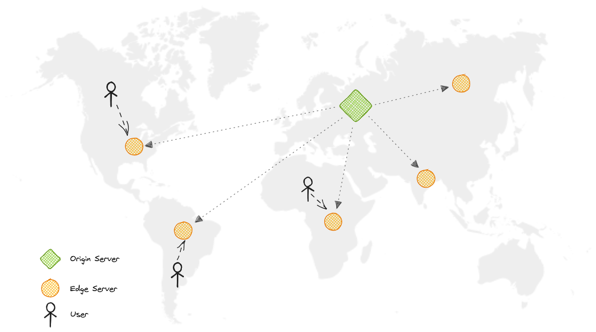

# Content Delivery Network (CDN)
- a network of servers that stores copies (caches) of website content (like images, videos, files) closer to users, speeding up delivery by reducing physical distance and improving website performance, reliability, and security by serving data from the nearest "edge server" instead of a single origin server. 
- a geographically distributed group of servers that caches content close to end users. 
- A CDN allows for the quick transfer of assets needed for loading Internet content, including HTML pages, JavaScript files, stylesheets, images, and videos.

# Why CDN?

**1. Improving website load times -** By distributing content closer to website visitors by using a nearby CDN server (among other optimizations), visitors experience faster page loading times. As visitors are more inclined to click away from a slow-loading site, a CDN can reduce bounce rates and increase the amount of time that people spend on the site. In other words, a faster a website means more visitors will stay and stick around longer.

**2. Reducing bandwidth costs -** Bandwidth consumption costs for website hosting is a primary expense for websites. Through caching and other optimizations, CDNs are able to reduce the amount of data an origin server must provide, thus reducing hosting costs for website owners.

**3. Increasing content availability and redundancy -** Large amounts of traffic or hardware failures can interrupt normal website function. Thanks to their distributed nature, a CDN can handle more traffic and withstand hardware failure better than many origin servers.

**4. Improving website security -** A CDN may improve security by providing [DDoS mitigation](https://www.cloudflare.com/learning/ddos/ddos-mitigation/), improvements to security certificates, and other optimizations.

## Q. How does CDN work?

In a CDN, the origin server contains the original versions of the content while the edge servers are numerous and distributed across various locations around the world.

To minimize the distance between the visitors and the website's server, a CDN stores a cached version of its content in multiple geographical locations known as edge locations. Each edge location contains several caching servers responsible for content delivery to visitors within its proximity.

Once the static assets are cached on all the CDN servers for a particular location, all subsequent website visitor requests for static assets will be delivered from these edge servers instead of the origin, thus reducing the origin load and improving scalability.

For example, when someone in the UK requests our website which might be hosted in the USA, they will be served from the closest edge location such as the London edge location. This is much quicker than having the visitor make a complete request to the origin server which will increase the latency.

A CDN will place servers at the exchange points between different networks.

These Internet exchange points (IXPs) are the primary locations where different Internet providers connect in order to provide each other access to traffic originating on their different networks. By having a connection to these high speed and highly interconnected locations, a CDN provider is able to reduce costs and transit times in high speed data delivery.

CDNs place Data Centers at strategic locations across the globe, enhance security, and are designed to survive various types of failures and Internet congestion.

# Types
CDNs are generally divided into two types:

## Push CDNs
Push CDNs receive new content whenever changes occur on the server. We take full responsibility for providing content, uploading directly to the CDN, and rewriting URLs to point to the CDN. We can configure when content expires and when it is updated. Content is uploaded only when it is new or changed, minimizing traffic, but maximizing storage.

Sites with a small amount of traffic or sites with content that isn't often updated work well with push CDNs. Content is placed on the CDNs once, instead of being re-pulled at regular intervals.

## Pull CDNs
In a Pull CDN situation, the cache is updated based on request. When the client sends a request that requires static assets to be fetched from the CDN if the CDN doesn't have it, then it will fetch the newly updated assets from the origin server and populate its cache with this new asset, and then send this new cached asset to the user.

Contrary to the Push CDN, this requires less maintenance because cache updates on CDN nodes are performed based on requests from the client to the origin server. Sites with heavy traffic work well with pull CDNs, as traffic is spread out more evenly with only recently-requested content remaining on the CDN.

## Disadvantages
As we all know good things come with extra costs, so let's discuss some disadvantages of CDNs:

**Extra charges:** It can be expensive to use a CDN, especially for high-traffic services.
**Restrictions:** Some organizations and countries have blocked the domains or IP addresses of popular CDNs.
**Location:** If most of our audience is located in a country where the CDN has no servers, the data on our website may have to travel further than without using any CDN.

## Examples
Here are some widely used CDNs:

[Amazon CloudFront](https://aws.amazon.com/cloudfront/)
[Google Cloud CDN](https://cloud.google.com/cdn)
[Cloudflare CDN](https://cloud.google.com/cdn)
[Fastly](https://www.fastly.com/products/cdn)

## Q. Is a CDN the same as a web host?
While a CDN does not host content and can’t replace the need for proper web hosting, it does help cache content at the network edge, which improves website performance. 