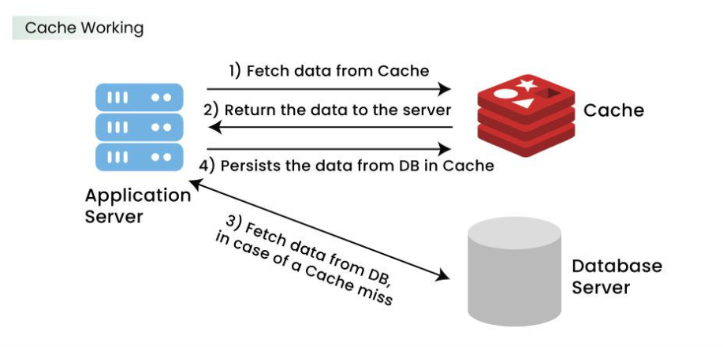

Caching is the process of storing copies of files or data in a temporary storage location, so that they can be accessed more quickly.

Caching is high speed data storage layer which stores subset of data, typically transient in nature, so that future requests for that data are served up faster than is possible by accessing the data's primary storage location.

Caching allows you to efficiently reuse previously retrieved or computed data.

A cache's primary purpose is to increase data retrieval performance by reducing the need to access the underlying slower storage layer.

Web browsers cache HTML files, JavaScript, and images in order to load websites more quickly, while DNS servers cache DNS records for faster lookups and CDN servers cache content to reduce latency.

Caches take advantage of the locality of reference principle *"recently requested data is likely to be requested again"*.

# How Does Cache Work?

# Caching Best Practices
When deciding whether to cache a piece of data, consider the following questions:
- **Is it safe to use a cached value?**  The same piece of data can have different consistency requirements in different contexts. 
For example, during online checkout, you need the authoritative price of an item, so caching might not be appropriate. On other pages, however, the price might be a few minutes out of date without a negative impact on users.

- **Is caching effective for that data?**   Some applications generate access patterns that are not suitable for caching— for example, sweeping through the key space of a large dataset that is changing frequently. 
In this case, keeping the cache up to date could offset any advantage caching could offer.

- **Is the data structured well for caching?**  Simply caching a database record can often be enough to offer significant performance advantages. However, other times, data is best cached in a format that combines multiple records together. Because caches are simple key-value stores, you might also need to cache a data record in multiple different formats, so you can access it by different attributes in the record.

You don’t need to make all of these decisions up front. As you expand your usage of caching, keep these guidelines in mind when deciding whether to cache a given piece of data.

# Caching and Memory
- Like a computer's memory, a cache is a compact, fast-performing memory that stores data in a hierarchy of levels, starting at level one, and progressing from there sequentially. 
- They are labeled as L1, L2, L3, and so on. 

- A cache stores frequently used data close to the CPU so accesses are much faster than reading from main memory (RAM).  
- When program data is updated, the cache may be **written** so the cached copy is replaced with the new content and remains consistent with memory.  
- Cache reads and writes always operate on fixed-size units called **blocks** or **cache lines (commonly 32–128 bytes)** rather than single bytes.  
- Each cache block includes a **tag** (metadata) that identifies the original memory address or region the block corresponds to.  
- When the CPU requests data, the cache controller compares the requested address against the tags in the **Level 1 (L1)** cache to check for a match.  
- If a matching tag is found in L1, this is a **cache hit** and the block is returned immediately to the CPU.  
- If no matching tag is found in L1, this is a **cache miss** and the controller searches the next level, **Level 2 (L2)** cache.  
- If L2 does not contain the block, the search proceeds to **Level 3 (L3)**, then **Level 4 (L4)** if present, continuing outward through the cache hierarchy until the block is found.  
- When the block is found in any cache level, it is **read and loaded** into the higher-level caches (often into L1) so subsequent accesses are faster.  
- If the block is not found in any cache level (a full cache miss), the block is fetched from **main memory (RAM)** and then **written into the cache** (usually into L1 and/or the level where it was found or into multiple levels depending on policy).  
- Cache write policies determine how updates propagate: some systems write changes immediately to main memory (**write-through**), others update only the cache and write back to memory later (**write-back**).  
- Replacement policies (e.g., **LRU**, **FIFO**, **Random**) decide which cache block to evict when a new block must be loaded and the cache is full.  
- The cache hierarchy balances **speed vs. capacity**: L1 is smallest and fastest, L2 is larger and slower, L3/L4 are larger and slower still, and RAM is largest but slowest.  
- The overall goal is to maximize **cache hits** (fast responses) and minimize **cache misses** (slow memory accesses), while keeping cached data correct and up to date.

# Simple Analogy (as points)

- Think of L1 as items on your desk (fastest access, very limited space).  
- Think of L2 as the drawer beside you (slower to open, more space).  
- Think of L3/L4 as filing cabinets in the room (slower still, much larger).  
- Think of RAM as the storage room down the hall (slowest to reach, holds everything).  
- You check the desk first, then the drawer, then the cabinets, then the storage room; if you bring something from storage, you put it closer for next time.

Cache hit and Cache miss
Cache hit
A cache hit describes the situation where content is successfully served from the cache. The tags are searched in the memory rapidly, and when the data is found and read, it's considered a cache hit.

Cold, Warm, and Hot Caches

A cache hit can also be described as cold, warm, or hot. In each of these, the speed at which the data is read is described.

A hot cache is an instance where data was read from the memory at the fastest possible rate. This happens when the data is retrieved from L1.

A cold cache is the slowest possible rate for data to be read, though, it's still successful so it's still considered a cache hit. The data is just found lower in the memory hierarchy such as in L3, or lower.

A warm cache is used to describe data that's found in L2 or L3. It's not as fast as a hot cache, but it's still faster than a cold cache. Generally, calling a cache warm is used to express that it's slower and closer to a cold cache than a hot one.

Cache miss
A cache miss refers to the instance when the memory is searched, and the data isn't found. When this happens, the content is transferred and written into the cache.

Cache Invalidation
Cache invalidation is a process where the computer system declares the cache entries as invalid and removes or replaces them. If the data is modified, it should be invalidated in the cache, if not, this can cause inconsistent application behavior. There are three kinds of caching systems:

Write-through cache
