# What is a Database?
A database is an **organized collection of structured information, or data**, typically stored electronically in a computer system. 
A database is usually controlled by a Database Management System (DBMS). 
Together, the data and the DBMS, along with the applications that are associated with them, are referred to as a database system, often shortened to just database.

# What is DBMS?
A database typically requires a comprehensive database software program known as a Database Management System (DBMS). 
A DBMS serves as an interface between the database and its end-users or programs, allowing users to retrieve, update, and manage how the information is organized and optimized. 
A DBMS also facilitates oversight and control of databases, enabling a variety of administrative operations such as performance monitoring, tuning, and backup and recovery.

# Components
Here are some common components found across different databases:

## Schema
The role of a schema is to define the shape of a data structure, and specify what kinds of data can go where. 
Schemas can be strictly enforced across the entire database, loosely enforced on part of the database, or they might not exist at all.

## Table
Each table contains various columns just like in a spreadsheet. 
A table can have as meager as two columns and upwards of a hundred or more columns, depending upon the kind of information being put in the table.

## Column
A column contains a set of data values of a particular type, one value for each row of the database. A column may contain text values, numbers, enums, timestamps, etc.

## Row
Data in a table is recorded in rows. 
There can be thousands or millions of rows in a table having any particular information.

Below are different types of databases:

- SQL
- NoSQL
   - Document
   - Key-value
   - Graph
   - Timeseries
   - Wide column
   - Multi-model

# Challenges
Some common challenges faced while running databases at scale:

- **Absorbing significant increases in data volume:** The explosion of data coming in from sensors, connected machines, and dozens of other sources.

- **Ensuring data security:** Data breaches are happening everywhere these days, it's more important than ever to ensure that data is secure but also easily accessible to users.

- **Keeping up with demand:** Companies need real-time access to their data to support timely decision-making and to take advantage of new opportunities.

- **Managing and maintaining the database and infrastructure:** As databases become more complex and data volumes grow, companies are faced with the expense of hiring additional talent to manage their databases.

- **Removing limits on scalability:** A business needs to grow if it's going to survive, and its data management must grow along with it. But it's very difficult to predict how much capacity the company will need, particularly with on-premises databases.

- **Ensuring data residency, data sovereignty, or latency requirements:** Some organizations have use cases that are better suited to run on-premises. 
In those cases, engineered systems that are pre-configured and pre-optimized for running the database are ideal.

# SQL databases
A SQL (or relational) database is a collection of data items with pre-defined relationships between them.
These items are organized as a set of tables with columns and rows. 
Tables are used to hold information about the objects to be represented in the database. 
Each column in a table holds a certain kind of data and a field stores the actual value of an attribute. The rows in the table represent a collection of related values of one object or entity.

Each row in a table could be marked with a unique identifier called a primary key, and rows among multiple tables can be made related using foreign keys. 
This data can be accessed in many different ways without re-organizing the database tables themselves. 
SQL databases usually follow the [ACID consistency model](https://www.karanpratapsingh.com/courses/system-design/acid-and-base-consistency-models).

## Materialized views
A materialized view is a pre-computed data set derived from a query specification and stored for later use. Because the data is pre-computed, querying a materialized view is faster than executing a query against the base table of the view. 
This performance difference can be significant when a query is run frequently or is sufficiently complex.

It also enables data subsetting and improves the performance of complex queries that run on large data sets which reduces network loads. 
There are other uses of materialized views, but they are mostly used for performance and replication.

## N+1 query problem
The N+1 query problem happens when the data access layer(DAL) executes N additional SQL statements to fetch the same data that could have been retrieved when executing the primary SQL query. 
The larger the value of N, the more queries will be executed, the larger the performance impact.

1. **The "1" Query:** The application executes one SQL statement to retrieve a collection of \(N\) parent objects (e.g., SELECT * FROM Orders).
2. **The "N" Queries:** For each parent record returned, the application triggers an additional SQL statement to fetch related data (e.g., SELECT * FROM Items WHERE OrderID = ?) [2, 5]. 

This is commonly seen in GraphQL and ORM (Object-Relational Mapping) tools and can be addressed by optimizing the SQL query or using a dataloader that batches consecutive requests and makes a single data request under the hood.

## Advantages
Let's look at some advantages of using relational databases:

- Simple and accurate
- Accessibility
- Data consistency
- Flexibility

## Disadvantages
Below are the disadvantages of relational databases:

- Expensive to maintain
- Difficult schema evolution
- Performance hits (join, denormalization, etc.)
- Difficult to scale due to poor horizontal scalability

## Examples
Here are some commonly used relational databases:

- PostgreSQL(https://www.postgresql.org/)
- MySQL(https://www.mysql.com/)
- MariaDB(https://mariadb.org/)
- Amazon Aurora(https://aws.amazon.com/rds/aurora)

# NoSQL databases
NoSQL is a broad category that includes any database that doesn't use SQL as its primary data access language. 
These types of databases are also sometimes referred to as non-relational databases. 
Unlike in relational databases, data in a NoSQL database doesn't have to conform to a pre-defined schema. NoSQL databases follow BASE consistency model.

Below are different types of NoSQL databases:
## Document
A document database (also known as a document-oriented database or a document store) is a database that stores information in documents. They are general-purpose databases that serve a variety of use cases for both transactional and analytical applications.

### Advantages

- Intuitive and flexible
- Easy horizontal scaling
- Schemaless

### Disadvantages

- Schemaless
- Non-relational

### Examples
- MongoDB
- Amazon DocumentDB
- CouchDB

## Key-value
One of the simplest types of NoSQL databases, key-value databases save data as a group of key-value pairs made up of two data items each. 
They're also sometimes referred to as a key-value store.

### Advantages

- Simple and performant
- Highly scalable for high volumes of traffic
- Session management
- Optimized lookups

### Disadvantages

- Basic CRUD
- Values can't be filtered
- Lacks indexing and scanning capabilities
- Not optimized for complex queries

### Examples
- Redis
- Memcached
- Amazon DynamoDB
- Aerospike

## Graph
A graph database is a NoSQL database that uses graph structures for semantic queries with nodes, edges, and properties to represent and store data instead of tables or documents.

The graph relates the data items in the store to a collection of nodes and edges, the edges representing the relationships between the nodes. The relationships allow data in the store to be linked together directly and, in many cases, retrieved with one operation.

### Advantages

- Query speed
- Agile and flexible
- Explicit data representation

### Disadvantages

- Complex
- No standardized query language

### Use cases

- Fraud detection
- Recommendation engines
- Social networks
- Network mapping

### Examples

- Neo4j
- ArangoDB
- Amazon Neptune
- JanusGraph

## Time series
A time-series database is a database optimized for time-stamped, or time series, data.

### Advantages

- Fast insertion and retrieval
- Efficient data storage

### Use cases

- IoT data
- Metrics analysis
- Application monitoring
- Understand financial trends

### Examples

- InfluxDB
- Apache Druid

## Wide column
Wide column databases, also known as wide column stores, are schema-agnostic. Data is stored in column families, rather than in rows and columns.

### Advantages

- Highly scalable, can handle petabytes of data
- Ideal for real-time big data applications

### Disadvantages

- Expensive
- Increased write time

### Use cases

- Business analytics
- Attribute-based data storage

### Examples

- BigTable
- Apache Cassandra
- ScyllaDB

## Multi-model
Multi-model databases combine different database models (i.e. relational, graph, key-value, document, etc.) into a single, integrated backend. 
This means they can accommodate various data types, indexes, queries, and store data in more than one model.

### Advantages

- Flexibility
- Suitable for complex projects
- Data consistent

### Disadvantages

- Complex
- Less mature
### Examples

- ArangoDB
- Azure Cosmos DB
- Couchbase

# SQL vs NoSQL databases
In the world of databases, there are two main types of solutions, SQL (relational) and NoSQL (non-relational) databases. 
Both of them differ in the way they were built, the kind of information they store, and how they store it. 
Relational databases are structured and have predefined schemas while non-relational databases are unstructured, distributed, and have a dynamic schema.

## High-level differences
Here are some high-level differences between SQL and NoSQL:

### Storage
- SQL stores data in tables, where each row represents an entity and each column represents a data point about that entity.

- NoSQL databases have different data storage models such as key-value, graph, document, etc.

### Schema
- In SQL, each record conforms to a fixed schema, meaning the columns must be decided and chosen before data entry and each row must have data for each column. The schema can be altered later, but it involves modifying the database using migrations.

- Whereas in NoSQL, schemas are dynamic. Fields can be added on the fly, and each record (or equivalent) doesn't have to contain data for each field.

### Querying
- SQL databases use SQL (structured query language) for defining and manipulating the data, which is very powerful.

- In a NoSQL database, queries are focused on a collection of documents. Different databases have different syntax for querying.

### Scalability
- In most common situations, SQL databases are vertically scalable, which can get very expensive. It is possible to scale a relational database across multiple servers, but this is a challenging and time-consuming process.

- On the other hand, NoSQL databases are horizontally scalable, meaning we can add more servers easily to our NoSQL database infrastructure to handle large traffic. Any cheap commodity hardware or cloud instances can host NoSQL databases, thus making it a lot more cost-effective than vertical scaling. A lot of NoSQL technologies also distribute data across servers automatically.

### Reliability
The vast majority of relational databases are ACID compliant. So, when it comes to data reliability and a safe guarantee of performing transactions, SQL databases are still the better bet.

Most of the NoSQL solutions sacrifice ACID compliance for performance and scalability.

## Reasons
As always we should always pick the technology that fits the requirements better. So, let's look at some reasons for picking SQL or NoSQL based database:

### For SQL

- Structured data with strict schema
- Relational data
- Need for complex joins
- Transactions
- Lookups by index are very fast

### For NoSQL

- Dynamic or flexible schema
- Non-relational data
- No need for complex joins
- Very data-intensive workload
- Very high throughput for IOPS

# Database Replication
Database replication is the process of creating and maintaining identical copies (replicas) of a database across multiple servers or locations to ensure high availability, fault tolerance, performance, and scalability, allowing users to access consistent, up-to-date data from different points while distributing workload and protecting against data loss. 
It typically involves a primary database receiving writes and propagating changes to secondary replicas, ensuring redundancy and faster access for users globally. 

## Why? 
- **Reducing Latency:** By geographically distributing replicas, systems can serve data from the closest node to the user, significantly reducing response times for read operations.

- **Increasing Throughput:** Replication allows systems to handle more read operations by distributing the load across multiple nodes. For certain replication strategies, write throughput can also be enhanced by parallelizing write operations.

- **Improving Availability:** Replication ensures that even in the event of a node failure, the system can continue to operate by failing over to replicas, thereby minimizing downtime and maintaining continuous access to data.

- **Enhancing Durability:** In scenarios of hardware failure or data center outages, having replicated data across multiple locations ensures that data is not lost and can be recovered, supporting robust disaster recovery strategies.

Replication strategies are critical in defining how data is copied and maintained across systems, each with its unique benefits and challenges.

## Leader-Follower Replication
Also known as Master/Backup or Master/Standby replication, this model employs a single Leader/Master node for write and data definition operations, such as database alterations, while follower/backup/standby nodes replicate and synchronize data from the master. 
This structure simplifies implementation by avoiding write conflicts, as only the master node handles write transactions.
If the master goes offline, the system can continue to operate in read-only mode until a follower is promoted to a master or a new master is provisioned.

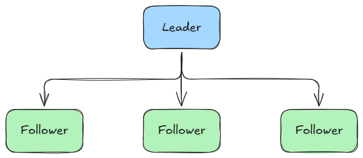

### Failures in Leader-Follower Replication

#### Follower Failures:
Regular health checks identify any follower node failures, prompting an immediate reroute of its traffic to operational replicas while efforts are made to recover or replace the compromised node. 
It’s critical to manage the distribution of traffic to avoid overburdening other nodes, which could risk the stability of the entire system.

#### Leader Failures:
Leader node failures present a more challenging scenario due to the exclusive write capabilities of the leader. 
Through heartbeat monitoring, a failed leader is quickly identified, necessitating a manual promotion of a follower to leader status or initiating an automatic leader election process, such as employing the Raft protocol. 
Transition periods may temporarily disrupt write capabilities, posing potential issues for systems requiring continuous write access.

## Multi-Leader Replication
Expanding on the leader-follower model, multi-leader replication allows multiple nodes to accept writes, enhancing write availability and system resilience. 
This strategy excels in distributed environments but requires sophisticated conflict resolution to manage concurrent data modifications.

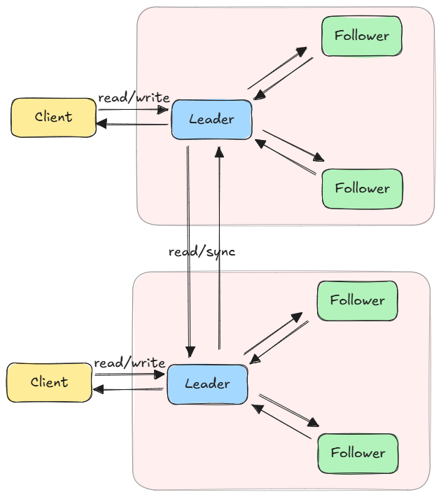

In this architecture, redundancy ensures system reliability; if a leader fails, another takes over, utilizing consensus algorithms like Paxos for seamless leadership transition. 
Despite potential delays due to data needing replication across leaders and the complexities in aligning data among them, the system’s enhanced fault tolerance generally compensates for these drawbacks.

### Managing Conflict in Multi-Leader Replication
In multi-leader replication, managing conflicts is critical due to simultaneous write operations by multiple leaders. A primary strategy, **Last Write Wins (LWW)**, prioritizes the most recent update, though it may overlook significant changes.

Other approaches include Conflict-free Replicated Data Types (CRDTs), which merge conflicting updates seamlessly; Operational Transformation (OT), offering detailed control for collaborative applications; and application-specific solutions, where conflicts are resolved based on the domain’s unique requirements. These methods collectively aim to maintain data consistency and integrity within distributed systems.

### Some Use Cases for Multi-Leader Replication

- **E-commerce Platforms:** Multi-leader replication is beneficial for large e-commerce sites that operate across different regions, enabling localized transaction processing and inventory management to enhance user experience and operational efficiency.

- **Internet of Things (IoT) Systems:** In IoT applications where devices are distributed globally and need to operate reliably even in disconnected modes, multi-leader replication allows for decentralized decision-making and data aggregation, improving responsiveness and system resilience.

## Leaderless Replication
Leaderless replication models represent a paradigm shift towards distributed authority in data management. By eliminating the traditional leader-follower hierarchy, these systems distribute write operations across nodes, leveraging consensus mechanisms to ensure data integrity and consistency.

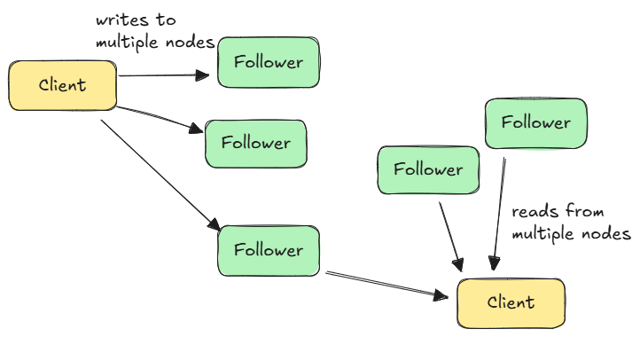

### Challenges and Considerations

While leaderless replication enhances system availability and fault tolerance, it introduces complexities in managing data consistency, especially under high write loads and across geographically distributed nodes. Systems must be designed to handle replication lag and transient inconsistencies, ensuring that applications can tolerate or rectify state discrepancies.

### Leveraging Leaderless Replication

Ideal for scenarios demanding high availability and distributed data access, leaderless replication suits applications with global user bases and those requiring robust fault tolerance. Implementing this model demands a nuanced understanding of its trade-offs, particularly in conflict resolution and system design to balance consistency with availability.


## Synchronous Replication
This method ensures strict data consistency by waiting for acknowledgment from all follower nodes before completing write operations. 
While it guarantees that followers always have the latest data, it introduces write latency, particularly in geographically dispersed setups.

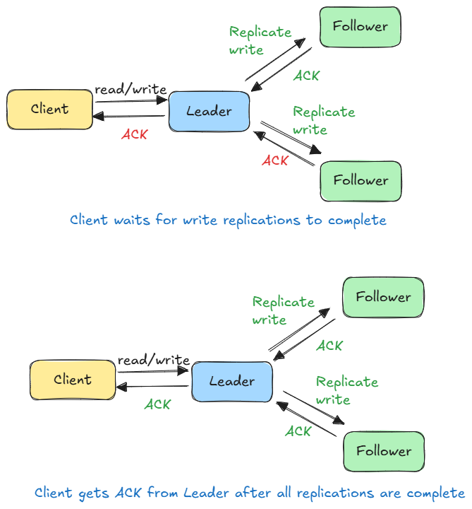

## Asynchronous Replication
Enhancing performance, asynchronous replication allows the leader to proceed with operations without immediate acknowledgment from followers. 
This approach reduces write latency but risks data loss if the leader fails before followers are updated, leading to eventual consistency challenges.

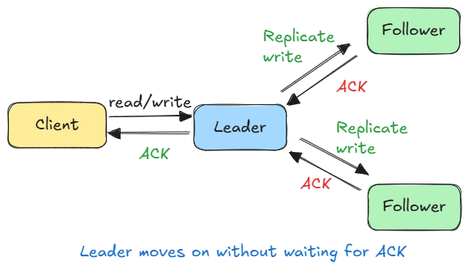


## Pros and Cons of Database Replication

### Advantages 
- **Scalability and Performance:** Replication enables systems to handle increased load by distributing reads and, in some models, writes across multiple nodes.

- **Data Locality:** By positioning data closer to users, replication can significantly reduce latency, enhancing the user experience.

- **Enhanced Durability and Availability:** Replication ensures data persistence across system failures, maintaining service continuity.

### Challenges:
- **Data Consistency:** Achieving strict consistency can be challenging, especially in asynchronous and leaderless models where eventual consistency prevails.

- **System Complexity:** Implementing and managing replication, particularly in multi-leader and leaderless setups, adds complexity to system design and operation.

- **Write Latency:** In synchronous replication, the integrity comes at the cost of increased latency due to the need for cross-node communication.


# Indexes
- a specialized data structure that speeds up data retrieval operations (queries) by providing quick lookup access to data

- Indexes are well known when it comes to databases, they are used to improve the speed of data retrieval operations on the data store. 

- A database index is a super-efficient lookup table that allows a database to find data much faster.

- It holds the indexed column values along with pointers to the corresponding rows in the table.

- Without an index, the database might have to scan every single row in a massive table to find what you want – a painfully slow process.

- But, with an index, the database can zero in on the exact location of the desired data using the index’s pointers.

**Trade-off**
- An index makes the trade-offs of increased storage overhead, and slower writes (since we not only have to write the data but also have to update the index) for the benefit of faster reads. 
- Indexes can be created using one or more columns of a database table, providing the basis for both rapid random lookups and efficient access to ordered records.

- Indexes are also used to create different views of the same data. 
- For large data sets, this is an excellent way to specify different filters or sorting schemes without resorting to creating multiple additional copies of the data.
- One quality that database indexes can have is that they can be dense or sparse. Each of these index qualities comes with its own trade-offs. 
- Let's look at how each index type would work:

## Dense Index
In a dense index, an index record is created for every row of the table. Records can be located directly as each record of the index holds the search key value and the pointer to the actual record.

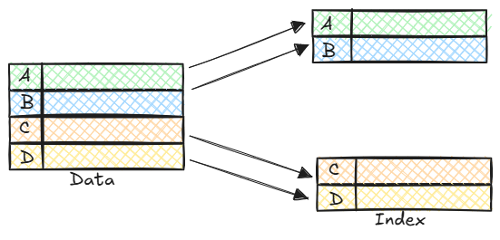

Dense indexes require more maintenance than sparse indexes at write-time. 
Since every row must have an entry, the database must maintain the index on inserts, updates, and deletes. 
Having an entry for every row also means that dense indexes will require more memory. 
The benefit of a dense index is that values can be quickly found with just a binary search. 
Dense indexes also do not impose any ordering requirements on the data.

## Sparse Index
In a sparse index, index records are created only for some of the records.

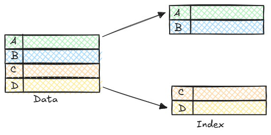

Sparse indexes require less maintenance than dense indexes at write-time since they only contain a subset of the values. This lighter maintenance burden means that inserts, updates, and deletes will be faster. Having fewer entries also means that the index will use less memory. Finding data is slower since a scan across the page typically follows the binary search. Sparse indexes are also optional when working with ordered data.

## How to create index:
`CREATE INDEX idx_last_name ON employees(last_name);`

`SELECT * FROM employees WHERE last_name = 'Smith'`

## Here's a step-by-step explanation of how database indexes work:

1. **Index Creation:** The database administrator creates an index on a specific column or set of columns.

2. **Index Building:** The database management system builds the index by scanning the table and storing the values of the indexed column(s) along with a pointer to the corresponding data.

3. **Query Execution:** When a query is executed, the database engine checks if an index exists for the requested column(s).

4. **Index Search:** If an index exists, the database searches the index for the requested data, using the pointers to quickly locate the data.

5. **Data Retrieval:** The database retrieves the requested data, using the pointers from the index.

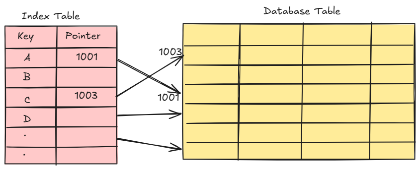

## Benefits of DB Idexes
- **Faster Query Performance:** Indexes can significantly improve query performance especially for large datasets by reducing the amount of data that needs to be scanned.

- **Reduced CPU Usage:** By reducing the number of rows that need to be scanned, indexes can decrease CPU usage and optimize resource utilization.

- **Rapid Data Retrieval:** Indexes enable quick data retrieval for queries that involve equality or range conditions on the indexed columns.

- **Efficient Sorting:** Indexes can also be used to efficiently sort data based on the indexed columns, eliminating the need for expensive sorting operations.

- **Better Data Organization:** Indexes can help maintain data organization and structure, making it easier to manage and maintain the database.

## Types of Database Indexes

### Indexes based on Structure and Key Attributes:
- **Primary Index:** Automatically created when a primary key constraint is defined on a table. Ensures uniqueness and helps with super-fast lookups using the primary key.

- **Clustered Index:** Determines the order in which data is physically stored in the table. A clustered index is most useful when we’re searching in a range. Only one clustered index can exist per table.

- **Non-clustered or Secondary Index:** This index does not store data in the order of the index. Instead, it provides a list of virtual pointers or references to the location where the data is actually stored.

### Indexes based on Data Coverage:
- **Dense index:** Has an entry for every search key value in the table. Suitable for situations where the data has a small number of distinct search key values or when fast access to individual records is required.
- **Sparse index:** Has entries only for some of the search key values. Suitable for situations where the data has a large number of distinct search key values.

### Specialized Index Types:
- **Bitmap Index:** Excellent for columns with low cardinality (few distinct values). Common in data warehousing.

*Cardinality -{A, B, C} has cardinality 3. How many unique values a column has?. High cardinality (like unique user IDs) can increase memory usage and slow down queries, while low cardinality is more efficient.*

- **Hash Index:** A index that uses a hash function to map values to specific locations. Great for exact match queries.

- **Filtered Index:** Indexes a subset of rows based on a specific filter condition. Useful to improve query speed on commonly filtered columns.

- **Covering Index:** Includes all the columns required by a query in the index itself, eliminating the need to access the underlying table data.

- **Function-based index:** Indexes that are created based on the result of a function or expression applied to one or more columns of a table.

- **Full-Text Index:** A index designed for full-text search, allowing for efficient searching of text data.

- **Spatial Index:** Used for indexing geographical data types.

## Data Structures used in indexes:
Most commonly used data structures that power indexes are B-Trees, Hash Tables and Bitmaps.

### B-Tree(Balanced Tree)

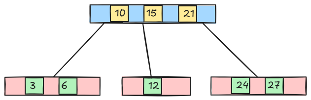

Most database engines use either a B-Tree or a variation of B-Trees like B+ Trees.

B-Trees have a hierarchical structure with a root node, internal nodes (index nodes), and leaf nodes.

Each node in a B-Tree contains a sorted array of keys and pointers to child nodes.

Here's why they are so well-suited:

- **Self-Balancing:** B-trees ensure that the 'height' of the tree stays balanced even when inserting or deleting data. This ensures logarithmic time complexity for insertion, deletion, and searching.

- **Ordered:** B-trees keep the data sorted, making range queries ("find all orders between date X and Y") and inequality comparisons very fast.

- **Disk-Friendly:** B-trees are designed to work well with disk-based storage. A single node of a B-tree often corresponds to a disk block, minimizing disk access operations.

Many databases use a slightly modified B-tree variant called the B+ tree.

In a B+ tree, all data values are stored only in the leaf nodes, which can further improve performance for certain use cases like range queries.

### Hash Table

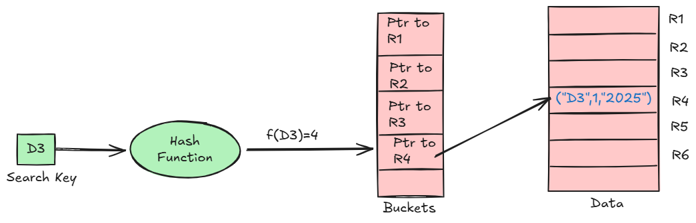

Hash tables are used for hash indexes, which are based on a hash function.

A hash table consists of an array of buckets, with each bucket containing the addresses for rows in the data.

Hash indexes employ a hash function to map keys to their corresponding bucket in the hash table, enabling constant-time lookup operations.

Hash indexes provide fast equality lookups, as the hash function determines the exact location of the data based on the key.

However, hash indexes do not support range queries or sorting efficiently.

### BitMap

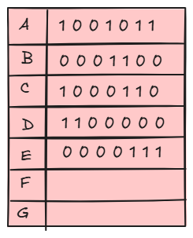

Each bit in the bitmap corresponds to a row, and the value of the bit indicates whether the key value exists in that row.

Bitmap indexes use a bitmap (a binary array) to represent the presence or absence of a specific key value in each row of a table.

Bitmap indexes are well-suited for columns with low cardinality (a small number of distinct values) and for performing complex queries involving multiple conditions.

Bitmap operations like AND, OR, and NOT are performed efficiently using bitwise operations, making bitmap indexes suitable for analytical queries involving multiple columns.

## How to use Database Indexes Smartly?

- **Identify Query Patterns:** Analyze the most frequent and critical queries executed against your database to determine which columns to index and which type of index to use.

- **Index Frequently Used Columns:** Consider indexing columns that are frequently used in WHERE, JOIN, and ORDER BY clauses.

- **Index Selective Columns:** Indexes are most effective on columns with a good spread of data values (high cardinality). Indexing a gender column might be less beneficial than one with a unique customer_id.

- **Use Appropriate Index Types:** Choose the right index type for your data and queries.

- **Consider Composite Indexes:** For queries involving multiple columns, consider creating composite indexes that encompass all relevant columns. This reduces the need for multiple single-column indexes and improves query performance.

- **Monitor Index Performance:** Regularly monitor index performance, remove unused indexes and adjust your indexing strategy as the database workload evolves.

- **Avoid Over-Indexing:** Avoid creating too many indexes, as this can lead to increased storage requirements and slower write performance.

   - Indexes take up extra disk space since they're additional data structures that need to be stored alongside your tables.

   - Every time you insert, update, or delete data in a table with an index, the index needs to update too. This can slightly slow down write operations.


# Normalization and Denormalization
## Terms
Before we go any further, let's look at some commonly used terms in normalization and denormalization.

### Keys
- **Primary key:** Column or group of columns that can be used to uniquely identify every row of the table.

- **Composite key:** A primary key made up of multiple columns.

- **Super key:** Set of all keys that can uniquely identify all the rows present in a table.

- **Candidate key:** Attributes that identify rows uniquely in a table.

- **Foreign key:** It is a reference to a primary key of another table.

- **Alternate key:** Keys that are not primary keys are known as alternate keys.

- **Surrogate key:** A system-generated value that uniquely identifies each entry in a table when no other column was able to hold properties of a primary key.

### Dependencies
- **Partial dependency:** Occurs when the primary key determines some other attributes.

- **Functional dependency:** It is a relationship that exists between two attributes, typically between the primary key and non-key attribute within a table.

- **Transitive functional dependency:** Occurs when some non-key attribute determines some other attribute.

### Anomalies
Database anomaly happens when there is a flaw in the database due to incorrect planning or storing everything in a flat database. This is generally addressed by the process of normalization.

There are three types of database anomalies:

- **Insertion anomaly:** Occurs when we are not able to insert certain attributes in the database without the presence of other attributes.

- **Update anomaly:** Occurs in case of data redundancy and partial update. In other words, a correct update of the database needs other actions such as addition, deletion, or both.

- **Deletion anomaly:** Occurs where deletion of some data requires deletion of other data.

Example

Let's consider the following table which is not normalized:

|ID|Name	|Role|Team
|--|--------|------------------|----
|1 |Peter	|Software Engineer |A
|2	|Brian	|DevOps Engineer	 |B
|3	|Hailey	|Product Manager	 |C
|4	|Hailey	|Product Manager	 |C
|5	|Steve	|Frontend Engineer |D

Let's imagine, we hired a new person "John" but they might not be assigned a team immediately. This will cause an insertion anomaly as the team attribute is not yet present.

Next, let's say Hailey from Team C got promoted, to reflect that change in the database, we will need to update 2 rows to maintain consistency which can cause an update anomaly.

Finally, we would like to remove Team B but to do that we will also need to remove additional information such as name and role, this is an example of a deletion anomaly.

## Normalization
Normalization is the process of organizing data in a database. This includes creating tables and establishing relationships between those tables according to rules designed both to protect the data and to make the database more flexible by eliminating redundancy and inconsistent dependency.

### Why do we need normalization?
The goal of normalization is to eliminate redundant data and ensure data is consistent. 
A fully normalized database allows its structure to be extended to accommodate new types of data without changing the existing structure too much. 
As a result, applications interacting with the database are minimally affected.

### Normal forms
Normal forms are a series of guidelines to ensure that the database is normalized. Let's discuss some essential normal forms:

1. #### 1NF

For a table to be in the first normal form (1NF), it should follow the following rules:

- Repeating groups are not permitted.
- Identify each set of related data with a primary key.
- Set of related data should have a separate table.
- Mixing data types in the same column is not permitted.

2. #### 2NF

For a table to be in the second normal form (2NF), it should follow the following rules:

- Satisfies the first normal form (1NF).
- Should not have any partial dependency.

3. #### 3NF

For a table to be in the third normal form (3NF), it should follow the following rules:

- Satisfies the second normal form (2NF).
- Transitive functional dependencies are not permitted.

4. #### BCNF

Boyce-Codd normal form (or BCNF) is a slightly stronger version of the third normal form (3NF) used to address certain types of anomalies not dealt with by 3NF as originally defined. 
Sometimes it is also known as the 3.5 normal form (3.5NF).

For a table to be in the Boyce-Codd normal form (BCNF), it should follow the following rules:

- Satisfied the third normal form (3NF).
- For every functional dependency X → Y, X should be the super key.
- There are more normal forms such as 4NF, 5NF, and 6NF but we won't discuss them here. 

Check out this amazing [video](https://www.youtube.com/watch?v=GFQaEYEc8_8) that goes into detail.

In a relational database, a relation is often described as "normalized" if it meets the third normal form. Most 3NF relations are free of insertion, update, and deletion anomalies.

As with many formal rules and specifications, real-world scenarios do not always allow for perfect compliance. 
If you decide to violate one of the first three rules of normalization, make sure that your application anticipates any problems that could occur, such as redundant data and inconsistent dependencies.

### Advantages
Here are some advantages of normalization:

- Reduces data redundancy.
- Better data design.
- Increases data consistency.
- Enforces referential integrity.

#### Disadvantages
Let's look at some disadvantages of normalization:

- Data design is complex.
- Slower performance.
- Maintenance overhead.
- Require more joins.

## Denormalization
Denormalization is a database optimization technique in which we add redundant data to one or more tables. This can help us avoid costly joins in a relational database. It attempts to improve read performance at the expense of some write performance. Redundant copies of the data are written in multiple tables to avoid expensive joins.

Once data becomes distributed with techniques such as federation and sharding, managing joins across the network further increases complexity. Denormalization might circumvent the need for such complex joins.

Note: Denormalization does not mean reversing normalization.

### Advantages
Let's look at some advantages of denormalization:

- Retrieving data is faster.
- Writing queries is easier.
- Convenient to manage.

### Disadvantages
Below are some disadvantages of denormalization:

- Expensive inserts and updates.
- Increases complexity of database design.
- Increases data redundancy.
- More chances of data inconsistency.

## ACID and BASE consistency models
Let's discuss the ACID and BASE consistency models.

### ACID
- The term ACID stands for **Atomicity**, **Consistency**, **Isolation**, and **Durability**. 
- ACID properties are used for maintaining data integrity during transaction processing.

In order to maintain consistency before and after a transaction relational databases follow ACID properties. Let us understand these terms:

- **Atomic**
All operations in a transaction succeed or every operation is rolled back.
Under the hood, atomicity is typically enforced using write-ahead logging(WAL) or undo/redo logs.
Before applying any changes to the main storage, the database logs the intended operations.
if the system crashes mid-transaction, it consults the log on restart: either roll everything back(undo log) or reapply changes that were pending commit(redo log)
this makes atomicity a foundational protection against system crashes, disk writes failures, or application bugs that abort mid-flight.

- **Consistent**
On the completion of a transaction, the database is structurally sound.
Consistency ensures that a tx moves the db from one valid state to another.
A valid state is defined by constraints such as primary keys, data types, uniqueness, and any custom rules enforced by business logic
Contrary to common belief, consistency isn't fully enforced by db. The ssytem can guarantee internal constraints(e.g. no duplicate keys) but app-level consistency(e.g. a driver can't be assigned to two rides at once) must be supported by the developer using the logic or tx scoping.
Still, ACID contract guarantees that no tx will leave the system in an invalid state from the db's perspective.
If a constraint is violated, the tx fails and rolls back.
This results in predictable behavior even when many processes interact with the data at once.

- **Isolated**
Transactions do not contend with one another. Contentious access to data is moderated by the database so that transactions appear to run sequentially.
Isolation ensures that concurrently executing txs do not see each other's intermediate states.
Each tx must behave as if were running alone, even though the databse may be interleaving its operations for performance.

Full isolation (known as serializability) means txs execute as if they were run in strict sequence.
It's safe but expensive.
Most production systems run with weaker isolation levels to trade some safety for throughput.
There are generally 4 levels:
- **Read Uncommited:** It allows dirty reads where one tx may see changes from other that rolls back later.
- **Read Commited:** Only sees commited changes from other txs.
Prevents dirty reads but allows non-repeatable reads.
- **Repeatable Read:** Guarantees that repeated reads within a tx see the same data. Still allows phantom rows to appear on re-query.
- **Serializable:** Enforces full isolation by making txs behave as if they ran one after another.Rarely outside of high-integrity systems.

These isolation levels aim to protect against common anomalies:
- **Dirty read:** reading uncommited data from another tx
- **Non-repeatable read:** reading the same row twice and getting different results
- **Phantom read:** A new row apears in a subsequent read due to another tx's insert

Each stronger level prevents more anomalies but increases contention and the risk of deadlocks.
Choosing the right isolation level is a performance versus correctness decision.
e.g financial systems may lean toward serializable, while analytics dashboards might settle for read commited

- **Durable**
Once the transaction has been completed and the writes and updates have been written to the disk, it will remain in the system even if a system failure occurs.
Durability ensures that once a tx commits, its changes are permanent, even if the db crashes miliseconds later.
This guarantee exists becoz in distributed or stateful systems, crashes are inevitable.
The durability property ensures that successful operations don't vanish due to hardware failures,software crashes or power loss.
Databases implement durability by persisting transaction logs (typically WAL - Write-Ahead Log files) to disk before acknowledging the commit to the client. This way, even if the database crashes immediately after, the committed changes can be recovered by replaying the log during startup. Additionally, databases may use checkpointing, where periodic snapshots of the in-memory state are flushed to disk, reducing recovery time by limiting how much of the log needs to be replayed.

### BASE (Basically Available, Soft state, Eventual consistency)
With the increasing amount of data and high availability requirements, the approach to database design has also changed dramatically. 
To increase the ability to scale and at the same time be highly available, we move the logic from the database to separate servers. 
In this way, the database becomes more independent and focused on the actual process of storing data.

In the NoSQL database world, ACID transactions are less common as some databases have loosened the requirements for immediate consistency, data freshness, and accuracy in order to gain other benefits, like scale and resilience.

BASE properties are much looser than ACID guarantees, but there isn't a direct one-for-one mapping between the two consistency models. Let us understand these terms:

- **Basic Availability**
The database appears to work most of the time.

- **Soft-state**
Stores don't have to be write-consistent, nor do different replicas have to be mutually consistent all the time.

- **Eventual consistency**
The data might not be consistent immediately but eventually, it becomes consistent.
Reads in the system are still possible even though they may not give the correct response due to inconsistency.

### ACID vs BASE Trade-offs
There's no right answer to whether our application needs an ACID or a BASE consistency model. 
Both the models have been designed to satisfy different requirements. 
**While choosing a database we need to keep the properties of both the models and the requirements of our application in mind.**

Given BASE's loose consistency, developers need to be more knowledgeable and rigorous about consistent data if they choose a BASE store for their application. It's essential to be familiar with the BASE behavior of the chosen database and work within those constraints.

On the other hand, planning around BASE limitations can sometimes be a major disadvantage when compared to the simplicity of ACID transactions. A fully ACID database is the perfect fit for use cases where data reliability and consistency are essential.

# CAP Theorem
CAP theorem states that a distributed system can deliver only two of the three desired characteristics Consistency, Availability, and Partition tolerance (CAP).


Let's take a detailed look at the three distributed system characteristics to which the CAP theorem refers.

## Consistency
Consistency means that all clients see the same data at the same time, no matter which node they connect to. For this to happen, whenever data is written to one node, it must be instantly forwarded or replicated across all the nodes in the system before the write is deemed "successful".

## Availability
Availability means that any client making a request for data gets a response, even if one or more nodes are down.

## Partition tolerance
Partition tolerance means the system continues to work despite message loss or partial failure. 
A system that is partition-tolerant can sustain any amount of network failure that doesn't result in a failure of the entire network. 
Data is sufficiently replicated across combinations of nodes and networks to keep the system up through intermittent outages.

## Consistency-Availability Tradeoff
We live in a physical world and can't guarantee the stability of a network, so distributed databases must choose Partition Tolerance (P). This implies a tradeoff between Consistency (C) and Availability (A).

### CA database
A CA database delivers consistency and availability across all nodes. It can't do this if there is a partition between any two nodes in the system, and therefore can't deliver fault tolerance.

Example: PostgreSQL, MariaDB.

### CP database
A CP database delivers consistency and partition tolerance at the expense of availability. 
When a partition occurs between any two nodes, the system has to shut down the non-consistent node until the partition is resolved.

Example: MongoDB, Apache HBase.

### AP database
An AP database delivers availability and partition tolerance at the expense of consistency. 
When a partition occurs, all nodes remain available but those at the wrong end of a partition might return an older version of data than others. 
When the partition is resolved, the AP databases typically re-syncs the nodes to repair all inconsistencies in the system.

Example: Apache Cassandra, CouchDB.

# PACELC Theorem
The PACELC theorem is an extension of the CAP theorem. The CAP theorem states that in the case of network partitioning (P) in a distributed system, one has to choose between Availability (A) and Consistency (C).

PACELC extends the CAP theorem by introducing latency (L) as an additional attribute of a distributed system. The theorem states that else (E), even when the system is running normally in the absence of partitions, one has to choose between latency (L) and consistency (C).

The PACELC theorem was first described by Daniel J. Abadi.


PACELC theorem was developed to address a key limitation of the CAP theorem as it makes no provision for performance or latency.

For example, according to the CAP theorem, a database can be considered available if a query returns a response after 30 days. Obviously, such latency would be unacceptable for any real-world application.

# Transactions
A transaction is a series of database operations that are considered to be a "single unit of work". 
The operations in a transaction either all succeed, or they all fail. 
In this way, the notion of a transaction supports data integrity when part of a system fails. 
Not all databases choose to support ACID transactions, usually because they are prioritizing other optimizations that are hard or theoretically impossible to implement together.

Usually, relational databases support ACID transactions, and non-relational databases don't (there are exceptions).

## States
A transaction in a database can be in one of the following states:


### Active
In this state, the transaction is being executed. This is the initial state of every transaction.

### Partially Committed
When a transaction executes its final operation, it is said to be in a partially committed state.

### Committed
If a transaction executes all its operations successfully, it is said to be committed. All its effects are now permanently established on the database system.

### Failed
The transaction is said to be in a failed state if any of the checks made by the database recovery system fails. A failed transaction can no longer proceed further.

### Aborted
If any of the checks fail and the transaction has reached a failed state, then the recovery manager rolls back all its write operations on the database to bring the database back to its original state where it was prior to the execution of the transaction. Transactions in this state are aborted.

The database recovery module can select one of the two operations after a transaction aborts:

- Restart the transaction
- Kill the transaction

### Terminated
If there isn't any roll-back or the transaction comes from the committed state, then the system is consistent and ready for a new transaction and the old transaction is terminated.

# Distributed Transactions

A distributed transaction spans multiple independent databases or services, ensuring that a group of operations either **all succeed** or **all fail** atomically—even when data lives on different nodes or networks.

## Why do we need distributed transactions?

In monolithic systems, a single database handles ACID guarantees. But in distributed architectures (microservices, sharded databases), a single logical operation often touches multiple data stores.

**Example**: An e-commerce order involves:
1. Deducting inventory (Inventory Service/DB)
2. Charging the customer (Payment Service/DB)  
3. Creating the order record (Order Service/DB)

If payment succeeds but inventory update fails, you have an **inconsistent state**. Distributed transactions solve the **atomic commitment problem**—ensuring all participants agree on commit or abort.

**Key challenges:**
- Network partitions can isolate nodes mid-transaction
- Nodes can crash at any point
- No global clock—nodes can't easily agree on "when" something happened
- Partial failures: some nodes succeed, others fail

## Two-Phase Commit (2PC)

The most widely used protocol for distributed atomic commits. It uses a **coordinator** (transaction manager) to orchestrate consensus among **participants** (resource managers).

### How it works

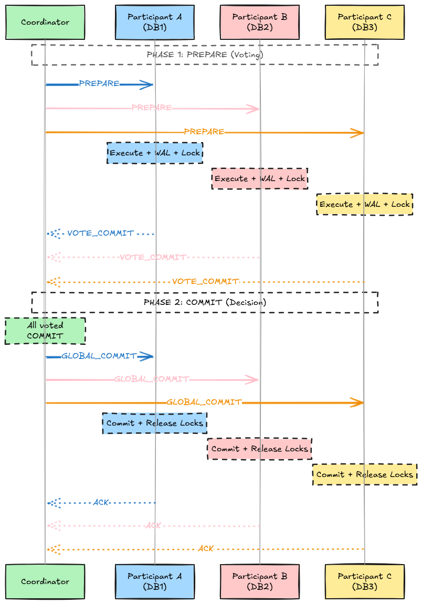

**Phase 1: Prepare (Voting)**
1. Coordinator sends `PREPARE` request to all participants
2. Each participant executes the transaction locally (but doesn't commit), writes changes to durable storage (WAL), and acquires locks
3. Participants respond with:
   - `VOTE_COMMIT` — "I can commit, my locks are held"
   - `VOTE_ABORT` — "I cannot commit" (constraint violation, timeout, etc.)

**Phase 2: Commit/Abort (Decision)**
- If **all participants voted COMMIT** → Coordinator sends `GLOBAL_COMMIT` to all
- If **any participant voted ABORT** (or timed out) → Coordinator sends `GLOBAL_ABORT` to all
- Participants execute the decision, release locks, and acknowledge

### Problems with 2PC

| Problem | Description |
|---------|-------------|
| **Blocking** | If coordinator crashes after Phase 1, participants holding locks are stuck waiting indefinitely. They can't unilaterally decide to commit or abort. |
| **Single point of failure** | Coordinator crash blocks the entire transaction until recovery. |
| **Synchronous & slow** | Requires multiple round-trips and disk flushes; high latency under load. |
| **Doesn't handle network partitions well** | A partitioned participant may not receive the final decision. |

### 2PC in Practice
- Used in traditional RDBMSs with XA protocol (Java JTA, .NET DTC)
- Not suitable for high-throughput, geo-distributed systems
- Most modern distributed systems avoid 2PC in favor of eventual consistency patterns

## Three-Phase Commit (3PC)

Three-Phase Commit is an enhancement to 2PC designed to **reduce the blocking problem**. It introduces an additional phase between voting and committing, allowing participants to make progress even if the coordinator fails.

**Core insight:** In 2PC, if the coordinator crashes after sending `PREPARE` but before sending the final decision, participants are stuck—they don't know if others voted to commit or abort. 3PC solves this by adding a `PRE_COMMIT` phase that tells participants "everyone agreed to commit" before the actual commit.

### How it works

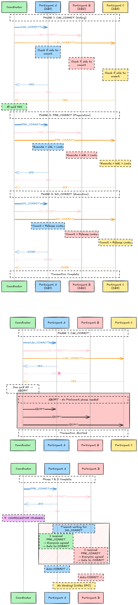

**Phase 1: CanCommit (Voting)**
1. Coordinator sends `CAN_COMMIT?` to all participants
2. Each participant checks if it can commit (validates constraints, checks resources)
3. Participants respond with:
   - `YES` — "I can commit this transaction"
   - `NO` — "I cannot commit" (abort immediately)

**Phase 2: PreCommit (Preparation)**
- If **all participants said YES** → Coordinator sends `PRE_COMMIT` to all
- If **any participant said NO** → Coordinator sends `ABORT` to all
- Upon receiving `PRE_COMMIT`, participants:
  - Execute the transaction locally (but don't commit yet)
  - Write changes to WAL (durable storage)
  - Acquire and hold locks
  - Respond with `ACK`

**Phase 3: DoCommit (Execution)**
- Coordinator sends `DO_COMMIT` to all participants
- Participants commit the transaction, release locks
- Participants respond with `DONE`

### Why 3PC reduces blocking

The key difference is **what participants can do on timeout**:

| Crash Point | 2PC Behavior | 3PC Behavior |
|-------------|--------------|--------------|
| Before PREPARE/CAN_COMMIT | Timeout → Abort | Timeout → Abort |
| After PREPARE, before decision | **BLOCKED** (can't decide) | Timeout → Abort (no PRE_COMMIT = not everyone agreed) |
| After PRE_COMMIT received | N/A | Timeout → **COMMIT** (everyone agreed, safe to proceed) |

**The PRE_COMMIT acts as a "promise"**: Once a participant receives `PRE_COMMIT`, it knows that all other participants voted YES. If the coordinator crashes, participants can safely commit after a timeout because they know no one will abort.

### 3PC State Transitions

```
Participant States:
                                           
  INITIAL ──CAN_COMMIT?──▶ WAITING ──YES──▶ PREPARED
     │                        │                │
     │                        │ NO             │ PRE_COMMIT
     │                        ▼                ▼
     │                     ABORTED         PRE_COMMITTED
     │                                         │
     │                                         │ DO_COMMIT
     │                                         ▼
     └────────────────────────────────────▶ COMMITTED
```

### Problems with 3PC

| Problem | Description |
|---------|-------------|
| **Network partitions** | If the network splits, two groups might make conflicting decisions. Group A (with coordinator) might abort while Group B (timed out, had PRE_COMMIT) commits. This leads to **split-brain**. |
| **More messages** | Requires 6n messages vs 4n for 2PC (n = number of participants). Higher latency. |
| **Not partition-tolerant** | The timeout-based recovery assumes crashed coordinator, not network partition. In async networks, you can't distinguish between the two. |
| **Rarely used** | The added complexity isn't worth it since network partitions are the bigger problem in practice. |

### 3PC Timeout Rules

```
┌────────────────────────────────────────────────────────────────┐
│                    PARTICIPANT TIMEOUT RULES                   │
├────────────────────────────────────────────────────────────────┤
│                                                                │
│  State: WAITING (sent YES, waiting for PRE_COMMIT)             │
│  Action on timeout: ABORT                                      │
│  Reason: Don't know if everyone agreed                         │
│                                                                │
├────────────────────────────────────────────────────────────────┤
│                                                                │
│  State: PRE_COMMITTED (received PRE_COMMIT, waiting for        │
│         DO_COMMIT)                                             │
│  Action on timeout: COMMIT                                     │
│  Reason: Everyone agreed (that's why we got PRE_COMMIT)        │
│                                                                │
└────────────────────────────────────────────────────────────────┘
```

### 2PC vs 3PC Comparison

| Aspect | 2PC | 3PC |
|--------|-----|-----|
| **Phases** | 2 (Prepare, Commit) | 3 (CanCommit, PreCommit, DoCommit) |
| **Blocking on coordinator crash** | YES - indefinite | NO - can timeout and decide |
| **Network partition safe** | No | No (can cause split-brain) |
| **Messages** | 4n | 6n |
| **Latency** | Lower | Higher (extra round-trip) |
| **Practical usage** | Common (XA, JTA) | Rare (theoretical) |

### 3PC in Practice

- **Rarely used** in production systems due to network partition vulnerability
- The FLP impossibility result proves that no deterministic protocol can guarantee consensus in async networks with failures
- Modern systems prefer:
  - **Paxos/Raft-based commits** (Spanner, CockroachDB) - handles partitions correctly
  - **Saga pattern** - eventual consistency without distributed locks
  - **2PC with coordinator replication** - practical compromise

### Interview Tips for 3PC

**Common questions:**
- *"How does 3PC improve on 2PC?"* → Reduces blocking by letting participants timeout and decide after PreCommit
- *"Why isn't 3PC used in practice?"* → Network partitions can cause split-brain; can't distinguish crash from partition
- *"What's the key insight of 3PC?"* → PreCommit phase guarantees all participants agreed, enabling safe timeout-based recovery

**Key points:**
- 3PC trades **message complexity** for **reduced blocking**
- Still not partition-tolerant (the real problem in distributed systems)
- FLP impossibility: can't have safety + liveness + fault tolerance in async systems
- Modern solution: Paxos/Raft for coordinator election + 2PC for atomic commit


## Saga Pattern

A Saga is a sequence of **local transactions** where each transaction updates its own database and triggers the next step. Unlike 2PC/3PC, Sagas don't lock resources across services—instead, they rely on **compensating transactions** to undo changes if something fails.

**Simple definition:** Break a distributed transaction into multiple small steps, and if any step fails, run "undo" operations for all completed steps.

### Why do we need Sagas?

2PC and 3PC have problems:
- They **lock resources** across services (bad for performance)
- They're **blocking** (one slow service holds everyone)
- They don't scale well in microservices

Sagas solve this by:
- Each service commits **independently** (no distributed locks)
- Failures are handled by **compensation** (undo actions)
- Better **availability** and **scalability**

### How Sagas Work
#### Saga- Order Processing 

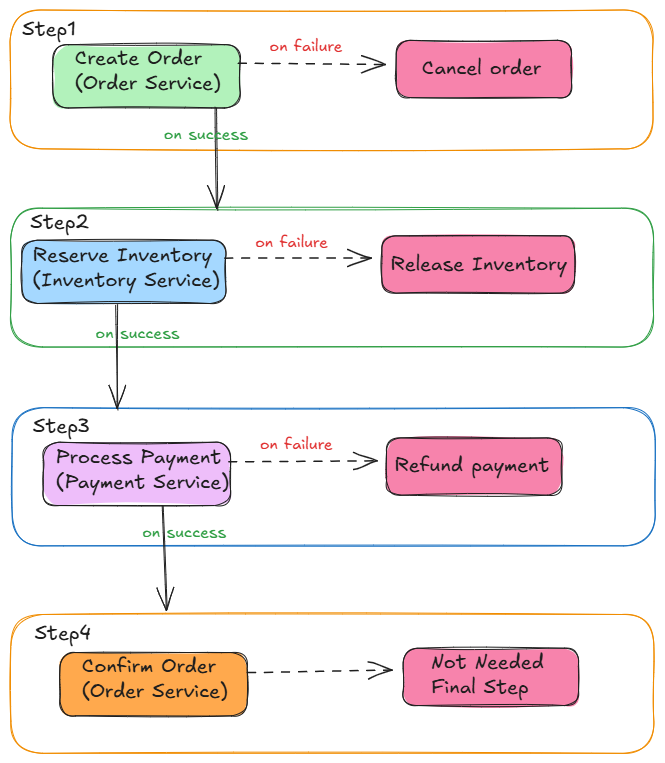

**If Step 3 (Payment) fails:**
```
Step 1: Create Order ✓
Step 2: Reserve Inventory ✓
Step 3: Process Payment ✗  ← FAILURE!

Compensation kicks in (reverse order):
  └── Compensate Step 2: Release Inventory
  └── Compensate Step 1: Cancel Order

Result: System back to consistent state
```

### Real-World Example: E-commerce Order

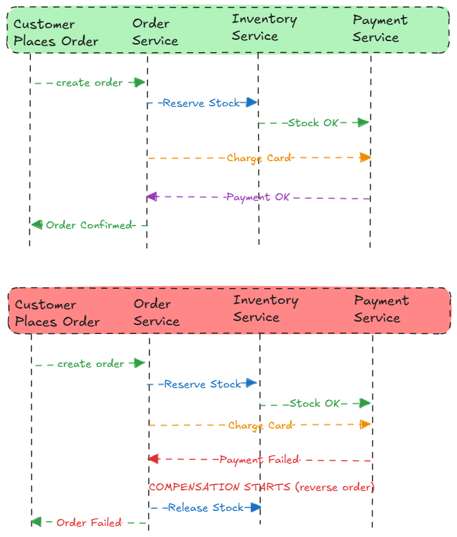

### Compensating Transactions

A compensating transaction **undoes** the effect of a previous transaction. It's NOT a rollback—it's a new transaction that reverses the business effect.

| Original Transaction | Compensating Transaction |
|---------------------|-------------------------|
| Create Order | Cancel Order |
| Reserve Inventory | Release Inventory |
| Charge Payment | Refund Payment |
| Send Email | Send Cancellation Email |
| Ship Package | Recall Package / Arrange Return |

**Important:** Some actions can't be easily compensated:
- Email already sent (can only send follow-up)
- Physical item shipped (expensive to reverse)
- External API called (may have side effects)

### Coordination Approaches

There are two ways to coordinate a Saga:

#### 1. Choreography (Event-Driven)

Each service **listens for events** and decides what to do next. No central controller.


**How it works:**
1. Order Service creates order, emits `OrderCreated` event
2. Inventory Service hears event, reserves stock, emits `StockReserved`
3. Payment Service hears event, charges card, emits `PaymentCompleted`
4. If payment fails, emits `PaymentFailed` → other services listen and compensate

**Pros:**
- Simple to implement for small sagas
- Loose coupling between services
- No single point of failure

**Cons:**
- Hard to track overall saga state
- Difficult to debug (events scattered across services)
- Risk of cyclic dependencies
- Hard to understand the full flow

#### 2. Orchestration (Central Controller)

A **central orchestrator** tells each service what to do and handles failures.

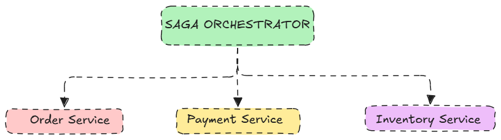

**How it works:**
1. Orchestrator receives "Create Order" request
2. Orchestrator calls Order Service → "Create Order"
3. Orchestrator calls Inventory Service → "Reserve Stock"
4. Orchestrator calls Payment Service → "Charge Card"
5. If any step fails, Orchestrator runs compensations in reverse

**Pros:**
- Easy to understand the full saga flow
- Centralized error handling and logging
- Easier to debug and monitor
- Clear ownership of saga logic

**Cons:**
- Orchestrator is a single point of failure (needs to be resilient)
- More coupling to orchestrator
- Can become complex if orchestrator handles too much

### Choreography vs Orchestration

| Aspect | Choreography | Orchestration |
|--------|--------------|---------------|
| **Coordination** | Decentralized (events) | Centralized (orchestrator) |
| **Coupling** | Loose | Tighter to orchestrator |
| **Visibility** | Hard to see full flow | Easy to see full flow |
| **Debugging** | Difficult | Easier |
| **Failure handling** | Distributed | Centralized |
| **Best for** | Simple sagas (2-3 steps) | Complex sagas (4+ steps) |
| **Single point of failure** | No | Yes (orchestrator) |

### Problems with Sagas

| Problem | Description | Mitigation |
|---------|-------------|------------|
| **No isolation** | Other transactions can see intermediate states (e.g., order created but payment pending) | Use status fields (`PENDING`, `CONFIRMED`), design for eventual consistency |
| **Hard to debug** | Failures can happen across multiple services | Use correlation IDs, centralized logging, distributed tracing |
| **Compensation complexity** | Some actions are hard to undo | Design compensatable operations upfront, use idempotent operations |
| **Cyclic dependencies** | Services might depend on each other in circles | Careful saga design, use orchestration |
| **Testing difficulty** | Need all services running | Use contract testing, mocks, integration test environments |

### Saga Design Best Practices

1. **Make operations idempotent**
   - Running the same operation twice should have the same effect
   - Helps with retries and recovery

2. **Use correlation IDs**
   - Assign a unique ID to each saga instance
   - Track all related events/calls with this ID

3. **Design compensations upfront**
   - Think about "what if this fails?" for each step
   - Some steps may need "semantic" compensation (send apology email)

4. **Handle partial failures**
   - What if compensation itself fails?
   - Use retry mechanisms, dead letter queues

5. **Keep sagas short**
   - Fewer steps = less chance of failure
   - Combine steps if possible

### When to Use Sagas

**Use Sagas when:**
- You have microservices that need to maintain data consistency
- Long-running transactions (minutes/hours)
- You can tolerate eventual consistency
- You can design compensating actions

**Don't use Sagas when:**
- You need strong consistency (use 2PC or single database)
- Compensations are impossible or very expensive
- Simple operations that can use a single database transaction

### Interview Tips for SDE1

**Common questions:**

*"What is a Saga pattern?"*
→ It's a way to manage distributed transactions by breaking them into local transactions with compensating actions for rollback.

*"Saga vs 2PC?"*
→ 2PC locks resources and is blocking; Saga doesn't lock, uses compensation, better for availability but only eventual consistency.

*"Choreography vs Orchestration?"*
→ Choreography = event-driven, decentralized, good for simple flows. Orchestration = central controller, easier to debug, good for complex flows.

*"What happens if compensation fails?"*
→ Retry with exponential backoff, use dead letter queues, alert for manual intervention.

**Key points to remember:**
- Saga = local transactions + compensating transactions
- No distributed locks = better performance and availability
- Trade-off: eventual consistency instead of strong consistency
- Two approaches: Choreography (events) and Orchestration (central controller)
- Always design compensations before implementing the saga

# Data Partitioning (Sharding)

Data partitioning is the technique of **splitting a large database into smaller, more manageable pieces** called partitions or shards. Each partition can be stored on different machines, allowing the system to scale horizontally.

**Simple definition:** Instead of one big database, split data across multiple smaller databases.

## Why do we need Partitioning?

As your application grows, a single database becomes a bottleneck:

| Problem | Description |
|---------|-------------|
| **Storage limit** | Single machine can't hold all data (TBs/PBs) |
| **Read/Write throughput** | One DB can't handle millions of queries/sec |
| **Single point of failure** | One DB down = entire app down |
| **Slow queries** | Large tables = slow scans and indexes |

**Partitioning solves these by:**
- Distributing data across multiple machines
- Parallel query execution
- Better fault isolation
- Smaller indexes per partition

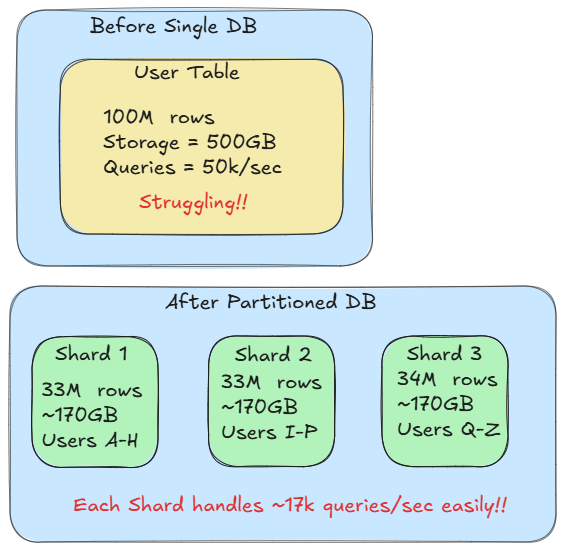

## Types of Partitioning

### 1. Horizontal Partitioning (Sharding)

Split **rows** of a table across multiple databases. Each shard has the **same schema** but different rows.

```
                        HORIZONTAL PARTITIONING
                        
Original Table (Users):
┌────────┬──────────┬─────────┬────────────────┐
│ UserID │   Name   │  Email  │    Country     │
├────────┼──────────┼─────────┼────────────────┤
│   1    │  Alice   │  a@...  │      USA       │
│   2    │   Bob    │  b@...  │      UK        │
│   3    │ Charlie  │  c@...  │      USA       │
│   4    │  David   │  d@...  │     India      │
│   5    │   Eve    │  e@...  │      UK        │
│   6    │  Frank   │  f@...  │     India      │
└────────┴──────────┴─────────┴────────────────┘

After Sharding (by Country):

  Shard 1 (USA)              Shard 2 (UK)             Shard 3 (India)
┌────────┬─────────┐     ┌────────┬─────────┐     ┌────────┬─────────┐
│ UserID │  Name   │     │ UserID │  Name   │     │ UserID │  Name   │
├────────┼─────────┤     ├────────┼─────────┤     ├────────┼─────────┤
│   1    │  Alice  │     │   2    │   Bob   │     │   4    │  David  │
│   3    │ Charlie │     │   5    │   Eve   │     │   6    │  Frank  │
└────────┴─────────┘     └────────┴─────────┘     └────────┴─────────┘

✓ Same columns in each shard
✓ Different rows in each shard
```

**Use cases:**
- User data (shard by user_id or region)
- Orders (shard by customer_id or date)
- Social media posts (shard by user_id)

### 2. Vertical Partitioning

Split **columns** of a table into separate tables/databases. Different tables have **different columns**.

```
                        VERTICAL PARTITIONING
                        
Original Table (Users):
┌────────┬──────────┬─────────┬───────────┬─────────────┬──────────────┐
│ UserID │   Name   │  Email  │  Password │   Avatar    │   Settings   │
│        │          │         │  (hash)   │  (5MB blob) │  (JSON 1KB)  │
└────────┴──────────┴─────────┴───────────┴─────────────┴──────────────┘

After Vertical Partitioning:

 Table 1: User_Core           Table 2: User_Auth         Table 3: User_Media
 (Frequently accessed)        (Auth operations)          (Large blobs)
┌────────┬──────────┐       ┌────────┬───────────┐     ┌────────┬─────────────┐
│ UserID │   Name   │       │ UserID │  Password │     │ UserID │   Avatar    │
│        │          │       │        │           │     │        │             │
└────────┴──────────┘       └────────┴───────────┘     └────────┴─────────────┘

✓ Separate frequently vs rarely accessed data
✓ Keep large blobs separate from small data
✓ Different tables can be on different servers
```

**Use cases:**
- Separate large blobs (images, files) from metadata
- Separate sensitive data (passwords, PII)
- Separate hot (frequently accessed) vs cold data

### Horizontal vs Vertical Comparison

| Aspect | Horizontal (Sharding) | Vertical |
|--------|----------------------|----------|
| **Splits** | Rows | Columns |
| **Schema** | Same across shards | Different tables |
| **Scalability** | Very high (add more shards) | Limited (finite columns) |
| **Use case** | Large datasets, high traffic | Different access patterns |
| **Complexity** | Higher (routing, joins) | Lower |
| **Common in** | Large-scale apps (Twitter, Facebook) | Most applications |

## Sharding Strategies (Partition Key Selection)

How do you decide **which row goes to which shard**? The answer is the **partition key** (or shard key).

### 1. Range-Based Sharding

Partition based on **ranges of values**.

```
Shard by User ID ranges:

┌─────────────────┐   ┌─────────────────┐   ┌─────────────────┐
│    Shard 1      │   │    Shard 2      │   │    Shard 3      │
│  UserID: 1-1M   │   │ UserID: 1M-2M   │   │ UserID: 2M-3M   │
└─────────────────┘   └─────────────────┘   └─────────────────┘
```

**Pros:**
- Simple to implement
- Range queries are efficient (all data in one shard)
- Easy to understand

**Cons:**
- **Hotspots** - new users (high IDs) all go to latest shard
- Uneven distribution if data isn't uniform

### 2. Hash-Based Sharding

Apply a **hash function** to the partition key.

```
shard_number = hash(user_id) % number_of_shards

Example: 4 shards
  User 101 → hash(101) % 4 = 1 → Shard 1
  User 102 → hash(102) % 4 = 2 → Shard 2
  User 103 → hash(103) % 4 = 3 → Shard 3
  User 104 → hash(104) % 4 = 0 → Shard 0
```

**Pros:**
- Even distribution (no hotspots)
- Works well for any data type

**Cons:**
- Range queries are expensive (need to query all shards)
- **Resharding is painful** - adding shards changes hash, requires data migration

### 3. Directory-Based Sharding

Maintain a **lookup table** that maps data to shards.

```
┌────────────────────────────┐
│      Lookup Service        │
│  ┌──────────┬───────────┐  │
│  │  UserID  │   Shard   │  │
│  ├──────────┼───────────┤  │
│  │  1-1000  │  Shard 1  │  │
│  │ 1001-5000│  Shard 2  │  │
│  │ VIP users│  Shard 3  │  │
│  └──────────┴───────────┘  │
└────────────────────────────┘
         │
         ▼
    Query: "Where is User 500?"
    Answer: "Shard 1"
```

**Pros:**
- Flexible - can move data without changing logic
- Custom placement (VIP users on faster hardware)
- Easy resharding

**Cons:**
- Lookup service is single point of failure
- Extra network hop for every query

### 4. Geo-Based Sharding

Partition based on **geographic location**.

```
┌─────────────────┐   ┌─────────────────┐   ┌─────────────────┐
│   US-East DC    │   │   EU-West DC    │   │   Asia DC       │
│  US users data  │   │  EU users data  │   │  Asia users     │
└─────────────────┘   └─────────────────┘   └─────────────────┘
```

**Pros:**
- Low latency for users (data is nearby)
- Compliance (GDPR - EU data stays in EU)

**Cons:**
- Complex for users who travel
- Cross-region queries are slow

### Strategy Comparison

| Strategy | Distribution | Range Queries | Resharding | Complexity |
|----------|-------------|---------------|------------|------------|
| **Range** | Can be uneven | ✅ Efficient | Medium | Low |
| **Hash** | Even | ❌ All shards | Hard | Low |
| **Directory** | Flexible | Depends | Easy | High |
| **Geo** | By location | Regional only | Medium | Medium |

## Common Problems with Sharding

### 1. Hotspots

One shard receives disproportionately more traffic.

```
Example: Celebrity Problem
- Justin Bieber has 100M followers
- All follower data on one shard
- That shard is overloaded!

Solutions:
- Further split hot shards
- Replicate hot data
- Use hash-based sharding
```

### 2. Cross-Shard Queries (Scatter-Gather)

Query needs data from multiple shards.

```
Query: "Find all orders > $100"

┌─────────┐     ┌─────────┐     ┌─────────┐
│ Shard 1 │     │ Shard 2 │     │ Shard 3 │
└────┬────┘     └────┬────┘     └────┬────┘
     │               │               │
     └───────────────┼───────────────┘
                     │
                     ▼
              Coordinator
              (merge results)

Problem: Slow! Need to query ALL shards
Solution: Design queries to target single shard
```

### 3. Cross-Shard Joins

Joining data across shards is very expensive.

```
Query: "Get user info with their orders"
- User data on Shard 1 (user_id based)
- Order data on Shard 2 (order_id based)

Solution: 
- Denormalize (duplicate data)
- Co-locate related data on same shard
- Use same partition key for related tables
```

### 4. Rebalancing / Resharding

Adding or removing shards requires data migration.

```
Before: 3 shards
hash(key) % 3 = shard_number

After: 4 shards  
hash(key) % 4 = shard_number ← Different result!

Many keys move to different shards = EXPENSIVE

Solution: Consistent Hashing
```

### 5. Consistent Hashing (Solution to Resharding)

Minimizes data movement when adding/removing shards.

```
                    Hash Ring
                    
                   0/360°
                     │
            Shard A ─┼─ Shard B
                    ╱ ╲
                   ╱   ╲
                  ╱     ╲
          Shard D ───────── Shard C
                   180°

- Data hashes to a point on the ring
- Assigned to next shard clockwise
- Adding shard only moves data from neighbors

Adding Shard E between A and B:
- Only keys between A and E move
- Other shards unaffected!
```

## Sharding Best Practices

1. **Choose partition key carefully**
   - High cardinality (many unique values)
   - Even distribution
   - Used in most queries

2. **Avoid cross-shard operations**
   - Design schema to co-locate related data
   - Denormalize if needed

3. **Plan for growth**
   - Use consistent hashing
   - Start with more shards than needed

4. **Monitor shard health**
   - Track size and traffic per shard
   - Rebalance before problems occur

5. **Consider using managed solutions**
   - MongoDB Atlas, Amazon DynamoDB, CockroachDB
   - They handle sharding complexity

## When to Shard (and When NOT to)

**Shard when:**
- Single DB can't handle load (after optimizing)
- Data exceeds single machine storage
- Need geographic distribution
- Availability requirements demand it

**Don't shard if:**
- You can still optimize (indexes, queries, caching)
- You can scale vertically (bigger machine)
- Data size is manageable
- Complexity cost outweighs benefits

**Rule of thumb:** Sharding adds significant complexity. Try everything else first!

## Interview Tips for SDE1

**Common questions:**

*"What is sharding?"*
→ Splitting a database horizontally across multiple machines. Each machine holds a subset of rows.

*"Horizontal vs Vertical partitioning?"*
→ Horizontal = split rows (sharding), Vertical = split columns. Horizontal scales better.

*"How do you choose a shard key?"*
→ High cardinality, even distribution, present in most queries. Avoid timestamps or sequential IDs for range sharding.

*"What's the problem with hash sharding?"*
→ Resharding requires moving lots of data. Solution: consistent hashing.

*"How do you handle joins across shards?"*
→ Denormalize, co-locate related data, or use application-level joins.

**Key points to remember:**
- Sharding = horizontal scaling for databases
- Partition key determines data distribution
- Hash sharding = even distribution, range sharding = efficient range queries
- Consistent hashing minimizes data movement
- Avoid cross-shard queries and joins
- Shard as last resort - adds significant complexity

# Consistent Hashing

Consistent hashing is a distributed hashing technique that **minimizes data redistribution** when nodes are added or removed from a cluster. It maps both data and nodes onto a circular hash space (hash ring).

**Simple definition:** A smart way to distribute data across servers so that adding/removing servers only moves a small amount of data.

## The Problem: Traditional Hash-Based Distribution

With traditional hashing, we use modulo to assign data to nodes:

```
node = hash(key) % N     (where N = number of nodes)
```

**Example with 4 nodes:**
```
┌─────────────────────────────────────────────────────────────────┐
│                    TRADITIONAL HASHING                          │
│                                                                 │
│  hash(key) % 4 = node_number                                    │
│                                                                 │
│  Key "user_1"  → hash = 14 → 14 % 4 = 2 → Node 2               │
│  Key "user_2"  → hash = 25 → 25 % 4 = 1 → Node 1               │
│  Key "user_3"  → hash = 38 → 38 % 4 = 2 → Node 2               │
│  Key "user_4"  → hash = 47 → 47 % 4 = 3 → Node 3               │
│  Key "user_5"  → hash = 52 → 52 % 4 = 0 → Node 0               │
│                                                                 │
└─────────────────────────────────────────────────────────────────┘
```

**The Problem: Adding a 5th node**
```
┌─────────────────────────────────────────────────────────────────┐
│             NOW: hash(key) % 5                                  │
│                                                                 │
│  Key "user_1"  → 14 % 5 = 4 → Node 4  (was Node 2) ❌ MOVED    │
│  Key "user_2"  → 25 % 5 = 0 → Node 0  (was Node 1) ❌ MOVED    │
│  Key "user_3"  → 38 % 5 = 3 → Node 3  (was Node 2) ❌ MOVED    │
│  Key "user_4"  → 47 % 5 = 2 → Node 2  (was Node 3) ❌ MOVED    │
│  Key "user_5"  → 52 % 5 = 2 → Node 2  (was Node 0) ❌ MOVED    │
│                                                                 │
│  Result: ALL 5 keys moved! (In reality: ~80% keys move)        │
└─────────────────────────────────────────────────────────────────┘
```

**Why is this bad?**
- Adding 1 server requires moving ~80% of data
- Massive network traffic during rebalancing
- Cache misses spike (all cached data invalidated)
- System performance degrades significantly

## How Consistent Hashing Solves This

Instead of modulo, we use a **hash ring** (circular space from 0 to 2^32 - 1).

### Step 1: Place Nodes on the Ring

Hash each node's identifier to get its position on the ring.

```
                         0
                         │
                    ┌────┴────┐
                   ╱          ╲
                  ╱            ╲
           Node A ●            ● Node B
           (pos: 50)           (pos: 150)
                 │              │
                 │              │
                 │              │
           Node D ●            ● Node C
           (pos: 300)          (pos: 220)
                  ╲            ╱
                   ╲          ╱
                    └────┬────┘
                         │
                     (wraps to 0)
```

### Step 2: Place Keys on the Ring

Hash each key to get its position, then assign it to the **first node clockwise**.

```
                         0
                         │
                    ┌────┴────┐
                   ╱    K1     ╲
                  ╱     ↓       ╲
           Node A ●────────────● Node B
                 │              │
              K4 │              │ K2
                 ↓              ↓
           Node D ●────────────● Node C
                  ╲     ↑      ╱
                   ╲   K3     ╱
                    └────┬────┘
                         │

Key Assignment (clockwise to nearest node):
┌─────────┬──────────┬────────────────────┐
│   Key   │ Position │   Assigned Node    │
├─────────┼──────────┼────────────────────┤
│   K1    │    80    │ Node B (pos: 150)  │
│   K2    │   180    │ Node C (pos: 220)  │
│   K3    │   280    │ Node D (pos: 300)  │
│   K4    │   320    │ Node A (pos: 50)   │
└─────────┴──────────┴────────────────────┘
```

### Step 3: Adding a Node (Minimal Redistribution!)

Add Node E at position 100:

```
                         0
                         │
                    ┌────┴────┐
                   ╱    K1     ╲
                  ╱     ↓       ╲
           Node A ●    ● Node E ● Node B
           (50)       (100)     (150)
                 │              │
              K4 │              │ K2
                 ↓              ↓
           Node D ●────────────● Node C
                  ╲            ╱
                   ╲          ╱
                    └────┬────┘

After adding Node E:
┌─────────┬────────────────────────────────────────────────┐
│   Key   │                    Result                      │
├─────────┼────────────────────────────────────────────────┤
│   K1    │ Node E (was B) ← ONLY this key moves!         │
│   K2    │ Node C ✓ (unchanged)                          │
│   K3    │ Node D ✓ (unchanged)                          │
│   K4    │ Node A ✓ (unchanged)                          │
└─────────┴────────────────────────────────────────────────┘

Only keys between Node A (50) and Node E (100) move to Node E.
Other keys stay with their original nodes!
```

### Step 4: Removing a Node

If Node C is removed, only its keys move to the next node (Node D):

```
Node C removed:
- K2 was on Node C (pos: 220)
- K2 now goes to Node D (pos: 300) - next clockwise

Only K2 moves! Other keys unaffected.
```

## The Math: How Much Data Moves?

```
┌─────────────────────────────────────────────────────────────────┐
│                                                                 │
│   Traditional Hashing:    ~(N-1)/N keys move                   │
│   (adding 1 node to N)    With 4→5 nodes: ~80% keys move       │
│                                                                 │
│   Consistent Hashing:     ~K/N keys move                       │
│   (adding 1 node to N)    With 4→5 nodes: ~20% keys move       │
│                                                                 │
│   R = K / N                                                     │
│   Where: R = data to redistribute                               │
│          K = total number of keys                               │
│          N = number of nodes                                    │
│                                                                 │
└─────────────────────────────────────────────────────────────────┘
```

## Problem: Uneven Distribution

With only a few nodes, keys may not be evenly distributed:

```
                    Problem: Uneven Load
                    
                         0
                         │
                    ┌────┴────┐
                   ╱          ╲
                  ╱            ╲
           Node A ●            
           (pos: 50)           
                 │              
                 │              Node B, C, D clustered here
                 │              ↓
                 │            ●●● 
                  ╲            ╱
                   ╲          ╱
                    └────┬────┘
                    
Node A handles ~80% of keys! (Hotspot)
Nodes B, C, D share only ~20%
```

## Solution: Virtual Nodes (VNodes)

Instead of 1 position per node, each physical node gets **multiple positions** on the ring.

```
┌─────────────────────────────────────────────────────────────────┐
│                      VIRTUAL NODES                              │
│                                                                 │
│   Physical Node A → VNode A1, A2, A3 (3 positions on ring)     │
│   Physical Node B → VNode B1, B2, B3                           │
│   Physical Node C → VNode C1, C2, C3                           │
│                                                                 │
└─────────────────────────────────────────────────────────────────┘

                         0
                         │
                    ┌────┴────┐
                   ╱   A1  B2  ╲
                  ╱      C1     ╲
                 ╱               ╲
                │ B1          A2 │
                │                │
                │ C3          B3 │
                 ╲               ╱
                  ╲     A3     ╱
                   ╲   C2  B1╱
                    └────┬────┘
                         │

Now: Nodes are spread evenly around the ring!
     Each node handles roughly equal load.
```

**How VNodes are created:**
```
VNode_position = hash(node_id + "_" + vnode_index)

Example for Node A with 3 VNodes:
  hash("NodeA_0") = position 50   → VNode A1
  hash("NodeA_1") = position 180  → VNode A2  
  hash("NodeA_2") = position 290  → VNode A3
```

**Benefits of VNodes:**
| Benefit | Description |
|---------|-------------|
| **Even distribution** | More points = more uniform spread |
| **Flexible capacity** | Powerful nodes can have more VNodes |
| **Faster rebalancing** | When node fails, its load spreads to many nodes |
| **Gradual migration** | Can move VNodes one at a time |

## Data Replication with Consistent Hashing

For high availability, data is replicated to **N nodes clockwise** from its position.

```
Replication Factor = 3 (store data on 3 nodes)

                         0
                         │
                    ┌────┴────┐
                   ╱          ╲
                  ╱            ╲
           Node A ●            ● Node B
                 │     K1      │
                 │      ↓      │
                 │   ┌─────┐   │
                 │   │ K1  │   │
           Node D ●──┤stored├──● Node C
                  ╲  │on B, │  ╱
                   ╲ │C, D  │ ╱
                    └┴─────┴─┘

K1 at position 80:
- Primary: Node B (first clockwise)
- Replica 1: Node C (second clockwise)
- Replica 2: Node D (third clockwise)

If Node B fails → read from C or D
```

## Consistent Hashing: Complete Example

```
┌─────────────────────────────────────────────────────────────────┐
│                    COMPLETE WALKTHROUGH                         │
└─────────────────────────────────────────────────────────────────┘

Initial Setup: 3 Nodes, Hash Range 0-359 (like degrees)

1. Hash nodes to get positions:
   hash("Server1") % 360 = 60   → S1 at position 60
   hash("Server2") % 360 = 180  → S2 at position 180
   hash("Server3") % 360 = 300  → S3 at position 300

2. Hash keys to get positions:
   hash("user_alice") % 360 = 45   → goes to S1 (next clockwise after 45)
   hash("user_bob") % 360 = 120    → goes to S2 (next clockwise after 120)
   hash("user_carol") % 360 = 200  → goes to S3 (next clockwise after 200)
   hash("user_dave") % 360 = 330   → goes to S1 (wraps around, next is 60)

```

```

3. ADD Server4 at position 240:
   - Only keys between S2 (180) and S4 (240) move
   - user_carol (200) moves from S3 to S4
   - Other keys unchanged!

4. REMOVE Server2:
   - Only keys between S1 (60) and S2 (180) move to S3
   - user_bob (120) moves from S2 to S3
   - Other keys unchanged!
```

## Advantages & Disadvantages

| Advantages | Disadvantages |
|------------|---------------|
| ✅ Minimal data movement on scaling | ❌ More complex to implement |
| ✅ Horizontal scalability | ❌ Potential for cascading failures |
| ✅ Even distribution with VNodes | ❌ Load can still be uneven without VNodes |
| ✅ Works well with replication | ❌ Key management overhead on node failures |
| ✅ No central coordination needed | ❌ Need good hash function |

## Real-World Usage

| System | How it uses Consistent Hashing |
|--------|-------------------------------|
| **Apache Cassandra** | Data partitioning across nodes |
| **Amazon DynamoDB** | Distributing data across storage hosts |
| **Memcached** | Distributing cache keys across servers |
| **Discord** | Distributing chat messages across servers |
| **Akamai CDN** | Routing requests to cache servers |
| **Riak** | Distributed key-value storage |

## Consistent Hashing vs Traditional Hashing

| Aspect | Traditional (Modulo) | Consistent Hashing |
|--------|---------------------|-------------------|
| **Redistribution** | ~80% keys move | ~K/N keys move |
| **Add/Remove node** | Expensive | Cheap |
| **Implementation** | Simple | Complex |
| **Load balancing** | Good if static | Good with VNodes |
| **Best for** | Fixed infrastructure | Dynamic scaling |

## Interview Tips

**Common questions:**

*"What is consistent hashing?"*
→ A technique that maps both keys and nodes to a ring, assigning keys to the nearest node clockwise. When nodes change, only K/N keys need to move instead of most keys.

*"Why use consistent hashing over modulo?"*
→ With modulo, adding/removing a server moves ~80% of data. Consistent hashing only moves ~20% (K/N).

*"What are virtual nodes?"*
→ Multiple hash positions per physical node to ensure even distribution. Prevents hotspots and allows flexible capacity.

*"How is data replicated?"*
→ Store data on N consecutive nodes clockwise from the key's position. Provides fault tolerance.

*"What's the formula for data redistribution?"*
→ R = K/N, where R is data to move, K is total keys, N is number of nodes.

**Key points to remember:**
- Hash ring = circular space, keys go to next node clockwise
- Adding node: only keys between new node and its predecessor move
- VNodes = multiple positions per physical node, better distribution
- Used by: Cassandra, DynamoDB, Memcached
- Trade-off: complexity for minimal redistribution


# Database Federation

Database Federation (also called **Functional Partitioning**) splits databases by **function or domain** rather than by rows. Each database handles a specific business function independently.

**Simple definition:** Instead of one giant database for everything, have separate databases for Users, Products, Orders, etc.

## Why do we need Federation?

As applications grow, a monolithic database becomes problematic:

| Problem | Description |
|---------|-------------|
| **Write bottleneck** | Single master handles all writes |
| **Read bottleneck** | Complex queries across all data |
| **Schema conflicts** | Changes affect unrelated features |
| **Scaling difficulty** | Can't scale parts independently |
| **Single point of failure** | One DB down = entire app down |

## How Federation Works

```
┌─────────────────────────────────────────────────────────────────────────────┐
│                         BEFORE: Monolithic Database                         │
│                                                                             │
│    ┌─────────────────────────────────────────────────────────────────────┐  │
│    │                        Single Database                              │  │
│    │  ┌─────────────┬─────────────┬─────────────┬─────────────────────┐ │  │
│    │  │   Users     │  Products   │   Orders    │   Payments    ...   │ │  │
│    │  │   Table     │   Table     │   Table     │   Table             │ │  │
│    │  └─────────────┴─────────────┴─────────────┴─────────────────────┘ │  │
│    │                                                                     │  │
│    │          ALL queries, ALL writes go to ONE database                │  │
│    └─────────────────────────────────────────────────────────────────────┘  │
└─────────────────────────────────────────────────────────────────────────────┘


┌─────────────────────────────────────────────────────────────────────────────┐
│                         AFTER: Federated Databases                          │
│                                                                             │
│  ┌──────────────┐  ┌──────────────┐  ┌──────────────┐  ┌──────────────┐    │
│  │   Users DB   │  │ Products DB  │  │  Orders DB   │  │ Payments DB  │    │
│  │              │  │              │  │              │  │              │    │
│  │ • users      │  │ • products   │  │ • orders     │  │ • payments   │    │
│  │ • profiles   │  │ • categories │  │ • order_items│  │ • refunds    │    │
│  │ • settings   │  │ • inventory  │  │ • shipments  │  │ • invoices   │    │
│  └──────┬───────┘  └──────┬───────┘  └──────┬───────┘  └──────┬───────┘    │
│         │                 │                 │                 │            │
│         └─────────────────┴────────┬────────┴─────────────────┘            │
│                                    │                                        │
│                           ┌────────┴────────┐                              │
│                           │   Application   │                              │
│                           │     Layer       │                              │
│                           └─────────────────┘                              │
│                                                                             │
│         Each database handles its own domain independently!                │
└─────────────────────────────────────────────────────────────────────────────┘
```

## Federation Architecture

```
                    ┌─────────────────────────────────┐
                    │           Client Request        │
                    └─────────────┬───────────────────┘
                                  │
                                  ▼
                    ┌─────────────────────────────────┐
                    │        Application Server       │
                    │   (Routes to correct database)  │
                    └─────────────┬───────────────────┘
                                  │
            ┌─────────────────────┼─────────────────────┐
            │                     │                     │
            ▼                     ▼                     ▼
    ┌───────────────┐    ┌───────────────┐    ┌───────────────┐
    │   Users DB    │    │  Products DB  │    │   Orders DB   │
    │   (Master)    │    │   (Master)    │    │   (Master)    │
    └───────┬───────┘    └───────┬───────┘    └───────┬───────┘
            │                    │                    │
      ┌─────┴─────┐        ┌─────┴─────┐        ┌─────┴─────┐
      │           │        │           │        │           │
      ▼           ▼        ▼           ▼        ▼           ▼
  ┌───────┐  ┌───────┐  ┌───────┐  ┌───────┐  ┌───────┐  ┌───────┐
  │Read   │  │Read   │  │Read   │  │Read   │  │Read   │  │Read   │
  │Replica│  │Replica│  │Replica│  │Replica│  │Replica│  │Replica│
  └───────┘  └───────┘  └───────┘  └───────┘  └───────┘  └───────┘

Each federated database can have its own:
  • Master for writes
  • Multiple read replicas
  • Independent scaling
  • Different hardware specs
```

## Real-World Example: E-Commerce

```
┌─────────────────────────────────────────────────────────────────────────────┐
│                    E-COMMERCE FEDERATED ARCHITECTURE                        │
└─────────────────────────────────────────────────────────────────────────────┘

    User Service              Product Service           Order Service
         │                          │                         │
         ▼                          ▼                         ▼
┌─────────────────┐        ┌─────────────────┐        ┌─────────────────┐
│    Users DB     │        │   Products DB   │        │    Orders DB    │
│                 │        │                 │        │                 │
│ • user_id (PK)  │        │ • product_id(PK)│        │ • order_id (PK) │
│ • email         │        │ • name          │        │ • user_id (FK)  │
│ • password_hash │        │ • description   │        │ • total_amount  │
│ • profile       │        │ • price         │        │ • status        │
│ • preferences   │        │ • inventory     │        │ • created_at    │
│                 │        │ • category_id   │        │                 │
│ Traffic: High   │        │ Traffic: Medium │        │ Traffic: High   │
│ Writes: Medium  │        │ Writes: Low     │        │ Writes: High    │
└─────────────────┘        └─────────────────┘        └─────────────────┘
        │                          │                         │
        │     PostgreSQL           │      MySQL              │   PostgreSQL
        │     3 Read Replicas      │   2 Read Replicas       │   5 Read Replicas
        │                          │                         │
        └──────────────────────────┴─────────────────────────┘
                                   │
                    Each DB can use different:
                    • Database technology
                    • Hardware specifications
                    • Scaling strategies
                    • Backup policies
```

## Federation vs Sharding

```
┌─────────────────────────────────────────────────────────────────────────────┐
│                         FEDERATION vs SHARDING                              │
└─────────────────────────────────────────────────────────────────────────────┘

FEDERATION (Vertical/Functional Split):
Split by FUNCTION - different tables in different databases

    ┌─────────────┐    ┌─────────────┐    ┌─────────────┐
    │  Users DB   │    │ Products DB │    │  Orders DB  │
    │ (all users) │    │(all products)│   │(all orders) │
    └─────────────┘    └─────────────┘    └─────────────┘
    
    Different tables → Different databases


SHARDING (Horizontal Split):
Split by DATA - same table split across databases

    ┌─────────────┐    ┌─────────────┐    ┌─────────────┐
    │  Users DB   │    │  Users DB   │    │  Users DB   │
    │  Shard 1    │    │  Shard 2    │    │  Shard 3    │
    │ (Users A-H) │    │ (Users I-P) │    │ (Users Q-Z) │
    └─────────────┘    └─────────────┘    └─────────────┘
    
    Same table → Split by rows
```

| Aspect | Federation | Sharding |
|--------|-----------|----------|
| **Split by** | Function/Domain | Data/Rows |
| **Schema** | Different per DB | Same across shards |
| **Complexity** | Lower | Higher |
| **Joins** | Cross-DB joins needed | Cross-shard joins needed |
| **Scaling** | Limited (finite functions) | Unlimited (add more shards) |
| **Use case** | Microservices, domain separation | Massive datasets |
| **Can combine** | Yes - federate first, then shard each | Yes |

## Combined Approach: Federation + Sharding

```
┌─────────────────────────────────────────────────────────────────────────────┐
│                    FEDERATION + SHARDING (Real-World)                       │
└─────────────────────────────────────────────────────────────────────────────┘

First: Federate by function
Then: Shard databases that grow too large

                         Application Layer
                               │
        ┌──────────────────────┼──────────────────────┐
        │                      │                      │
        ▼                      ▼                      ▼
   ┌─────────┐           ┌─────────┐           ┌─────────┐
   │ Users   │           │Products │           │ Orders  │
   │   DB    │           │   DB    │           │   DB    │
   │(federated)          │(federated)          │(federated)
   └────┬────┘           └─────────┘           └────┬────┘
        │                (not sharded             │
        │                 - small)                 │
        │                                          │
   ┌────┴────┐                              ┌──────┴──────┐
   │ SHARDED │                              │   SHARDED   │
   │ (large) │                              │   (large)   │
   ▼         ▼                              ▼             ▼
┌──────┐ ┌──────┐                      ┌──────┐     ┌──────┐
│Shard1│ │Shard2│                      │Shard1│     │Shard2│
│A-M   │ │N-Z   │                      │2023  │     │2024  │
└──────┘ └──────┘                      └──────┘     └──────┘
   Users DB (100M users)                Orders DB (by year)
   sharded by user_id                   sharded by date
```

## Handling Cross-Database Queries

**The Challenge:** With federation, data lives in separate databases. How do you join?

### Solution 1: Application-Level Joins

```python
# Instead of SQL JOIN, do it in application code

# Step 1: Get order from Orders DB
order = orders_db.query("SELECT * FROM orders WHERE id = 123")

# Step 2: Get user from Users DB  
user = users_db.query("SELECT * FROM users WHERE id = ?", order.user_id)

# Step 3: Get products from Products DB
products = products_db.query(
    "SELECT * FROM products WHERE id IN (?)", 
    order.product_ids
)

# Step 4: Combine in application
result = {
    "order": order,
    "user": user,
    "products": products
}
```

### Solution 2: Data Denormalization

```
┌─────────────────────────────────────────────────────────────────┐
│                      DENORMALIZATION                            │
│                                                                 │
│  Instead of joining, duplicate commonly needed data             │
│                                                                 │
│  Orders DB:                                                     │
│  ┌─────────────────────────────────────────────────────────┐   │
│  │ order_id │ user_id │ user_name │ user_email │ total    │   │
│  │   123    │   456   │  "Alice"  │ "a@b.com"  │  $99.00  │   │
│  └─────────────────────────────────────────────────────────┘   │
│                    ↑                                            │
│           Duplicated from Users DB                              │
│           (No join needed!)                                     │
│                                                                 │
│  Trade-off: Storage vs Query complexity                        │
└─────────────────────────────────────────────────────────────────┘
```

### Solution 3: API Composition

```
┌──────────────────────────────────────────────────────────────────┐
│                    API COMPOSITION PATTERN                       │
└──────────────────────────────────────────────────────────────────┘

    Client Request: GET /orders/123/details
                          │
                          ▼
              ┌───────────────────────┐
              │    API Gateway /      │
              │   Aggregator Service  │
              └───────────┬───────────┘
                          │
        ┌─────────────────┼─────────────────┐
        │                 │                 │
        ▼                 ▼                 ▼
  ┌───────────┐    ┌───────────┐    ┌───────────┐
  │  Orders   │    │   Users   │    │ Products  │
  │  Service  │    │  Service  │    │  Service  │
  └─────┬─────┘    └─────┬─────┘    └─────┬─────┘
        │                │                │
        ▼                ▼                ▼
  ┌───────────┐    ┌───────────┐    ┌───────────┐
  │ Orders DB │    │ Users DB  │    │Products DB│
  └───────────┘    └───────────┘    └───────────┘
        │                │                │
        └────────────────┴────────────────┘
                         │
                         ▼
                  Combined Response
```

## Advantages of Federation

| Advantage | Description |
|-----------|-------------|
| **Independent scaling** | Scale each database based on its needs |
| **Isolation** | One DB failure doesn't affect others |
| **Team ownership** | Different teams can own different DBs |
| **Technology flexibility** | Use best DB for each use case (SQL, NoSQL, etc.) |
| **Better performance** | Smaller DBs = faster queries, smaller indexes |
| **Easier maintenance** | Schema changes don't affect other domains |
| **Parallel development** | Teams can work independently |

## Disadvantages of Federation

| Disadvantage | Description |
|--------------|-------------|
| **No cross-DB joins** | Must join in application layer |
| **Distributed transactions** | ACID across DBs is complex (need Saga/2PC) |
| **Data consistency** | Eventual consistency between DBs |
| **Operational complexity** | Multiple DBs to manage, monitor, backup |
| **Referential integrity** | Can't enforce foreign keys across DBs |
| **More infrastructure** | More servers, more cost |

## When to Use Federation

**Use Federation when:**
- Clear domain boundaries exist (Users, Products, Orders)
- Different data has different access patterns
- Teams are organized by domain (microservices)
- You need independent scaling per domain
- Different parts need different DB technologies

**Don't use Federation when:**
- Heavy cross-domain queries are needed
- Data is tightly coupled
- Small application (overhead not worth it)
- Strong consistency required across domains

## Federation in Microservices

```
┌─────────────────────────────────────────────────────────────────────────────┐
│                  MICROSERVICES + DATABASE FEDERATION                        │
│                       (Database per Service Pattern)                        │
└─────────────────────────────────────────────────────────────────────────────┘

           ┌─────────────────────────────────────────────────┐
           │                  API Gateway                    │
           └──────────────────────┬──────────────────────────┘
                                  │
        ┌─────────────────────────┼─────────────────────────┐
        │                         │                         │
        ▼                         ▼                         ▼
┌───────────────┐        ┌───────────────┐        ┌───────────────┐
│ User Service  │        │Product Service│        │ Order Service │
│               │        │               │        │               │
│  REST API     │        │  REST API     │        │  REST API     │
└───────┬───────┘        └───────┬───────┘        └───────┬───────┘
        │                        │                        │
        │ ONLY this              │ ONLY this              │ ONLY this
        │ service can            │ service can            │ service can
        │ access                 │ access                 │ access
        ▼                        ▼                        ▼
┌───────────────┐        ┌───────────────┐        ┌───────────────┐
│   Users DB    │        │  Products DB  │        │   Orders DB   │
│  (PostgreSQL) │        │   (MongoDB)   │        │  (PostgreSQL) │
└───────────────┘        └───────────────┘        └───────────────┘

Key Rule: Services communicate via APIs, NOT direct DB access!
```

## Interview Tips

**Common questions:**

*"What is database federation?"*
→ Splitting a database by function/domain into separate databases. Each handles a specific business area (Users DB, Orders DB, etc.).

*"Federation vs Sharding?"*
→ Federation splits by function (different tables), Sharding splits by data (same table, different rows). Federation is vertical, Sharding is horizontal.

*"How do you handle joins across federated databases?"*
→ Application-level joins, data denormalization, or API composition. No direct SQL joins across databases.

*"What are the challenges of federation?"*
→ Cross-DB joins, distributed transactions (need Saga pattern), eventual consistency, operational complexity.

*"When would you use federation?"*
→ Microservices architecture, clear domain boundaries, different scaling needs per domain, team autonomy.

**Key points to remember:**
- Federation = split by function/domain (vertical)
- Sharding = split by data/rows (horizontal)
- Can combine both: federate first, then shard large DBs
- Cross-DB queries: use application joins or denormalization
- Common in microservices (database per service pattern)
- Trade-off: independence vs query complexity

---

## Related Topics

- [Architecture Patterns](../system-design/Architecture-Patterns.md) - Database per service in microservices
- [Event-Driven Architecture](../system-design/Event-Driven-Architecture.md) - Event stores and CQRS
- [Message Systems](../system-design/Message-Systems.md) - Message persistence
- [Caching](../system-design/Caching.md) - Cache database queries
