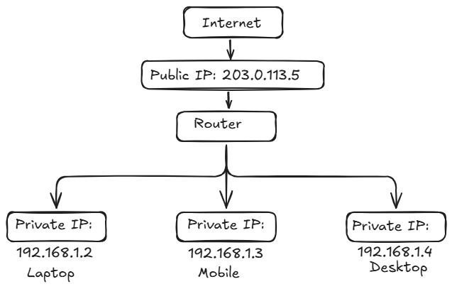
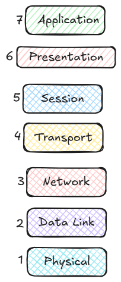

# What is IP and ip address ?
- a unique numerical label (address) for every device on a network (internet or a local network)
-  IP stands for "Internet Protocol", which is the set of rules governing the format of data sent via the internet or local network.
- they contain location information and make devices accessible for communication
- IP addresses are the identifier that allows information to be sent between devices on a network
-  IP addresses provide a way for internet to differentiate between different computers, routers, and websites

## Versions
## IP v4
- The original Internet Protocol is IPv4 which uses a 32-bit numeric dot-decimal notation that only allows for around 4 billion IP addresses. 
- Initially, it was more than enough but as internet adoption grew, we needed something better.
- Example: 102.22.192.181

## IP v6
- new protocol that was introduced in 1998. Deployment commenced in the mid-2000s
- uses 128-bit alphanumeric hexadecimal notation (~340e+36 IP addresses)
- Example: 2001:0db8:85a3:0000:0000:8a2e:0370:7334

## Types
## Public 
- unique address visible to the internet
- address where one primary address is associated with your whole network. 
- In this type of IP address, each of the connected devices has the same IP address.
- Example: IP address provided to your router by the ISP.

## Private
- Used within your local home/office network
-  a unique IP number assigned to every device that connects to your internet network, which includes devices like computers, tablets, and smartphones, which are used in your household.
- Example: IP addresses generated by your home router for your devices.

Here’s a simple diagram showing public and private IPs:

## Static
- does not change and is one that was manually created, as opposed to having been assigned.
- these addresses are usually more expensive but are more reliable
- Example: used for important things like reliable geo-location services, remote access, server hosting, etc.

## Dynamic
- A dynamic IP address changes from time to time and is not always the same. 
- It has been assigned by a [Dynamic Host Configuration Protocol (DHCP)](https://en.wikipedia.org/wiki/Dynamic_Host_Configuration_Protocol) server. 
- Dynamic IP addresses are the most common type of internet protocol address. 
- They are cheaper to deploy and allow us to reuse IP addresses within a network as needed
- Example: They are more commonly used for consumer equipment and personal use.

# OSI Model (Open System Interconnection)
- a conceptual framework that standardizes network communication into seven distinct layers, from physical connections to user applications
- enables different systems to talk to each other by defining specific functions at each level, making networks more understandable
- a 7-layer framework created by the ISO to standardize how computers communicate over a network
- explains the flow of data from physical hardware up to user-facing applications, making it easier to design, troubleshoot, and understand networking systems
- provides a clear structure for data transmission and managing network issues

While this model is not directly implemented in the TCP/IP networks that are most common today, it can still help us do so much more, such as:
- Make troubleshooting easier and help identify threats across the entire stack.
- Encourage hardware manufacturers to create networking products that can communicate with each other over the network.
- Essential for developing a security-first mindset.
- Separate a complex function into simpler components.

## Layers
- The seven abstraction layers of the OSI model can be defined as follows, from top to bottom:

### Application Layer:
- only layer that directly interacts with data from the user
- Software applications like web browsers and email clients **rely** on the application layer to initiate communication. 
- But it should be made clear that client software applications are not part of the application layer, rather the application layer is responsible for the protocols and data manipulation that the software relies on to present meaningful data to the user. 
- Application layer protocols include HTTP as well as SMTP.

### Presentation Layer:
- The presentation layer is also called the Translation layer. 
- The data from the application layer is extracted here and manipulated as per the required format to transmit over the network. 
- The functions of the presentation layer are translation, encryption/decryption, and compression.

### Session Layer:
- This is the layer responsible for opening and closing communication between the two devices. 
- The time between when the communication is opened and closed is known as the session. 
- The session layer ensures that the session stays open long enough to transfer all the data being exchanged, and then promptly closes the session in order to avoid wasting resources. 
- The session layer also synchronizes data transfer with checkpoints.

### Transport Layer
- The transport layer (also known as layer 4) is responsible for end-to-end communication between the two devices. 
- This includes taking data from the session layer and breaking it up into chunks called segments before sending it to the Network layer (layer 3). 
- It is also responsible for reassembling the segments on the receiving device into data the session layer can consume.

### Network Layer
- The network layer is responsible for **facilitating data transfer between two different networks**. 
- The network layer breaks up segments from the transport layer into smaller units, called packets, on the sender's device, and reassembles these packets on the receiving device. 
- The network layer also finds the best physical path for the data to reach its destination this is known as routing. 
- If the two devices communicating are on the same network, then the network layer is unnecessary.

### Data Link Layer
- The data link layer is very similar to the network layer, except the data link layer **facilitates data transfer between two devices on the same network**. 
- The data link layer takes packets from the network layer and breaks them into smaller pieces called frames.

### Physical Layer
- This layer includes the physical equipment involved in the data transfer, such as the cables and switches. 
- This is also the layer where the data gets converted into a bit stream, which is a string of 1s and 0s. 
- The physical layer of both devices must also agree on a signal convention so that the 1s can be distinguished from the 0s on both devices.

# TCP
- Transmission Control Protocol (TCP) is connection-oriented, meaning once a connection has been established, data can be transmitted in both directions. 
- TCP has built-in systems to check for errors and to guarantee data will be delivered in the order it was sent, making it the perfect protocol for transferring information like still images, data files, and web pages.
- TCP establishes a reliable connection between sender and receiver using the three-way handshake (SYN, SYN-ACK, ACK) and it uses a four-step handshake (FIN, ACK, FIN, ACK) to close connections properly.
- It ensures error-free, in-order delivery of data packets.
- It uses acknowledgments (ACKs) to confirm receipt.
- It prevents data overflow by adjusting the data transmission rate according to the receiver's buffer size.
It prevents network congestion using algorithms like Slow Start, Congestion Avoidance, Fast Retransmit, and Fast Recovery.
TCP header uses checksum to detect corrupted data and requests retransmission if needed.
It is used in applications requiring reliable and ordered data transfer, such as web browsing, email, and remote login.

